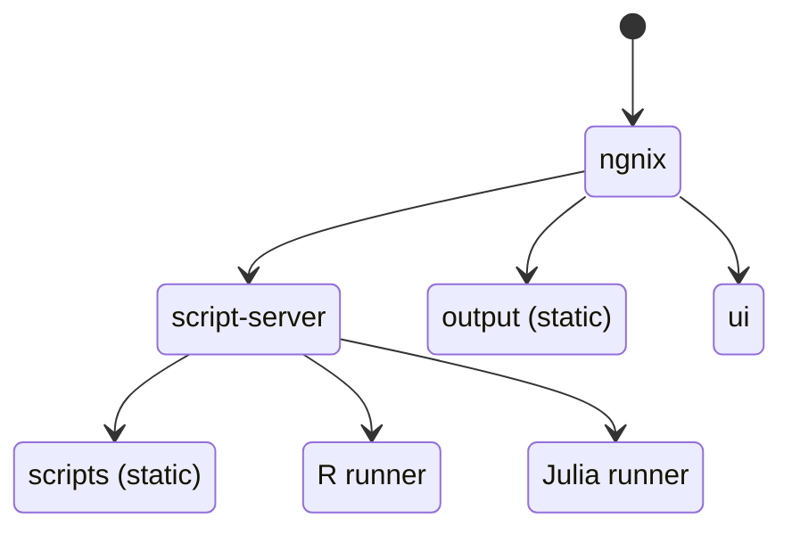
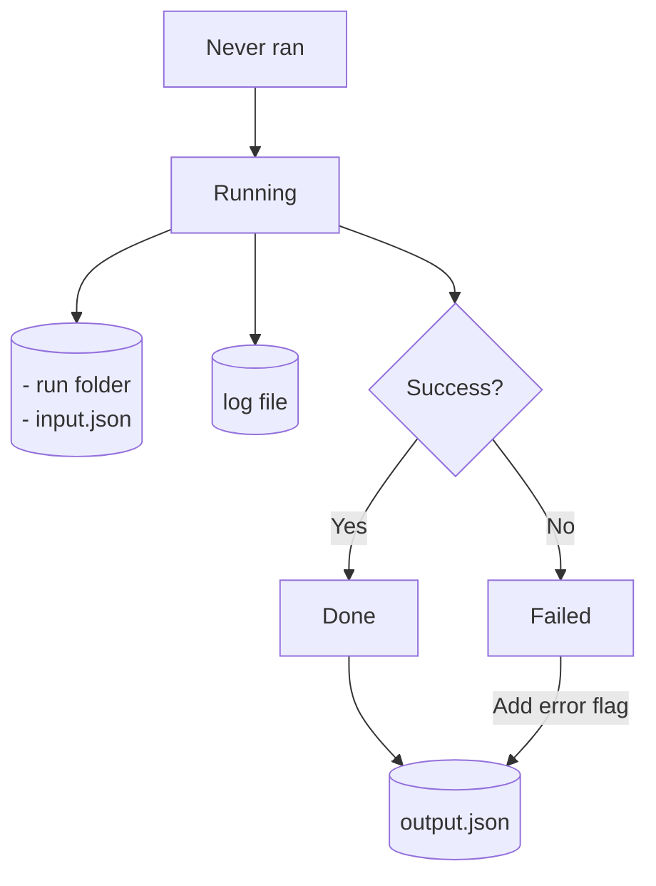
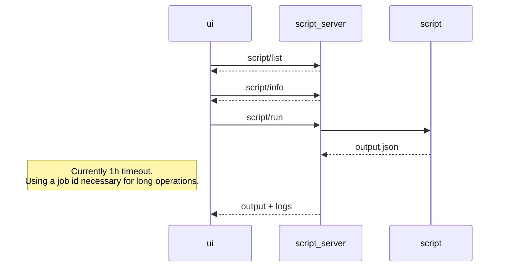
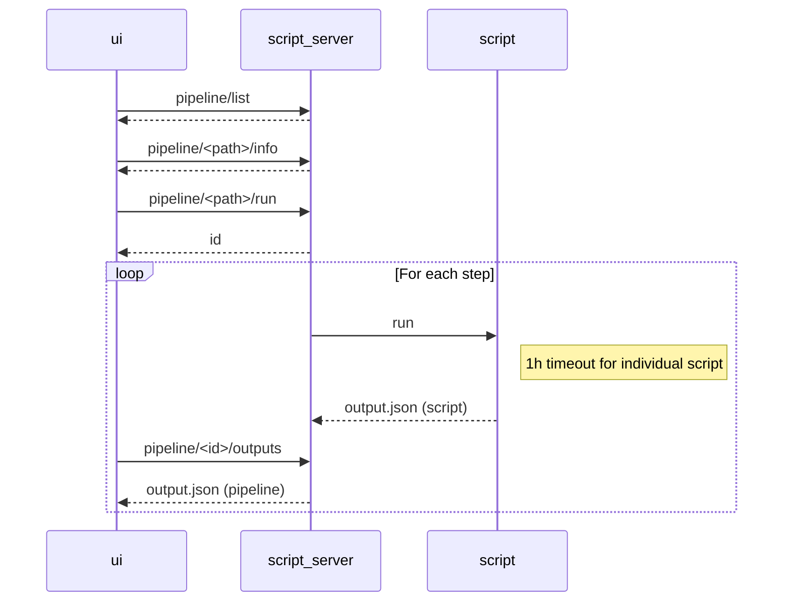

# Developer documentation

## IDE setup

For the global project, Visual Studio Code. Recommended extensions:
- GitLens
- Markdown Preview Mermaid
- Mermaid Markdown Syntax Highlighting

For the script-server (Kotlin code), IntelliJ Idea. Note that on Linux there will be an ownership conflict between gradle files generated by the development docker and those from the IDE. To solve this, make sure to stop the dockers and run `sudo chown -R <yourinfo>:<yourinfo> . ` before running the tests in IntelliJ.

## Launching the dockers in development mode
`docker compose -f compose.yml -f compose.dev.yml build`

`docker compose -f compose.yml -f compose.dev.yml up`

This command enables:
- OpenAPI editor at http://localhost/swagger/
- UI server: React automatic hot-swapping
- Script-server: Kotlin hot-swapping by launching [./script-server/hotswap.sh](../script-server/hotswap.sh)
- NGINX: [http-proxy/conf.d/ngnix.conf](../http-proxy/conf.d/ngnix.conf) will be loaded

Once in a while you should use `docker compose -f compose.yml -f compose.dev.yml pull` to have the latest base images.

## Microservice infrastructure



- ui: React front-end
- script-server: Running scripts and pipeline orchestration
- R runner: Docker dedicated to runs R code, with most relevant packages pre-installed
- Julia runner: Docker dedicated to runs Julia code

In addition to these services, 
- [scripts](../scripts/) folder contains all the scripts that can be run.
- [output](../output/) folder contains all scripts result.

## Script lifecycle & artifacts


## OpenAPI specification

The [OpenApi specification file](../script-server/api/openapi.yaml) is used by the UI to launch runs and track them until completion.

### Single-script scenario


### Pipeline scenario


Every second, the UI polls for:
- output.json from the pipeline, to get the output folders of individual scripts. Stops polling when pipeline stops.
- logs.txt of individual scripts, for realtime logging, only if log section is opened. Stops when individual script completes, or when log section closed.
- output.json of individual scripts, to know when script completes and display its outputs. Stops when script stops.


### Editing the OpenAPI specification of the script-server
1. Using http://localhost/swagger, edit the specification.
2. Copy the result to [script-server/api/openapi.yaml](../script-server/api/openapi.yaml)
3. Use [ui/BonInABoxScriptService/generate-client.sh](../ui/BonInABoxScriptService/generate-client.sh) and  [script-server/generate-server-openapitools.sh](../script-server/generate-server-openapitools.sh) to regenerate the client and the server.
4. Merge carefully, not all generated code is to be kept.
5. Implement the gaps.

## Debugging signal forwarding
Since runner-r and runner-julia run in a separate docker, when the user stops the pipeline, the signal must go from the script-server, to the runner, to the running script. Docker does not allow this by default, this is why we use docker-exec-sigproxy.

In case stop feature seems not to work, we can test that the signal is properly forwarded in an environment with the following:

1. Launch the server as usual (up)
2. Open a shell in the script-server `docker exec -it biab-script-server bash`
3. In the script-server, launch a signal trap on the runner and let it complete

    `/root/docker-exec-sigproxy exec -i biab-runner-r bash -c "trap \"echo 'trapped SIGINT' | tee -a /output/trapped; exit 1;\" INT; echo 'start' | tee -a /output/trapped; for i in {1..5}; do sleep 1; echo 'tick' | tee -a /output/trapped; done; echo 'stop' | tee -a /output/trapped"`

    This will echo the following to the console and to /output/trapped:
    ```
    start
    tick
    tick
    tick
    tick
    tick
    stop
    ```

4. Run the command once more but quickly hit ctrl+c to interrupt (SIGINT). You should have something like that:
    ```
    start
    tick
    tick
    trapped SIGINT
    ```

### Further debugging
You can uncomment `#define DEBUG (1)` in [docker-exec-sigproxy.c](./script-server/docker-exec-sigproxy.c).

Recompile it by installing gcc on the script-server dev docker and run

`RUN gcc -Wall -O2 -o /root/docker-exec-sigproxy docker-exec-sigproxy.c`