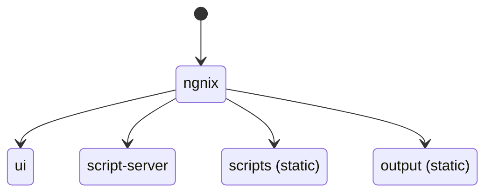
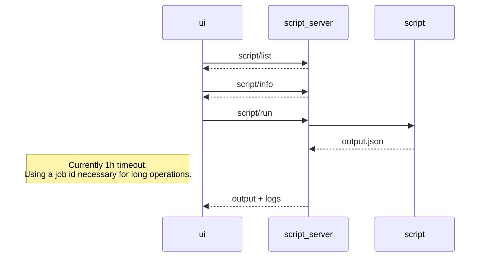

# Developer documentation

## IDE setup

For the global project, Visual Studio Code. Recommended extensions:
- GitLens
- Markdown Preview Mermaid
- Mermaid Markdown Syntax Highlighting

For the script-server (Kotlin code), IntelliJ Idea

## Launching the dockers in development mode
`docker compose -f compose.yml -f compose.dev.yml build`
`docker compose -f compose.yml -f compose.dev.yml up`

This command enables:
- OpenAPI editor at http://localhost/swagger
- UI server automatic React hot-swapping
- Script-server (Kotlin) hot-swapping with ./script-server/hotswap.sh in 
- [http-proxy/conf.d/ngnix.conf](../http-proxy/conf.d/ngnix.conf) will be loaded

## Microservice infrastructure

- ui: Front-end
- script-server: Running scripts and pipeline orchestration

In addition to these services, 
- [scripts](../scripts/) folder contains all the scripts that can be run.
- [output](../output/) folder contains all scripts result.

## OpenAPI specification

### Single-script scenario

### Pipeline scenario

### Editing the specification
1. Using http://localhost/swagger, edit the specification.
2. Copy the result to [script-server/api/openapi.yaml](../script-server/api/openapi.yaml)
3. Use [ui/BonInABoxScriptService/generate-client.sh](../ui/BonInABoxScriptService/generate-client.sh) and  [script-server/generate-server-openapitools.sh](../script-server/generate-server-openapitools.sh) to regenerate the client and the server.
4. Merge carefully, not all generated code is to be kept.
5. Implement the gaps.

