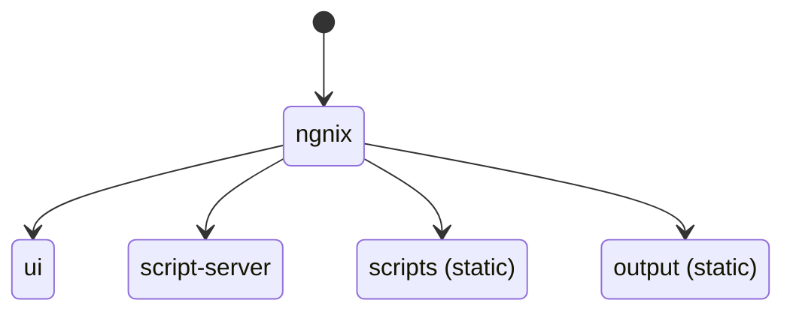
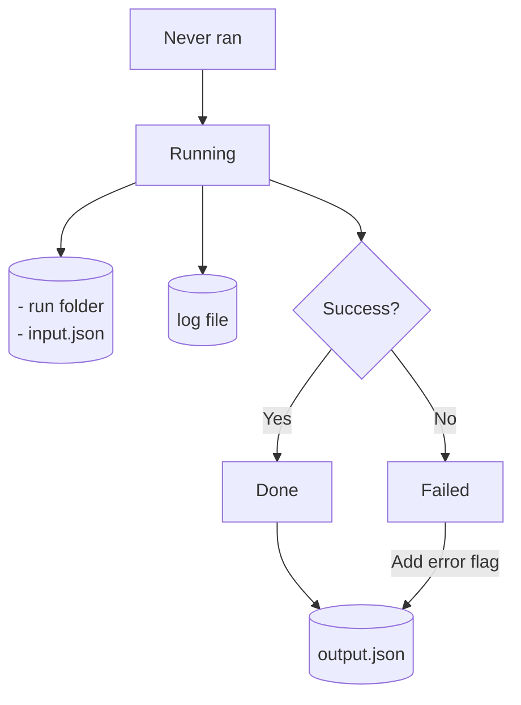
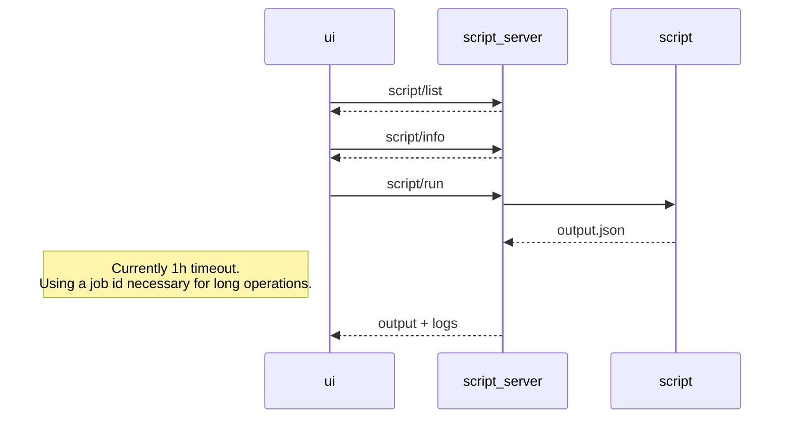
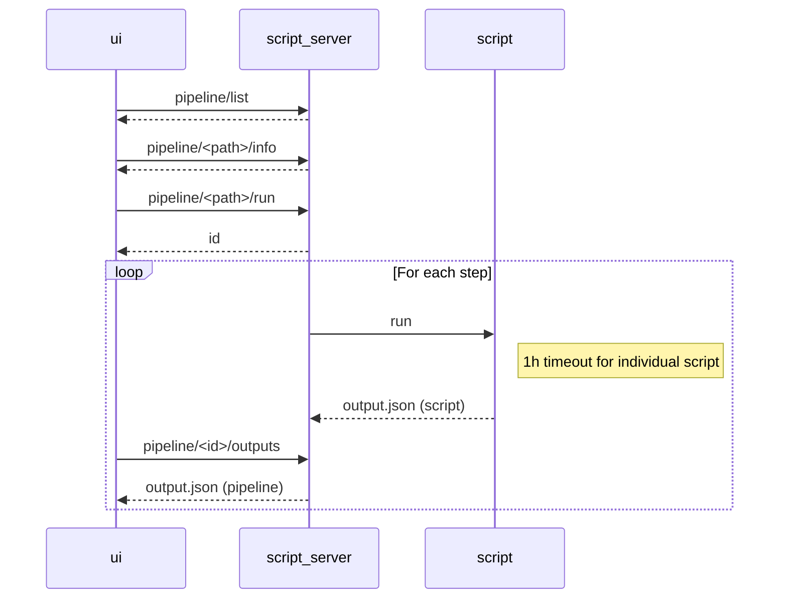

# Developer documentation

## IDE setup

For the global project, Visual Studio Code. Recommended extensions:
- GitLens
- Markdown Preview Mermaid
- Mermaid Markdown Syntax Highlighting

For the script-server (Kotlin code), IntelliJ Idea. Note that on Linux there will be an ownership conflict between gradle files generated by the development docker and those from the IDE. To solve this, run `sudo chown -R <yourinfo>:<yourinfo> .` before running the tests in IntelliJ.

## Launching the dockers in development mode
`docker compose -f compose.yml -f compose.dev.yml build`

`docker compose -f compose.yml -f compose.dev.yml up`

This command enables:
- OpenAPI editor at http://localhost/swagger
- UI server: React automatic hot-swapping
- Script-server: Kotlin hot-swapping by launching [./script-server/hotswap.sh](../script-server/hotswap.sh)
- NGINX: [http-proxy/conf.d/ngnix.conf](../http-proxy/conf.d/ngnix.conf) will be loaded

## Microservice infrastructure

- ui: Front-end
- script-server: Running scripts and pipeline orchestration

In addition to these services, 
- [scripts](../scripts/) folder contains all the scripts that can be run.
- [output](../output/) folder contains all scripts result.

## Script lifecycle & artifacts

## OpenAPI specification

### Single-script scenario

### Pipeline scenario

Every second, the UI polls for:
- output.json from the pipeline, to get the output folders of individual scripts. Stops polling when pipeline stops.
- logs.txt of individual scripts, for realtime logging, only if log section is opened. Stops when individual script completes, or when log section closed.
- output.json of individual scripts, to know when script completes and display its outputs. Stops when script stops.

### Editing the OpenAPI specification of the script-server
1. Using http://localhost/swagger, edit the specification.
2. Copy the result to [script-server/api/openapi.yaml](../script-server/api/openapi.yaml)
3. Use [ui/BonInABoxScriptService/generate-client.sh](../ui/BonInABoxScriptService/generate-client.sh) and  [script-server/generate-server-openapitools.sh](../script-server/generate-server-openapitools.sh) to regenerate the client and the server.
4. Merge carefully, not all generated code is to be kept.
5. Implement the gaps.
