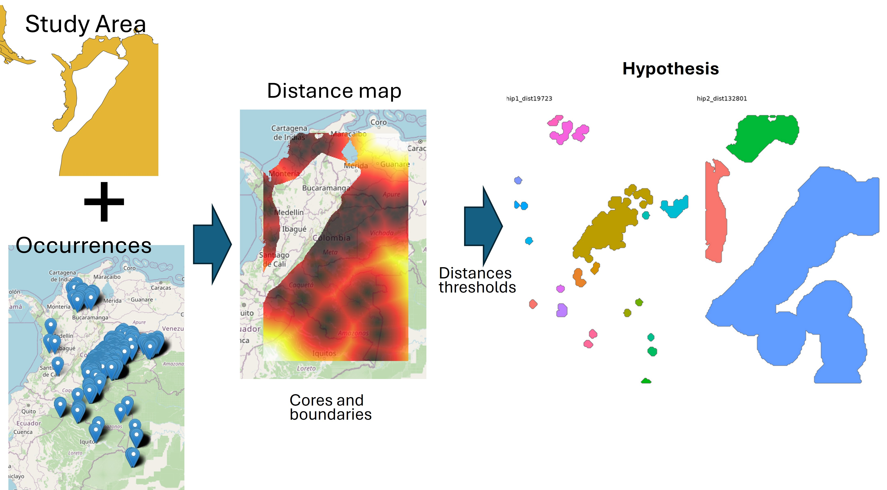
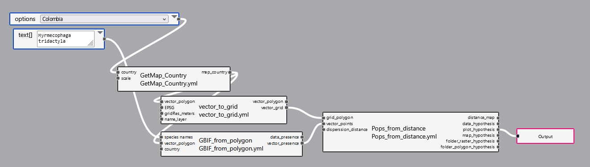
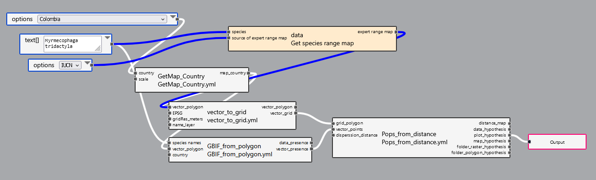

Estimation of Hypotheses for Spatial Delimitation of Discrete
Populations.
================

# Estimation of Hypotheses for Spatial Delimitation of Discrete Populations – Contributions to the methodology of the complementary genetic indicator for the Kunming-Montreal GBF (Hoban et al., 2023; Mastretta‐Yanes et al., 2024).

This workflow estimates hypotheses for the spatial delimitation of
discrete populations of species based on secondary information. It was
developed to support the proposed methodology for indicators designed to
monitor the loss of genetic diversity, as outlined in the
Kunming-Montreal Global Biodiversity Framework (GBF), using secondary
data sources.

This preliminary version was compiled in one afternoon, utilizing weeks
of recycled code. While we are aware that conceptual and mathematical
support needs to be strengthened, we have decided to share this initial
version due to its practical potential, with the aim of obtaining
feedback and building knowledge networks that will help us develop a
more robust tool.

  - [Justification](#justification)
  - [Assumptions](#assumptions)
    - [How to define threshold (cut-off)
      distances?](#how-to-define-threshold-cut-off-distances)
  - [Pipelines according to available
    information:](#pipelines-according-to-available-information)
    - [1. For users without any data](#1-for-users-without-any-data)
    - [2. For users without data but using IUCN species distribution
      models](#2-for-users-without-data-but-using-iucn-species-distribution-models)
    - [3. For users with a defined study
      area.](#3-for-users-with-a-defined-study-area)
    - [4. For users with species dispersal
      data.](#4-for-users-with-species-dispersal-data)
  - [General results](#general-results)
    - [Step GetMap_Country](#step-getmap_country)
- 
  - [distance_map](#distance_map)
- 
  - [plot_hypothesis](#plot_hypothesis)
- 
  - [map_hypothesis](#map_hypothesis)
- 

### Justification

To calculate these indicators accurately, it is essential to have a
clear spatial delimitation of populations, as this serves as a basis for
guiding the search for reported information in those locations.
Additionally, this delimitation is key to analyzing the indicators,
allowing us to determine, for example, how many populations still exist,
how many have been lost, and whether the remaining populations are large
enough to maintain genetic diversity. It is also crucial for guiding
conservation actions by spatially identifying the genetic management
units that require priority attention.

However, delimiting populations is not straightforward, as it presents
several methodological challenges. First, it is difficult to define the
exact geographic and genetic boundaries of a population, as species may
be distributed continuously or in fragmented areas. Furthermore, the
availability of adequate data, such as genetic or census records, is
limited, and when available, they often refer to specific localities.
This complicates the precise estimation of the proposed indicators,
which require detailed information about the number and size of
populations.

The inherent complexity of population delimitation is one of the major
challenges to making the genetic diversity indicator replicable at a
global scale. Based on the experience gained in the pilot of this
indicator in Colombia, specific scripts were developed for its
estimation, which have been integrated into this alternative branch of
“Bon in a Box” as semi-automated pipelines. These tools offer several
options for estimating spatially discrete populations and are designed
to be user-friendly, so that users only need “Bon in a Box” to run them.
However, if they have their own data, they can refine the analyses and
obtain more accurate results. The results generated provide spatial
hypotheses on the distribution of discrete populations, which serve as a
guide for users to organize and improve their database.

### Assumptions

To estimate how populations of a species are spatially delimited, maps
are used to show the distances between the locations where its presence
has been recorded. These maps are generated from data obtained through
the GBIF API for the study area (Chamberlain et al., 2024). The
distances are interpreted as the maximum dispersion areas in which the
species could move, acting as delimitation boundaries. If the presence
areas overlap within these maximum dispersion thresholds, it is assumed
that these records correspond to the same population. The delimitation
of each population is made by referencing the maximum distance between
the most extreme geographic points of occurrence of each potential
population. Unlike other methods that create circles around each point
(buffers), here maps are used that reflect the actual distances between
the points, which better represents how the species is distributed in
space.

#### How to define threshold (cut-off) distances?

Ideally, the threshold distances should be defined based on scientific
literature reporting known dispersal distances for the species in
question. However, when this information is not available, the workflow
estimates dispersal hypotheses based on the quantiles of the distances
between recorded occurrence points.

By calculating the quantiles of the distances, a distribution of
potential dispersal distances between the points where the species has
been observed is obtained. It is assumed that the maximum distance
between all points (the 1st quantile, or 100%) corresponds to the
maximum dispersal distance that the species could reach. This
establishes an upper limit that hypothetically reflects the maximum
range within which the species can move in that environment. Other
quantiles, such as 75% or 50%, represent smaller fractions of that
maximum distance and may reflect areas where dispersal is more likely,
although not necessarily the absolute maximum distance. This approach is
useful because it allows us to generate hypotheses about the different
degrees of potential dispersal, without needing detailed dispersal data
for that species. Thus, different scenarios can be modeled, and
population delimitation adjusted based on the actual dispersal observed
in the occurrence points.

### Pipelines according to available information:

#### 1. For users without any data

The only required inputs are the name of the country (as the study area)
and the species name. The outputs are hypotheses for population
delimitation estimated from cut-off distances, using distance thresholds
calculated as quantiles from 0 to 1, in 0.1 intervals, between
occurrence points reported in GBIF for the species in the country of
interest.

#### 2. For users without data but using IUCN species distribution models

Through GEO BON’s Spatiotemporal Catalog Asset (STAC), the IUCN species
distribution map can be accessed. The user must specify the species
name, and the pipeline will download and use this map as a mask in the
distance analysis.

#### 3. For users with a defined study area.

Required inputs are a polygon representing the area of interest (e.g.,
the study area, the species distribution model, or the species
distribution model applied to the study area).

#### 4. For users with species dispersal data.

If the user knows the dispersal distance of the species, they can
specify it. The final result will include an additional population
hypothesis estimated from the defined distance threshold.

### General results

#### Step GetMap_Country

 \#### Step
GBIF_from_polygon

# 

 \####
Pops_from_distance

##### distance_map

 \#####
data_hypothesis

# 

##### plot_hypothesis

# 

##### map_hypothesis

# 

## References

Chamberlain, S., Oldoni, D., Barve, V., Desmet, P., Geffert, L.,
Mcglinn, D., et al. (2024). rgbif: Interface to the Global Biodiversity
Information Facility API. Available at:
<https://cran.r-project.org/web/packages/rgbif/index.html> (Accessed
October 2, 2024). Hoban, S., Da Silva, J. M., Mastretta‐Yanes, A.,
Grueber, C. E., Heuertz, M., Hunter, M. E., et al. (2023). Monitoring
status and trends in genetic diversity for the Convention on Biological
Diversity: An ongoing assessment of genetic indicators in nine
countries. Conservation Letters. 16, e12953. doi: 10.1111/conl.12953
Mastretta‐Yanes, A., Da Silva, J. M., Grueber, C. E., Castillo‐Reina,
L., Köppä, V., Forester, B. R., et al. (2024). Multinational evaluation
of genetic diversity indicators for the Kunming‐Montreal Global
Biodiversity Framework. Ecology Letters 27, e14461. doi:
10.1111/ele.14461
