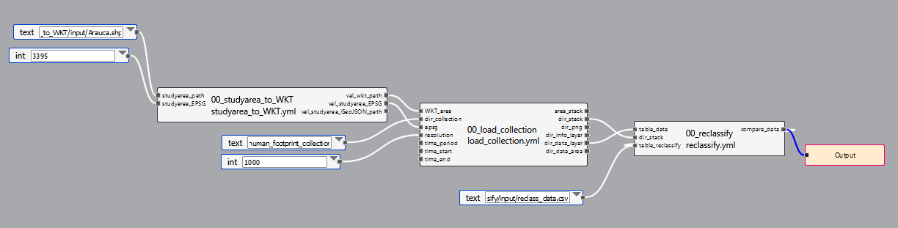

```{r setup, include=FALSE}
knitr::opts_chunk$set(echo = TRUE)
library(knitr)
knitr::opts_chunk$set(echo = TRUE)
require("knitr")

```

## General description
<div style="text-align: justify"> The human footprint index (HFI) address human impacts on ecosystems, it can be estimated at different scales depending on the homogeneity of the available information. HFI version includes the dimension of land use intensity, along with time of human intervention on ecosystems and their biophysical vulnerability (soil fertility, slope, moisture availability and number of short-range species). Correa et al. alter the original HFI into the Legacy-adjusted Human Footprint Index (LHFI), using just two dimensions, 1) human activities intensity and 2) Time. By incorporating time since disturbance, the extended HFI version explicitly acknowledge that ecosystems might carry legacy effects from past landscape transformation that might not be evident before a tipping point is reached.


The Human Spatial Footprint Index was generated at a resolution of 300 m for the year 2018 quantifying the intensity of anthropogenic activities measured through: 1) type of use, 2) population density, 3) distance to rivers, 4) distance to settlements, 5) fragmentation index and 6) biomass index relative to natural potential. The index is grouped under the categories Natural (0 - 15), Low (15 - 40), Medium (40 - 60) and High (> 60). <div/>

$$
LHFI=\frac{F_{int}+F_{time}*100}{\sum_{F_{int}max+F_{time}max}}
$$
**Where:**

F~int~ = Land use intensity

F~time~ = Time of human intervention on ecosystems

$$
F_{int}=LU+PD+DR+DS+FI+BI
$$
$$
F_{time}=TI
$$
**Where:**

- LU = Land use type
- PD = Rural population density
- DR = Distance to roads
- DS = Distance to settlements
- FI = Fragmentation index of natural vegetation
- BI = Biomass index relative to natural potential
- TI = Time of intervention on ecosystems in years


The function for the calculation the *Human Footprint indicator* for this pipeline, was made by Victor Julio Rincón (**vrincon@humboldt.org.co**), researcher of [Instituto de Investigación de Recursos Biológicos Alexander von Humboldt](http://www.humboldt.org.co/es/), the routine can be found with the name *HumanFootprint Colombia* its last modification in R was July 14 2023. The documentation of the pipeline to calculate the Human Footprint indicator was built by Maria Camila Diaz on August 22, 2023.<div/>

This document explains the pipeline flow for the Human footprint indicator, which refers to the anthropogenic activities' influence on landscapes and ecosystems.<div/>

## Authorship

<div style="text-align: justify">The Spatial Human Footprint Index for Colombia was developed by Camilo Correa-Ayram et al. [( 2020 )](https://www.sciencedirect.com/science/article/abs/pii/S1470160X20305677?via%3Dihub) and is available for download from the [Geographic Repository](http://geonetwork.humboldt.org.co/geonetwork/srv/spa/catalog.search#/metadata/e29b399c-24ee-4c16-b19c-be2eb1ce0aae) of the Instituto de Investigación de Recursos Biológicos Alexander von Humboldt .<div/>


## Pipeline Description
### General inputs required

<div style="text-align: justify">**Human Footprint collection:** Collection of raster layers where each feature corresponds to a year and the Human Footprint Index values.

**study area:** Refers to the study area determined by the user for analysis.<div/>

### Pipeline steps



<div style="text-align: center">Pipeline for the Human Footprint Index <div/>

<div style="text-align: justify">

#### **First step** 
studyarea_to_WKT: In the first step of this pipeline, the user determines the path where is located the area of interest shape for the analysis , later it is transformed to .wkt format. The result of this first step is the study area in a .wkt format and the EPSG code of the layer, both necessary for the second step of the pipeline.<div/>


<div style="text-align: center">Study area example<div/>

<div style="text-align: justify">

<div style="text-align: justify"> 
#### **Second step**
load_collection: The second step of the pipeline aims to load the Human footprint layers categorizing de index values into the four categories (Natural, Low, Medium and High).   


<div style="text-align: center">Second step output table example <div/>

<div style="text-align: justify">

<div style="text-align: justify">


## Output

The final result of this pipeline consists of one table. The amount of rows corresponds to the years in the analysis. It has 3 columns that refers to:

**Period**: Corresponds to the year of analysis.

**classes**: Category according to the human footprint index value.

**area_km2**: Area in each category for every year.<div/>

<div style="text-align: center">Final output for the Human Footprint pipeline<div/>

| **Period**                    | **Classes**      | **area_km2** |
|:------------------------------|:----------------:|:------------:|
| 1970-01-01_1971-01-01         | Alto             | 559          |
| 1970-01-01_1971-01-01         | Bajo             | 4208         |
| 1970-01-01_1971-01-01         | Medio            | 1127         |
| 1970-01-01_1971-01-01         | Natural          | 17970        |
| 1990-01-01_1991-01-01         | Alto             | 1264         |


## Indicator interpretation

<div style="text-align: justify">Higher Human Footprint indicates more human alteration in the ecosystem. Allows the identification of highly disturbed areas, as well as areas that despite having human impacts these are still slight and management actions can be carried out.<div/>


## Considerations

<div style="text-align: justify"> When interpreting the *Human Footprint* and *Human Footprint Persistence* indicator, the following must be taken into account:

- The lack of detailed information on economic activities, establishment of human structures such as antennas, garbage areas, mining, agricultural land, hunting data, among others, may underestimate the values of the index in regions such as the Orinoco, Pacific and Amazon.

- Currently the Human Footprint Index (IHEH) focuses on terrestrial ecosystems; the freshwater ecosystems aspect should be strengthened.

- The Human Footprint was constructed with information from 2018, it is an approximate sample of this year and does not reflect the current state of the anthropic activities intensity.

- The Human Footprint was constructed at a resolution of 300 m, which is suitable for regional and national analyses.


```{r correcion atmosferica,echo=FALSE, fig.align="center", fig.height=8, fig.width=8, warning=TRUE, cache=TRUE, dpi=300 }

```

