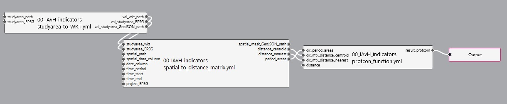
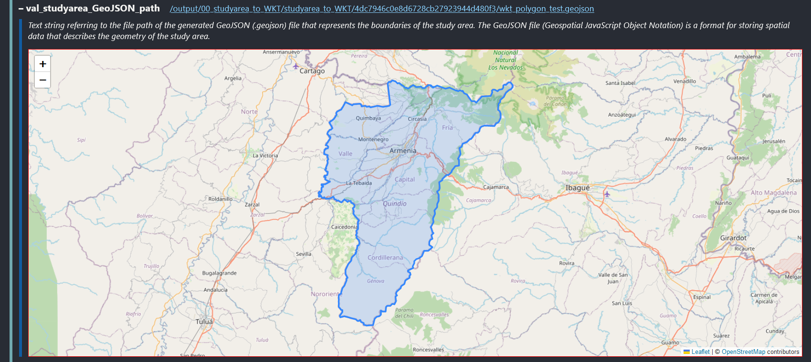
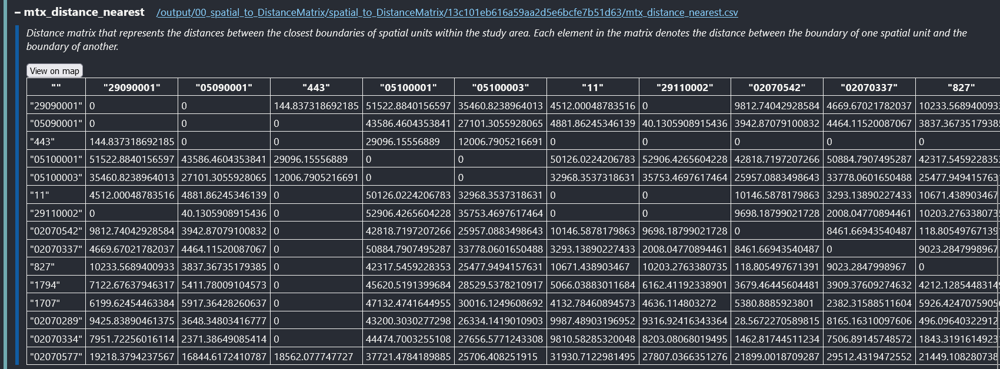
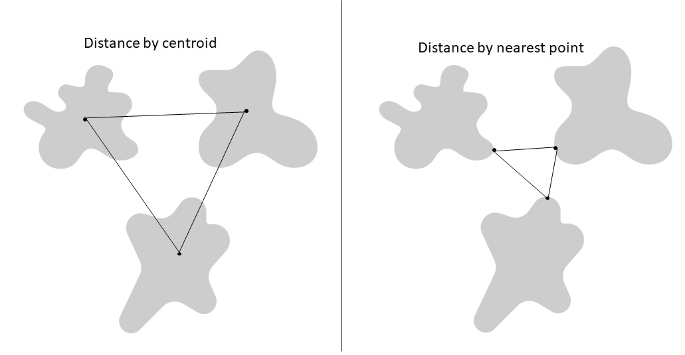
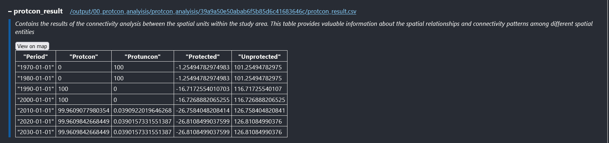
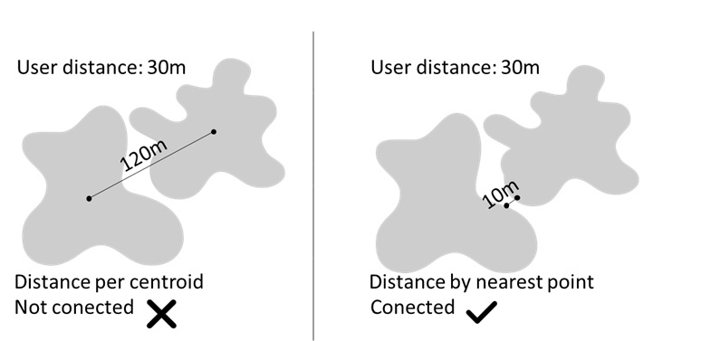

## General description

Protected areas are the most widely applied conservation strategy in the world and can maintain an acceptable representation of biodiversity and its processes. However, connectivity is an essential part of an effective system of areas and is rarely taken into account. The ability of the landscape to facilitate or impede the movement of species between protected areas is crucial for processes such as dispersal and gene flow to circulate between patches and to maintain the stability and integrity of different ecosystems over time.

This document explains the pipeline flow for the protected areas connectivity indicator, which refers to the percentage of protected areas that are well connected given a distance and consultation area determine by the user.This routine can be applied to other types of spatial units other than protected areas, such as habitat patches or nodes of natural cover.

## Authorship

This pipeline uses products at the national or international level that spatially define the units or nodes with which the analysis is to be run. It is common that layers of the distribution of protected areas or patches of natural areas are used to analyze their connectivity within a given landscape. Likewise, the methodology for calculating the connectivity of protected areas that was used for this indicator and this pipeline is based on the *protcon* indicator proposed by [Saura et al.in 2017](https://www.sciencedirect. com/science/article/pii/S1470160X1630752X?via%3Dihub).

This methodology is based on a minimum distance in which protected areas are considered to be well connected; of course, this distance may vary according to the objective for which connectivity is desired. Once the protected areas that are at a distance equal to or less than the defined distance have been identified, the percentage that these represent with respect to the total protected areas of the total area of analysis (protcon) is estimated. To extract the percentage of protected areas that are not well connected (protuncon), the protcon is subtracted from the total number of protected areas in the area of interest. The indicator also generates the percentage values of protected (protected) and unprotected (unprotected) area of interest.

$$
protcon=\frac{A_{pac}}{A_{tpa}}*100
$$
**Where:**

A~pac~ = Area of protected areas well connected

A~tpa~ = Area total of protected areas in the area of interest

$$
protuncon=\frac{A_{panc}}{A_{tpa}}*100
$$
**Where:**

A~panc~ = Area of protected areas not connected

A~tpa~ = Area total of protected areas in the area of interest

$$
protected=\frac{A_{prot}}{A_{t}}*100
$$
**Where:**

A~prot~ = Area of protected areas in the area of interest

A~t~ = Area total of area of interest

$$
unprotected=\frac{A_{uprot}}{A_{t}}*100
$$
**Where:**

A~prot~ = Area of unprotected areas in the area of interest

A~t~ = Area total of area of interest

The function for the calculate de *protcon indicator* for this pipeline, was made by Maria Alejandra Molina Berbeo (**mmolina@humboldt.org.co**), researcher of [Instituto de Investigación de Recursos Biológicos Alexander von Humboldt](http://www.humboldt.org.co/es/), the routine and it can found with the name *protcon_function* its last modification in R was July 14 2023. The documentation of pipeline to generate the calculate the connectivity indicator was built for the same person and the date of the production was July 13 of 2023.

## Pipeline Description
### General inputs required

**areas collection:** Collection of raster layers where each feature corresponds to a decade that contains the system of protected areas, nodes or patches that were registered for that same decade.

**study area:** Refers to the study area determined by the user for analysis.

**distance:** This is the minimum distance where the user considers that the protected areas, nodes or patches of his study area are well connected. [Saura et al.in 2019](https://www.sciencedirect.com/science/article/pii/S0006320719308225) consider this distance to be 10 kilometers is good for protected areas, however, it may vary if it is about the dispersal of a species, political decision or other specific goal.

### Pipeline steps

Pipeline for the protcon indicator

#### **First step** 
studyarea_to_WKT: In the first step of this pipeline, the user determines the path where the shape of the area of interest for the analysis is located, later it is transformed to .wkt format. The result of this first step is the study area in a .wkt format and the EPSG code of the layer, both necessary for the second step of the pipeline.

#### **Second step**
spatial_to_distance_matrix: The second step of the pipeline aims to generate a distance matrix between all the protected areas that intersect with the area of interest provided by the user, this is the main input to calculate the protcon indicator. The distances matrix can be provided by the user or calculated within the pipeline.

The three results generated by this step are: i) a distance matrix taking into account the centroid of each protected area, ii) a distance matrix taking into account the closest point between the protected areas, and iii) a table with the IDs of each of the areas that intersect with the area of interest, the year in which they were created, the area and the time period to which they belong.

Two types of distances for calculate the protcon indicator

#### **Third step**

protcon_funtion: The third and final step of this pipeline outputs a table where the final results of the protcon flag are stored.

## Output

The final result of this pipeline consists of a table where the number of rows corresponds to the number of decades of analysis and five columns that refer to:

**Period**: Corresponds to the decade of analysis

**Protcon_centroid**: Percentage of protected areas that are connected within the user's study area, using the centroid distance.

**Protuncon_centroid**: Percentage of protected areas that are not within the user's study area, using the centroid distance.

**Protcon_nearest**: Percentage of protected areas that are connected within the user's study area using the nearest point distance.

**Protuncon_nearest**: Percentage of protected areas that are not within the user's study area using the nearest point distance.

**Protected**: Percentage of protected areas within the user's study area.

**Unprotected**: Percentage of area that is not protected within the user's study area.

**n_pa**: Number of declared protected areas for the corresponding period that were taken into account for the analysis.

Final output for the protcon pipeline

| **Period**  | **Protcon_centroid**  | **Protuncon_centroid** | **Protcon_nearest**  | **Protuncon_nearest** | **Protected**  | **Unprotected** | **n_pa** |
|:--------|:----------:|:--------:|:----------:|:--------:|:--------:|:--------:|:--------:|
| 1980         | 10          | 90        | 20          | 80        | 25          | 75        |5
| 1990         | 10          | 90        | 20          | 80        | 25          | 75        |5
| 2000         | 15          | 85        | 25          | 75        | 30          | 70        |12
| 2010         | 15          | 85        | 25          | 75        | 30          | 70        |12
| 2020         | 10          | 80        | 20          | 70        | 40          | 60        |14

## Indicator interpretation

This indicator facilitates the definition of strategies for the designation of protected areas based on a representation goal. If the percentage of protected area is less than the target, the strategy should be to increase the representation of protected areas taking into account that if the connected protected area is less than the target value, the designation of protected areas in locations should be encouraged. strategies to improve connectivity.

## Considerations

When interpreting the *protcon* indicator, the following must be taken into account:

- Although the declaration of new protected areas does not always contribute to improving their connectivity, it does contribute to the fulfillment of other conservation objectives such as representation. For this reason, it is recommended that the protected area and the connected protected area be interpreted together.

- The indicators presented do not account for the fulfillment of other conservation objectives such as the effective management of protected areas or their status or pressures. For this reason, it is recommended that this indicator be interpreted together with the percentage of natural and transformed coverage, and the Human Spatial Footprint indicator (IHEH), also incorporated into the pipeline.

- The indicator is presented with two types of distances because, for example, two protected areas may be continuous, but given the user distance, the indicator may vary if the distance is taken from the centroid of each one or from the closest edge of one. Likewise, the indicator may decrease despite the fact that the number of protected areas increases and therefore the percentage of protected area in the study area does as well, since more protected areas does not mean that they are better connected, this will depend on the location. of these newly declared areas.

- The connectivity indicators presented are based solely on the distance determined by the user, so it may vary if other distances such as dispersal ranges and other landscape elements that favor or hinder the movement of species are taken into account.

- Some complementary conservation strategies at the local and regional level, and other existing conservation figures such as indigenous reservations and other collective territories were not taken into account in this analysis. Their inclusion could increase the value of the connected protected area.

- All protected areas whose distribution overlaps some limit of the consulted area were included in the calculation using the full area of their distribution, since it is assumed that the system of protected areas is not restricted solely to administrative limits.

