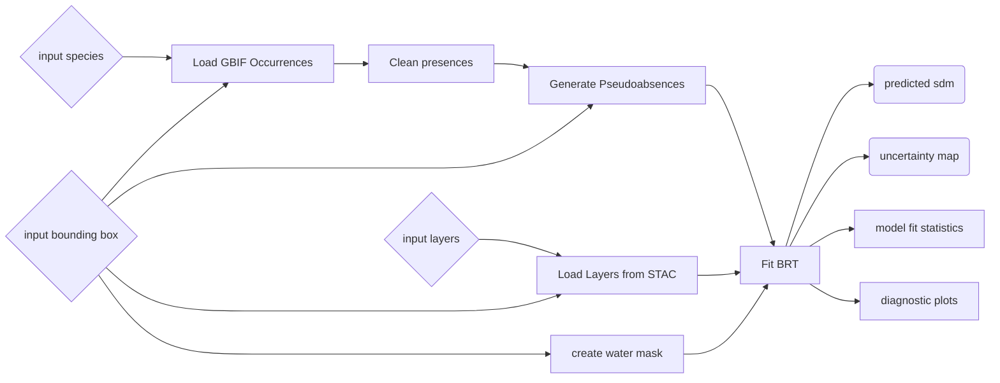

Species distributions are an important EBV in the ‘species populations’ class. Knowing where species are is essential for understanding biodiversity patterns and informing conservation efforts. However, less than 10% of the world is well sampled, and even the longest running and well-sampled biodiversity observation networks have substantial data gaps. Information on species occurrences is often sparse and heavily spatially and taxonomically biased, necessitating the need for species distribution models (SDMs) to fill these data gaps and provide a better, less biased idea of where species are. SDM outputs be used as key base layers for a wide variety of purposes including: creating maps for sampling prioritization, quantifying the impact of environmental stressors on species, mapping habitat suitability for at-risk species, mapping biodiversity hotspots across the landscape, identifying the locations of conservation priorities and protected area expansion, identifying sampling gaps and the needed locations of future sampling, and calculating a range of biodiversity indicators including the Species Habitat Index (SHI), the Species Protection Index (SPI)

### **MaxEnt**

_Author: [Sarah Valentin](https://orcid.org/0000-0002-9028-681X), [Guillaume Larocque](https://orcid.org/0000-0002-5967-9156), [François Rousseu](https://orcid.org/0000-0002-2400-2479)_

Review status: Under development

### **Introcution:**
  The MaxEnt pipeline builds a species distribution model using occurrence
  records from the Global Biodiversity Information Facility (GBIF) and
  environmental raster layers from a STAC catalog. The pipeline retrieves GBIF
  observations for the selected taxon or taxa, cleans occurrence coordinates,
  removes highly collinear environmental predictors, generates background
  points, and fits a MaxEnt model using the ENMeval R package. MaxEnt is a
  presence-background modeling approach, meaning it compares known species
  presences with background environmental conditions across the study area.   

  The pipeline evaluates different MaxEnt settings, including feature classes
  and regularization multipliers, and selects a tuned model based on model
  performance. It produces a habitat suitability prediction raster, cleaned
  occurrence records, selected environmental predictors, a GBIF download DOI,
  and a raster summarizing variability among model runs.  

### **Uses:**

  SDMs predict where species are likely to occur based on a suite of environmental variables that are associated with known occurrences (Peterson, 2001; Elith and Leathwick, 2009). The MaxEnt pipeline can be used to estimate the potential distribution or relative habitat suitability of one or more species within a selected study area. Outputs can support conservation planning, sampling prioritization, identification of biodiversity hotspots, protected area planning, risk assessment for species of conservation concern, and environmental impact
  assessments.  

  The results can also be used as inputs to other biodiversity analyses and
  indicators, such as identifying areas where species are likely to occur,
  comparing predicted habitat suitability across regions, or highlighting areas
  where additional occurrence sampling may be needed. Because the pipeline
  retrieves both GBIF observations and environmental predictor layers, it
  provides a reproducible workflow for generating species distribution maps from
  public biodiversity and environmental data.

 ## **Pipeline limitations:**

  * MaxEnt uses presence-background data, not confirmed absence data.
  Predictions should be interpreted as relative habitat suitability or relative
  occurrence potential, not confirmed species presence or absence.

  * GBIF records may contain spatial, taxonomic, and temporal biases. The
  pipeline applies coordinate-cleaning steps, but users should still inspect the
  cleaned presences and interpret results cautiously, especially for poorly
  sampled taxa or regions.

  * Model quality depends strongly on the number and quality of occurrence
  records. Very small numbers of cleaned presences may produce unreliable
  predictions.

  * The choice of environmental predictors, background sampling method, feature
  classes, regularization multipliers, and partitioning method can affect model
  outputs. Users should treat the model as sensitive to these settings,
  especially for final analyses.

  * Environmental predictors must be ecologically relevant to the species being
  modeled. Including many correlated or irrelevant predictors can reduce
  interpretability and increase overfitting risk.

  * The pipeline estimates suitability based on the predictor layers supplied by
  the user. It does not directly account for dispersal limits, biotic
  interactions, land-use barriers, species detectability, or future
  environmental change unless those factors are represented in the input data.

  * Larger study areas, finer spatial resolutions, more environmental
  predictors, and more model runs increase computation time and memory use.

## **Before you start:**
A GBIF API key is required to run this pipeline and can be added into the runner.env file.

Before running the pipeline, choose the taxon or taxa you want to model and make sure the names match the GBIF taxonomic backbone. Species names can be checked on the GBIF website.

Select a study area using the bounding box and CRS input. The CRS and spatial resolution determine the scale of the analysis, so choose a CRS appropriate for the region and make sure the spatial resolution is in the units of that CRS.

Choose environmental predictor layers from the STAC catalog that are ecologically relevant to the species being modeled. For example, climate, vegetation, elevation, land cover, or habitat-related predictors may be appropriate depending on the species. Avoid including many predictors that represent the same underlying environmental gradient.

## **Running the pipeline:**
### Pipeline inputs
The BON in a Box pipeline allows you to run an SDM for a specific region and species (or multiple species) of interest. The pipeline has the following inputs:

- **Taxa list:** Comma-separated list of [taxa](https://en.wikipedia.org/wiki/Taxon). Each value could be a species name, order, class, genus, kingdom or family, as long as it is an exact match with the GBIF taxonomic backbone. Individual species can be looked up [on the GBIF website](https://www.gbif.org/species/).
- **Taxanomic group:** Broad taxonomic group used to retrieve the GBIF observation-density heatmap for background-point sampling. Choose the group that best matches the modeled taxa, or all for all GBIF observations.
- **Bounding box and CRS:** Bounding box and coordinate reference system defining the analysis extent. This extent is used to retrieve GBIF occurrences, environmental predictor rasters, the GBIF sampling-effort heatmap, and the study extent for modeling.
- **Study area:** Polygon of the study area, in geopackage format. To use a custom study area, input the path to the file in userdata (e.g. /userdata/study_area_polygon.gpkg) and it will crop the area to the shape of the polygon. Leave blank to use bounding box and CRS chosen above.
- **Spatial resolution:** Target spatial resolution for the predictor rasters and GBIF heatmap. Units must match the selected CRS, for example meters for projected CRS or degrees for latitude-longitude CRS.
- **Temporal resolution:** Temporal resolution to use when querying STAC items by date, in the format ("P", time interval, and time unit, e.g. "P1Y" is yearly, "P1M" is montly, and "P1D" is daily). Leave blank if not querying by date. If the temporal resolution is coarser than the temporal resolution of the time series, the layers will be aggregated with the aggregation method chosen below.
- **Minimum and maximum year:** The user can specify the year range for which they want to pull GBIF observations.
- **STAC URL:** URL of the STAC catalog used to retrieve environmental predictor layers.
- **STAC collection items:** To pull specific collection items, input the collection name followed by '|' followed by item id (e.g. "chelsa-clim|bio1"). To extract a whole collection, type the collection name only (e.g. "chelsa-clim"). To pull collection items by date, write the collection name and provide a start date, end date, and temporal resolution. If pulling a layer that is tiled (e.g. https://stac.geobon.org/viewer/gfw-lossyear/_80N_180W), enter the collection name (e.g. gfw-lossyear), bounding box and time range if the layer is a time series, and the script will assemble the tiles into a continuous layer automatically.
- **Number of background points:** Target number of pseudo-absence/background points to generate within the study extent.
- **Method background:** Generates background points using any of the six available methods. 
  - `random`: background points are randomly sampled throughout the whole study extent.
  - `weighted_raster`: background points are sampled in proportion to the number of observations of a target group in an observation density raster. 
  - `unweighted_raster`: background points are sampled only in cells where there are observations from a target group. 
  - `inclusion_buffer`: background points are sampled within a buffer around observations. 
  - `thickening`: background points are sampled in proportion the local density of observations by sampling in a buffer around each observation. 
- **Feature classes:** MaxEnt feature classes control the shapes of relationships the model can learn between species occurrence and environmental predictors. Simpler classes, such as L or LQ, fit smoother, more constrained responses and are often safer for small datasets. More complex combinations, such as LQH or LQHP, can capture more flexible ecological responses but may overfit when occurrence records are limited. This pipeline tests all values provided here and selects the best-performing combination using the parameter selection method configured in the MaxEnt step. Accepted values are combinations of L (linear), Q (quadratic), P (product), H (hinge) or T (threshold).
- **Regularization multiplier:** Regularization multiplier values to evaluate for MaxEnt model tuning. The regularization multiplier controls how strongly MaxEnt penalizes model complexity. Lower values allow a more flexible model that may fit local patterns closely. Higher values produce smoother, more generalized predictions and reduce overfitting risk. 
- **Partition type:** ENMeval partitioning method used to evaluate MaxEnt parameter combinations. This option controls how ENMeval partitions presence and background data while tuning MaxEnt parameters. 
  - Block \- partitions the bounding box into four equally sized quadrants and assigns groups by quadrant
  - Checkerboard 1 \- Generates checkerboard from the study area and assigns groups based on what square the points fall in
  - Checkerboard 2 \- Similar to checkerboard 1 but performs this separately for occurrence and background points
  - Jackknife \- Does not partition the background points into testing and training (uses them all), performs leave one out cross validation (recommended for small datasets only)
  - Random k-fold \- Does not partition the background points into testing and training, partitions groups randomly into a user specified (K) number of bins, and runs the model k times, with each bin used once as testing.
  - **Number of runs:** The number of SDMs to run to compute the 95% confidence interval through cross validation.

### Pipeline steps

#### **1. Pulling occurences from GBIF**

 This step pulls occurrences of the species of interest from GBIF and environmental raster layers from the GEO BON STAC catalog. 
 
#### **2. Cleaning input data**

 This step cleans the GBIF data by only including one occurrence per pixel and removes collinearity between the environmental layers. 

#### **3. Generating background points**

This step creates a set of pseudo-absences (background points) and combines this with presences and the environmental predictors to create a dataset that is ready to be input into the SDM model. 
 
#### **4. Running the MaxEnt model**

 This step runs the SDM on the clean data using the MaxEnt algorithm using the ENMeval R package (Kass et al. 2021). The MaxEnt SDM is run by 1\) partitioning occurrence and background points into subsets for training and evaluation, 2\) building the model with different algorithmic settings (model tuning), and 3\) evaluating their performance ([see package vignette](https://jamiemkass.github.io/ENMeval/articles/ENMeval-2.0-vignette.html#partition)). 
 
#### **5. Prediction range**
 
 This step computes the 95% confidence interval using bootstrapping and cross validation techniques.

### **Pipeline outputs**
The pipeline creates the following outputs:

- **DOI of GBIF download:** A permanent DOI assigned to this specific GBIF data download. Must be cited in any publication using these data — see [GBIF's citation guidelines](https://www.gbif.org/citation-guidelines).
- **Taxa list:** Taxa supplied to the pipeline and used for GBIF occurrence retrieval and model fitting.
- **Presences:** Cleaned GBIF occurrence records that passed the selected coordinate-cleaning tests. These records are used as presence points in the SDM workflow.
- **Environmental Predictors:** GeoTIFF predictor rasters retained after collinearity filtering. These are the environmental variables used to fit and project the MaxEnt model.
- **Predictions:** MaxEnt habitat suitability prediction raster fitted using the selected model settings.
- **Variability of predictions:** The variability of the 95% confidence of each prediction can be viewed on a map to show uncertainty.

## **Examples:**
[See an example output here](https://pipelines-results.geobon.org/viewer/_2025-10-16%3ESDM%3ESDM_maxEnt%3E78ed53b7ea6b96ef58008075a4dfb487)

## **References:**

Baston D (2025). exactextractr: Fast Extraction from Raster Datasets using Polygons. [doi:10.32614/CRAN.package.exactextractr](doi:10.32614/CRAN.package.exactextractr)

Elith, J., & Leathwick, J. R. (2009). Species Distribution Models: Ecological Explanation and Prediction Across Space and Time. Annual Review of Ecology, Evolution, and Systematics, 40(Volume 40, 2009), 677–697. https://doi.org/10.1146/annurev.ecolsys.110308.120159

Kass JM, Muscarella R, Galante PJ, Bohl CL, Pinilla-Buitrago GE, Boria RA, Soley-Guardia M, Anderson RP (2021). “ENMeval 2.0: Redesigned for customizable and reproducible modeling of species’ niches and distributions.” Methods in Ecology and Evolution, 12(9), 1602-1608. https://doi.org/10.1111/2041-210X.13628.

Peterson, A. T. (2001). Predicting Species’ Geographic Distributions Based on Ecological Niche Modeling. The Condor, 103(3), 599–605. [https://doi.org/10.1093/condor/103.3.599](https://doi.org/10.1093/condor/103.3.599)

Phillips, S. J., Dudík, M., Elith, J., Graham, C. H., Lehmann, A., Leathwick, J., & Ferrier, S. (2009). Sample selection bias and presence‐only distribution models: implications for background and pseudo‐absence data. Ecological applications, 19(1), 181-197. [https://doi.org/10.1890/07-2153.1](https://doi.org/10.1890/07-2153.1)

Vollering, J., Halvorsen, R., Auestad, I., & Rydgren, K. (2019). Bunching up the background betters bias in species distribution models. Ecography, 42(10), 1717-1727. [https://doi.org/10.1111/ecog.04503](https://doi.org/10.1111/ecog.04503)

### **Boosted Regression Trees**

_Author: [Michael D. Catchen](https://orcid.org/0000-0002-6506-6487)_

Review status: Under development

This document describes the methodology behind the BON in a Box pipeline for using Boosted Regression Trees (BRTs) for species distribution modeling.

**Summary**

This pipeline builds a model to predict the distribution of a species (a type of
essential biodiversity variable), by using occurrence data from the Global
Biodiversity Information Facility (GBIF), and environmental predictors from an
arbitrary STAC Catalogue.

In particular, this pipeline uses a specific model called a Boosted Regression
Tree (BRT), a machine-learning model which tends to work well with spatial data. The
details of how a BRT works are in the description of the key script in the
pipeline, [`fitBRT.jl`](../../scripts/SDM/BRT/fitBRT.md).

**Inputs**:

- **Species**: The name of the taxon the build a species distribution model for
- **Environmental Predictors**: The set of environmental predictors to use
- **Coordinate Reference System**: The coordinate reference system to use for the analysis
- **Bounding Box**: The bounding box for the analysis, given in the same coordinate
  reference system as listed above
- **GBIF Data Source**: the source of GBIF data to use
- **Start Year**: the earliest year to select occurrences from
- **End Year**: the final year to select occurrences from
- **Spatial Resolution**: the spatial resolution of the analysis in meters
- **Mask**: a mask of regions to ignore
- **STAC URL**: the URL to the STAC catalogue where the environmental predictors are hosted

**Outputs**

- **Predicted SDM**: map of the predicted occurrence score at each location
- **SDM Uncertainty**: map of relative uncertainty of the SDM at each location
- **Fit Statistics**: describes different metrics of how
  good the model is on the test set
- **Pseudoabsences**: generated locations where species is assumed to not occur,
  based on hueristics.

[See an example pipeline output here](https://pipelines-results.geobon.org/viewer/_2025-10-16%3ESDM%3ESDM_BRT%3E933ca049e112ab67db9711517e6ee30a)

> [!IMPORTANT]
> Using BRTs to fit a species distribution model requires _absence data_. For the majority of species where no absence data is available, there are various methods to generate pseudoabsences (PAs) based on heuristics about species occurrence. However, the performance characteristics of an SDM fit using PAs can be widely variable depending on the method and parameters used to generate PAs. This means the results of BRT should be explicitly considered as a function of how PAs were generated, and sensitivity analysis to different PAs is _highly_ encouraged.

- **Range Map**: species range, computed by thresholding the predicted SDM at
  the optimum threshold (defined as the threshold the maximizes the Matthew's
  Correlation Coefficient)
- **Environment Space**: diagnostic **corners plot** of the locations of occurrences and
  pseudoabsences in environmetal space
- **Tuning Curve**: diagnostic **tuning curve** plot of the value of the Matthew's Correlation
  Coefficient across various thresholding values between 0 and 1.
- **Presences**: cleaned occurrence data after cleaning
- **DOI of GBIF download**

**Pipeline Steps**

### **ewlgcpSDM (mapSpecies)**

_Authors: [François Rousseu](https://orcid.org/0000-0002-2400-2479), [Guillaume Blanchet](https://orcid.org/0000-0001-5149-2488), [Dominique Gravel](https://orcid.org/0000-0002-4498-7076)_

Review status: Under development

**Methods:**
The species distribution modeling method provided in the package ewlgcpSDM (Effort-Weighted Log-Gaussian Cox Process) is based on spatial point processes and presence-only observations. It implements the method proposed by Simpson et al. (2016) to estimate log-Gaussian Cox processes using INLA (Rue et al. 2009) and the SPDE approach (Lindgren et al. 2009). The model relies on a discrete grid (the mesh) of arbitrary resolution to approximate the spatial component of the model. The method proposed in ewlgcpSDM contains three key aspects for species distribution modeling, namely:

- a spatial component that can help in accounting for variation in relative intensities not explained by predictors
- an effort-weighted adjustment analogous to target-group background selection (Phillips et al. 2009)
- a suit of model-based prediction uncertainty layers thanks to the bayesian approach used by INLA

The current version of the pipeline does not make use of the spatial component yet as some more work is needed to allow the adjustments necessary for the spatial component to work properly. The current version of the pipeline thus corresponds to an effort-weighted inhomogeneous Poisson point process.

**BON in a Box pipeline:**
The pipeline is used to run an SDM for a set of species in a specific region and using a set of environmental predictors. Some inputs are yet to be added to the list of inputs required by the user. Currently, the pipeline mostly reuses the same inputs as the MaxEnt pipeline, namely:

- **Taxa list:** The user can specify the species (or multiple species) they are interested in.
- **Bounding box**: The user can specify the bounding box where they want to distribution to be predicted (units must be in the chosen CRS).
- **Projection system**: The user can specify a projection system.
- **Data source**: The user can pull species’ occurrences using the GBIF API or from GBIF on the planetary computer.
- \*\*Environmental layers: The user specifies the environmental layers that they want to include in the species distribution model, pulled from a STAC catalog.
- **Minimum and maximum year**: The user can specify the year range for which they want to pull GBIF observations.
- **Method background**: The user chooses a method to sample background points (pseudo absences) from a drop down menu
- **Number of background points**: The user specifies the number of background points to use
- **Number of blocks**: The number of cross-validation blocks used to compute predictive performance metrics (not implemented yet).
- **Mask**: If the user is only interested in a specific country or study area, they can upload a polygon and the pipeline will crop the results to only that area.
- **Spatial resolution**: The spatial resolution of the predictors used

The pipeline creates the following outputs:

- **Predictions**: model intensity predictions (analogous to relative densities)
- **Species list:** a list of species for which the model was run
- **Presences:** GBIF observations used for the model
- **Uncertainty:** a list of raster layers with model outputs and uncertainties (e.g. 95% credible interval, standard deviation, spatial component, etc.)
- **CI range:** difference between the upper (0.975) and the lower (0.025) credible interval bound
- **Environmental predictors:** layers used as predictors
- **Background:** background points used for the effort weighting
- **Dmesh:** dual mesh used by the sdm model (INLA mesh)
- **DOI of GBIF download:** Used for citing downloaded data.

[See an example pipeline output here](https://pipelines-results.geobon.org/viewer/_2025-10-16%3ESDM%3ESDM_ewlgcp%3Edfbdc18c5e923c2a9fa426efc502843c)

**Citations:**
Lindgren, F., Rue, H., and Lindström, J. 2011. An explicit link between Gaussian fields and Gaussian Markov random fields: the stochastic partial differential equation approach. Journal of the Royal Statistical Society Series B: Statistical Methodology, 73(4): 423-498.

Phillips, S. J., Dudík, M., Elith, J., Graham, C. H., Lehmann, A., Leathwick, J. and Ferrier, S. 2009. Sample selection bias and presence-only distribution models: implications for background and pseudo-absence data. Ecological Applications, 19(1): 181-197, https://doi.org/10.1890/07-2153.1

Rue, H., Martino, S. and Chopin, N. 2009. Approximate Bayesian Inference for Latent Gaussian models by using Integrated Nested Laplace Approximations, Journal of the Royal Statistical Society Series B: Statistical Methodology, 71(2): 319–392, https://doi.org/10.1111/j.1467-9868.2008.00700.x

Simpson, D., Illian, J. B., Lindgren, F., Sørbye, S. H. and H. Rue. 2016. Going off grid: computationally efficient inference for log-Gaussian Cox processes, Biometrika 103(1): 49–70, https://doi.org/10.1093/biomet/asv064
