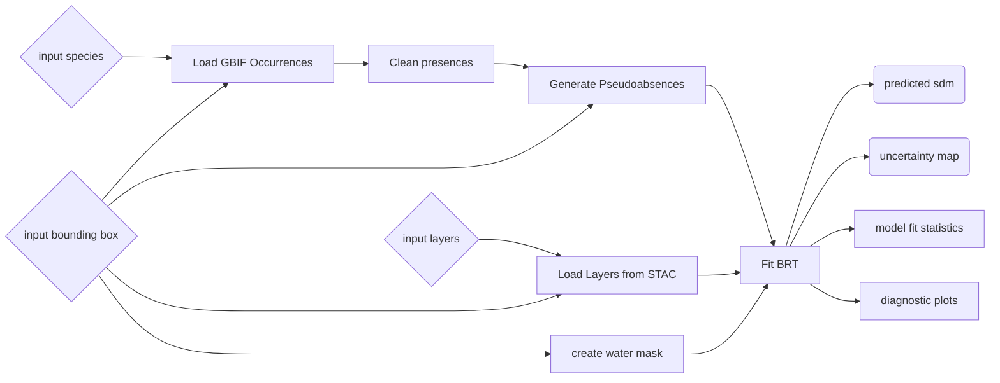

# Species Distribution Modeling with Boosted Regression Trees 

This document describes the methodology behind the BON-in-a-Box (BiaB) pipeline for using Boosted Regression Trees (BRTs) for species distribution modeling.

# Summary

> [!WARNING]  
> This really should change to PAs being in a separate script from BRT, but that
> isn't how `fitBRT.jl` works at the moment

This pipeline builds a model to predict the distribution of a species (a type of
essential biodiversity variable), by using occurrence data from the Global
Biodiversity Information Facility (GBIF), and environmental predictors from an
arbitrary STAC Catalogue. 

In particular, this pipeline uses a specific model called a Boosted Regression
Tree (BRT), a machine-learning model which tends to work well with spatial data. The
details of how a BRT works are in the description of the key script in the
pipeline, [`fitBRT.jl`](LINK).

## Inputs:
- **Species**: The name of the taxon the build a species distribution model for
- **Environmental Predictors**: The set of environmental predictors to use
- **Coordinate Reference System**: The coordinate reference system to use for the analysis
- **Bounding Box**: The bounding box for the analysis, given in the same coordinate
  reference system as listed above
- **GBIF Data Source**: the source of GBIF data to use
- **Start Year**: the earliest year to select occurrences from 
- **End Year**: the final year to select occurrences from
- **Spatial Resolution**: the spatial resolution of the analysis in meters
- **Mask**: a mask of regions to ignore
- **STAC URL**: the URL to the STAC catalogue where the environmental predictors are hosted

## Outputs

- **Predicted SDM**: map of the predicted occurrence score at each location
- **SDM Uncertainty**: map of relative uncertainty of the SDM at each location
- **Fit Statistics**: describes different metrics of how
  good the model is on the test set
- **Pseudoabsences**: generated locations where species is assumed to not occur,
  based on hueristics. 

> [!IMPORTANT]  
> Using BRTs to fit a species distribution model requires _absence data_. For the majority of species where no absence data is available, there are various methods to generate pseudoabsences (PAs) based on heuristics about species occurrence. However, the performance characteristics of an SDM fit using PAs can be widely variable depending on the method and parameters used to generate PAs. This means the results of BRT should be explicitly considered as a function of how PAs were generated, and sensitivity analysis to different PAs is _highly_ encouraged. 

- **Range Map**: species range, computed by thresholding the predicted SDM at
  the optimum threshold (defined as the threshold the maximizes the Matthew's
  Correlation Coefficient)
- **Environment Space**: diagnostic **corners plot** of the locations of occurrences and
  pseudoabsences in environmetal space
- **Tuning Curve**: diagnostic **tuning curve** plot of the value of the Matthew's Correlation
  Coefficient across various thresholding values between 0 and 1. 
- **Presences**: cleaned occurrence data after cleaning
- **DOI of GBIF download**

# Pipeline Steps

