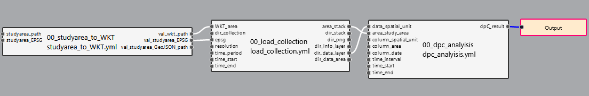

```{r setup, include=FALSE}
knitr::opts_chunk$set(echo = TRUE)
library(knitr)
knitr::opts_chunk$set(echo = TRUE)
require("knitr")

```

## General description
<div style="text-align: justify">Protected areas are the most widely applied conservation strategy in the world and can maintain an acceptable representation of biodiversity and its processes. However, connectivity is an essential part of an effective system of areas and is rarely taken into account. The ability of the landscape to facilitate or impede the movement of species between protected areas is crucial for processes such as dispersal and gene flow to circulate between patches and to maintain the stability and integrity of different ecosystems over time.

This document explains the pipeline flow for the protected areas connectivity indicator dPC, which refers to the percentage of protected areas that are well connected given a distance and consultation area determine by the user.<div/>

## Authorship
This pipeline uses products at the national or international level that spatially define the units or nodes with which the analysis is to be run. It is common that layers of the distribution of protected areas or patches of natural areas are used to analyze their connectivity within a given landscape. Likewise, the methodology for calculating the connectivity probability indicator that was used for this indicator and this pipeline is based on the *dPC* indicator proposed by [Saura et al.in 2007](https://www.sciencedirect.com/science/article/abs/pii/S0169204607000709?via%3Dihub).

This methodology is based on the Connectivity Probability Index (PC) that is the probability that two animals randomly placed within the query area fall into habitat areas that are interconnected given a set of protected areas. 


$$PC=\frac{\sum_{i=1}^n \sum_{j=1}^n a_{i} a_{j} p_{ij}}{A_{L^2}}$$
**Where:**

n = Number of protected areas

a~i~/a~i~ = Areas of the protected areas i and j 

A~L~ = Total area of the area of interest


Once this probability is obtained, the percentage of variation in PC (dPC) can be estimated, which indicates how each protected area contributes to the connectivity of the entire consultation area. .
$$
dPC=\frac{PC -{PC_{remove , k}}}{PC} *100
$$ 
**Where:**

PC = Connectivity Probability Index

PC~remove,k~ = Is the metric value after removal of a protected area each time.


The function for the calculate de *dPC indicator* for this pipeline, was made by Maria Alejandra Molina Berbeo (**mmolina@humboldt.org.co**),researcher of [Instituto de Investigación de Recursos Biológicos Alexander von Humboldt](http://www.humboldt.org.co/es/), the routine and it can found with the name *protcon_function* its last modification in R was July 14 2023. The documentation of pipeline to generate the calculate the connectivity indicator was built for the same person and the date of the production was July 24 of 2023.<div/>


## Pipeline Description
### General inputs required

<div style="text-align: justify">**protected areas collection:** Collection of raster layers where each feature corresponds to a decade that contains the system of protected areas that were registered for that same decade.

**study area:** Refers to the study area determined by the user for analysis.


### Pipeline steps



<div style="text-align: center">Pipeline for the dPC indicator<div/>

<div style="text-align: justify">
#### **First step** 
studyarea_to_WKT: In the first step of this pipeline, the user determines the path where the shape of the area of interest for the analysis is located, later it is transformed to .wkt format. The result of this first step is the study area in a .wkt format and the EPSG code of the layer, both necessary for the second step of the pipeline.<div/>

#### **Second step**
In the second step, the pipeline takes as input the data collection indicated by the user, and cuts it for the study area that the user himself provided. In this same step, the value of the area of each unit area or node is generated, this value is necessary for the calculation for dPC.


#### **Third step**
In the third step, the areas of the spatial units or nodes with which you want to make the calculation and the pumps of the fields that are required for it are taken. Finally, in this step, the final result is extracted.


## Output

The final result of this pipeline consists of a table where are the top five of the protected areas the most contribute of the connectivity for the area of interest, if there are lees of five protected areas, the result show all of them, also the table have four columns that refer to:

**Period**: Corresponds to the period of time of analysis.

**id_pa**: Corresponds to the id of the spatial unit (node) that contributes the most to connectivity the area of interest determined by the user.This column take the same name that the user give in the inputs.

**name**: Corresponds to the name of the spatial unit (node) that contributes the most to connectivity the area of interest determined by the user.This column take the same name that the user give in the inputs.

**PC**: Corresponds to the probability of connectivity (PC) that the study area has determined by the user when all the spatial units (nodes) are present.

**PC_out**: Corresponds to the probability of connectivity (PC) that the study area has, determined by the user, when x spatial unit (node) is removed.

**dPC**: Value of the dPC index for the spatial unit (node), value that indicates to what extent the spatial unit (node) contributes to landscape connectivity.
<div style="text-align: justify">


<div style="text-align: center">Final output for the dPC pipeline<div/>


| **Period**  | **id_pa**  | **name** | **PC**  | **PC_out**  | **dPC**  |
|:--------|:----------:|:--------:|:----------:|:----------:|:----------:|
| 1980         | 00912855          | Los Nevavos        | 0.6609  | 0.0513    |0.1528     |
| 1990         | 00912854          | Tatamá             |0.6609          |0.04954       |0.2504     |
| 2000         | 00912852          | Río Quindio y Salento        | 0.6609  | 0.011     |0.8276     |
| 2010         | 00912853          | Campoalegre        |0.6609          |0.005162      |0.9218      | 2020         | 00912851          | Farallones del Citará        | 0.6609          |0.0019        |0.9685     | 
 


## Indicator interpretation

<div style="text-align: justify">The dPC value is the difference between the probability of connectivity that exists between all the protected areas of an area of interest minus that same probability calculated by removing a protected area each time it is calculated. This makes it possible to identify the effect on connectivity each time an element within the landscape is removed. Therefore, if the dPC value is very low, it means that the PC varied considerably when a certain protected area was removed, otherwise if the dPC is high, it means that when a certain protected area was removed, the probability of connectivity did not decrease considerably. Therefore, protected areas with a lower dPC are the ones that contribute the most to landscape connectivity.<div/>


## Considerations

<div style="text-align: justify">When interpreting the *dPC* indicator, the following must be taken into account:

- All the spatial units or nodes whose distribution overlaps some limit of the consulted area were included in the calculation using the full area of their distribution.
<div style="text-align: justify">


```{r correcion atmosferica,echo=FALSE, fig.align="center", fig.height=8, fig.width=8, warning=TRUE, cache=TRUE, dpi=300 }

```

