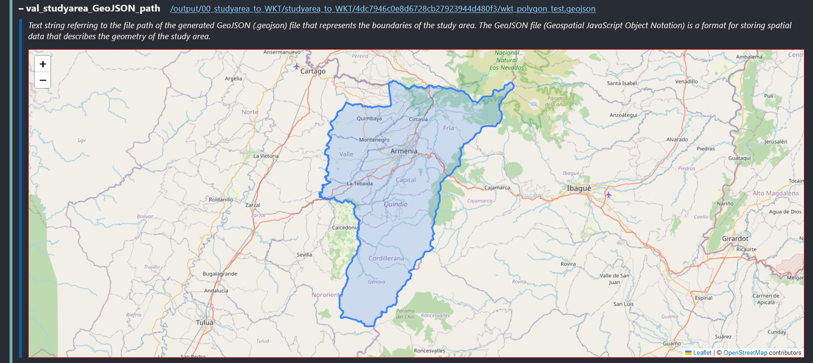
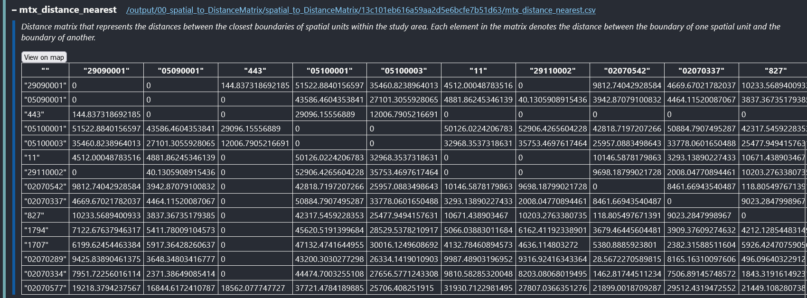
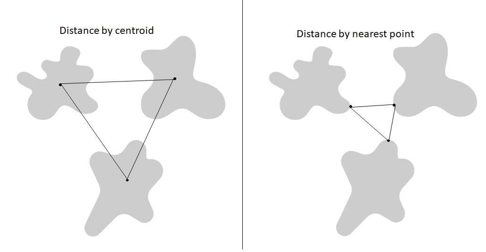
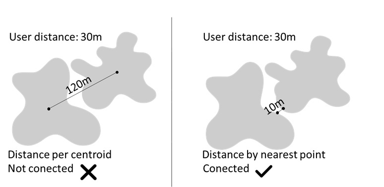

Protcon pipeline documentation
================

- <a href="#general-description" id="toc-general-description">General
  description</a>
- <a href="#authorship" id="toc-authorship">Authorship</a>
- <a href="#pipeline-description" id="toc-pipeline-description">Pipeline
  Description</a>
  - <a href="#general-inputs-required"
    id="toc-general-inputs-required">General inputs required</a>
  - <a href="#pipeline-steps" id="toc-pipeline-steps">Pipeline steps</a>
- <a href="#output" id="toc-output">Output</a>
- <a href="#indicator-interpretation"
  id="toc-indicator-interpretation">Indicator interpretation</a>
- <a href="#considerations" id="toc-considerations">Considerations</a>

## General description

Protected areas are the most widely applied conservation strategy in the
world and can maintain an acceptable representation of biodiversity and
its processes. However, connectivity is an essential part of an
effective system of areas and is rarely taken into account. The ability
of the landscape to facilitate or impede the movement of species between
protected areas is crucial for processes such as dispersal and gene flow
to circulate between patches and to maintain the stability and integrity
of different ecosystems over time.

This document explains the pipeline flow for the protected areas
connectivity indicator, which refers to the percentage of protected
areas that are well connected given a distance and consultation area
determine by the user.This routine can be applied to other types of
spatial units other than protected areas, such as habitat patches or
nodes of natural cover.

## Authorship

This pipeline uses products at the national or international level that
spatially define the units or nodes with which the analysis is to be
run. It is common that layers of the distribution of protected areas or
patches of natural areas are used to analyze their connectivity within a
given landscape. Likewise, the methodology for calculating the
connectivity of protected areas that was used for this indicator and
this pipeline is based on the *protcon* indicator proposed by [Saura et
al.in
2017](https://www.sciencedirect.%20com/science/article/pii/S1470160X1630752X?via%3Dihub).

This methodology is based on a minimum distance in which protected areas
are considered to be well connected; of course, this distance may vary
according to the objective for which connectivity is desired. Once the
protected areas that are at a distance equal to or less than the defined
distance have been identified, the percentage that these represent with
respect to the total protected areas of the total area of analysis
(protcon) is estimated. To extract the percentage of protected areas
that are not well connected (protuncon), the protcon is subtracted from
the total number of protected areas in the area of interest. The
indicator also generates the percentage values of protected (protected)
and unprotected (unprotected) area of interest.

**Where:**

Apac = Area of protected areas well connected

Atpa = Area total of protected areas in the area of interest

**Where:**

Apanc = Area of protected areas not connected

Atpa = Area total of protected areas in the area of interest

**Where:**

Aprot = Area of protected areas in the area of interest

At = Area total of area of interest

**Where:**

Aprot = Area of unprotected areas in the area of interest

At = Area total of area of interest

The function for the calculate de *protcon indicator* for this pipeline,
was made by Maria Alejandra Molina Berbeo
(**<mmolina@humboldt.org.co>**), researcher of [Instituto de
Investigación de Recursos Biológicos Alexander von
Humboldt](http://www.humboldt.org.co/es/), the routine and it can found
with the name *protcon_function* its last modification in R was July 14
2023. The documentation of pipeline to generate the calculate the
connectivity indicator was built for the same person and the date of the
production was July 13 of 2023.

## Pipeline Description

### General inputs required

**areas collection:** Collection of raster layers where each feature
corresponds to a decade that contains the system of protected areas,
nodes or patches that were registered for that same decade.

**study area:** Refers to the study area determined by the user for
analysis.

**distance:** This is the minimum distance where the user considers that
the protected areas, nodes or patches of his study area are well
connected. [Saura et al.in
2019](https://www.sciencedirect.com/science/article/pii/S0006320719308225)
consider this distance to be 10 kilometers is good for protected areas,
however, it may vary if it is about the dispersal of a species,
political decision or other specific goal.

### Pipeline steps

Pipeline for the protcon indicator

#### **First step**

studyarea_to_WKT: In the first step of this pipeline, the user
determines the path where the shape of the area of interest for the
analysis is located, later it is transformed to .wkt format. The result
of this first step is the study area in a .wkt format and the EPSG code
of the layer, both necessary for the second step of the pipeline.

#### **Second step**

spatial_to_distance_matrix: The second step of the pipeline aims to
generate a distance matrix between all the protected areas that
intersect with the area of interest provided by the user, this is the
main input to calculate the protcon indicator. The distances matrix can
be provided by the user or calculated within the pipeline.

The three results generated by this step are: i) a distance matrix
taking into account the centroid of each protected area, ii) a distance
matrix taking into account the closest point between the protected
areas, and iii) a table with the IDs of each of the areas that intersect
with the area of interest, the year in which they were created, the area
and the time period to which they belong.

Two types of distances for calculate the protcon indicator

#### **Third step**

protcon_funtion: The third and final step of this pipeline outputs a
table where the final results of the protcon flag are stored.

## Output

The final result of this pipeline consists of a table where the number
of rows corresponds to the number of decades of analysis and five
columns that refer to:

**Period**: Corresponds to the decade of analysis

**Protcon_centroid**: Percentage of protected areas that are connected
within the user’s study area, using the centroid distance.

**Protuncon_centroid**: Percentage of protected areas that are not
within the user’s study area, using the centroid distance.

**Protcon_nearest**: Percentage of protected areas that are connected
within the user’s study area using the nearest point distance.

**Protuncon_nearest**: Percentage of protected areas that are not within
the user’s study area using the nearest point distance.

**Protected**: Percentage of protected areas within the user’s study
area.

**Unprotected**: Percentage of area that is not protected within the
user’s study area.

**n_pa**: Number of declared protected areas for the corresponding
period that were taken into account for the analysis.

Final output for the protcon pipeline

| **Period** | **Protcon_centroid** | **Protuncon_centroid** | **Protcon_nearest** | **Protuncon_nearest** | **Protected** | **Unprotected** | **n_pa** |
|:-----------|:--------------------:|:----------------------:|:-------------------:|:---------------------:|:-------------:|:---------------:|:--------:|
| 1980       |          10          |           90           |         20          |          80           |      25       |       75        |    5     |
| 1990       |          10          |           90           |         20          |          80           |      25       |       75        |    5     |
| 2000       |          15          |           85           |         25          |          75           |      30       |       70        |    12    |
| 2010       |          15          |           85           |         25          |          75           |      30       |       70        |    12    |
| 2020       |          10          |           80           |         20          |          70           |      40       |       60        |    14    |

## Indicator interpretation

This indicator facilitates the definition of strategies for the
designation of protected areas based on a representation goal. If the
percentage of protected area is less than the target, the strategy
should be to increase the representation of protected areas taking into
account that if the connected protected area is less than the target
value, the designation of protected areas in locations should be
encouraged. strategies to improve connectivity.

## Considerations

When interpreting the *protcon* indicator, the following must be taken
into account:

- Although the declaration of new protected areas does not always
  contribute to improving their connectivity, it does contribute to the
  fulfillment of other conservation objectives such as representation.
  For this reason, it is recommended that the protected area and the
  connected protected area be interpreted together.

- The indicators presented do not account for the fulfillment of other
  conservation objectives such as the effective management of protected
  areas or their status or pressures. For this reason, it is recommended
  that this indicator be interpreted together with the percentage of
  natural and transformed coverage, and the Human Spatial Footprint
  indicator (IHEH), also incorporated into the pipeline.

- The indicator is presented with two types of distances because, for
  example, two protected areas may be continuous, but given the user
  distance, the indicator may vary if the distance is taken from the
  centroid of each one or from the closest edge of one. Likewise, the
  indicator may decrease despite the fact that the number of protected
  areas increases and therefore the percentage of protected area in the
  study area does as well, since more protected areas does not mean that
  they are better connected, this will depend on the location. of these
  newly declared areas.

  

- The connectivity indicators presented are based solely on the distance
  determined by the user, so it may vary if other distances such as
  dispersal ranges and other landscape elements that favor or hinder the
  movement of species are taken into account.

- Some complementary conservation strategies at the local and regional
  level, and other existing conservation figures such as indigenous
  reservations and other collective territories were not taken into
  account in this analysis. Their inclusion could increase the value of
  the connected protected area.

- All protected areas whose distribution overlaps some limit of the
  consulted area were included in the calculation using the full area of
  their distribution, since it is assumed that the system of protected
  areas is not restricted solely to administrative limits.

  

