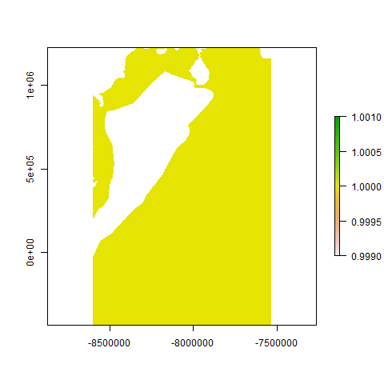
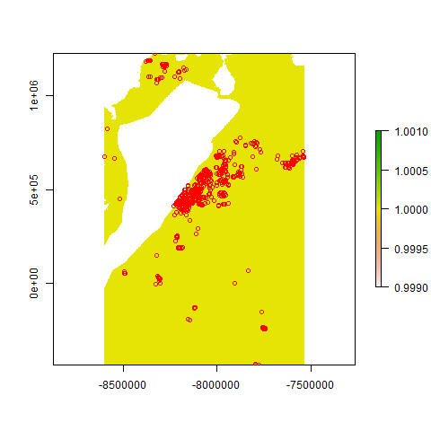
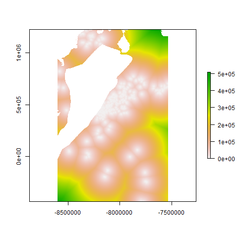
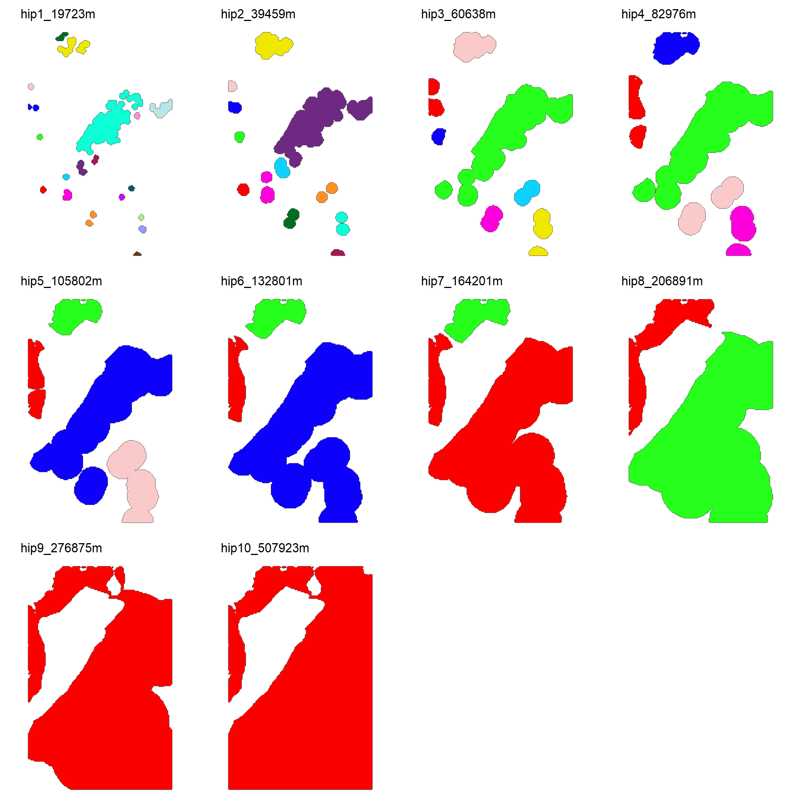

Population Polygons Using Dispersal Thresholds from Distance Maps
================

This `box` estimates discrete population polygons using dispersal
thresholds based on distance maps generated from species occurrence
points within a predefined grid map, such as a study area or species
distribution model. It calculates a distance map from the occurrence
points and, based on the quantiles of this map, generates hypotheses
regarding the spatial boundaries of populations. If the species’ maximum
dispersal distance is known, it is added as an additional hypothesis.
The resulting population polygons represent spatial clusters under
different dispersal scenarios. The script produces various outputs,
including distance maps, hypothesis summaries in CSV format,
visualizations of population polygons, and raster and vector files,
enabling the analysis of spatial distribution for the estimated
populations based on dispersal thresholds.This methodology differs from
buffers by not using a fixed and uniform distance to delimit areas, but
instead generates discrete population polygons based on dispersal
threshold hypotheses derived from distance maps.

- [inputs](#inputs)
- [outputs](#outputs)
- [Script body: Pops_from_DispDist.R](#script-body-pops_from_dispdistr)
  - [Setting Up the Working
    Environment](#setting-up-the-working-environment)
  - [Load grid](#load-grid)
  - [Load Spatial Records](#load-spatial-records)
  - [Estimate Distance Density Map](#estimate-distance-density-map)
  - [Estimate Distance tresholds](#estimate-distance-tresholds)
  - [Estimate discrete populations
    hypothesis](#estimate-discrete-populations-hypothesis)
  - [Summary table](#summary-table)
  - [Plot discrete populations
    hypothesis](#plot-discrete-populations-hypothesis)
- [Export results](#export-results)

## inputs

- ***`grid_map`***: Map used as the study area for estimating population
  polygon hypotheses (e.g., study area, species distribution model).
  - type: `tif`
  - example: `"~/raster_study_area_path.tif"`
- ***`occ_points`***: Occurrence points of the species within the study
  area, used to calculate the distance map.
  - type: vector (either `.shp`, `.gpkg`, `.GeoJSON`)
  - example: `"~/vector_presence_path.shp"`
- ***`DispersalDistance_m`***: Maximum known dispersal distance of the
  species in meters. If available (different to `null`), it is added as
  an additional hypothesis for defining population polygons; otherwise,
  hypotheses are estimated based on quantiles from the distance map
  values.
  - type: `int`
  - example: (either `null`, `10000`, `50000`)

## outputs

- ***`distance_map`***: Map showing the calculated distances from
  occurrence points within the study area.
  - type: `tif`
  - example: `"~/distance_map_path.tif"`
- ***`data_hypothesis`***: Data compiling information for each distance
  threshold, including the distance value in meters and the estimated
  number of populations.
  - type: `text/csv`
  - example: `"~/data_hypothesis.csv"`
- ***`plot_hypothesis`***: Figure summarizing discrete population
  polygon hypotheses for each distance threshold.
  - type: `image/jpg`
  - example: `"~/plot_hypothesis.jpg"`
- ***`map_hypothesis`***: Maps displaying the spatial distribution of
  discrete population polygon hypotheses for each distance threshold.
  - type: `tif`
  - example: `"~/map_hypothesis.tif"`
- ***`folder_raster_hypothesis`***: Folder containing the collection of
  raster layer hypotheses of discrete population polygons for each
  distance threshold.
  - type: `folder`
  - example: `"~/raster_hypothesis_folder"`
- ***`folder_polygon_hypothesis`***: Folder containing the collection of
  vector layer hypotheses of discrete population polygons for each
  distance threshold.
  - type: `folder`
  - example: `"~/polygon_hypothesis_folder"`

## Script body: Pops_from_DispDist.R

### Setting Up the Working Environment

Check and install the necessary libraries and packages. Load the
libraries into the script environment and define the input and output
folders, which serve as bridges between the code and `Bon in a Box`.

``` r
# Load required packages - libraries to run the script ####

## Check and install necessary libraries - packages  ####
packagesPrev<- installed.packages()[,"Package"] # Check and get a list of installed packages in this machine and R version
packagesNeed<- c("magrittr", "dplyr" , "this.path", "rjson", "sf", "raster", "pbapply", "ggplot2", "Polychrome", "ggpubr", "purrr"); packagesNeed<- packagesNeed[!packagesNeed==""] # Define the list of required packages to run the script
new.packages <- packagesNeed[!(packagesNeed %in% packagesPrev)]; if(length(new.packages)) {install.packages(new.packages, binary=T, force=T, dependencies = T, repos= "https://packagemanager.posit.co/cran/__linux__/jammy/latest")} # Check and install required packages that are not previously installed
packagesRemotes<- c(""); packagesRemotes<- packagesRemotes[!packagesRemotes==""] # Define the list of required packages to run that are avaliable from other sources
new.packagesRemotes <- packagesRemotes[!(packagesRemotes %in% packagesPrev)]; if(length(packagesRemotes)) {lapply(packagesRemotes, function(x) devtools::install_github(x))} # Check and install required packages that are not previously installed

## Load the necessary libraries into the script environment ####
packagesList<-list("magrittr", "terra", "raster", "ggplot2") # Explicitly list the required packages throughout the entire routine. Explicitly listing the required packages throughout the routine ensures that only the necessary packages are listed. Unlike 'packagesNeed', this list includes packages with functions that cannot be directly called using the '::' syntax. By using '::', specific functions or objects from a package can be accessed directly without loading the entire package. Loading an entire package involves loading all the functions and objects 
lapply(packagesList, library, character.only = TRUE)  # Load libraries - packages  

# Set enviroment variables ####
### Define output folder path ####
Sys.setenv(outputFolder = "/path/to/output/folder")
### Define input folder path ####
input <- rjson::fromJSON(file=file.path(outputFolder, "input.json")) # Load input file
```

### Load grid

The `base_raster` contains a raster map that defines the study area and
serves as a spatial reference for calculating distances from species
occurrence points. This map can represent both the study area and the
species distribution, either by delineating the geographical region
selected for the research or by reflecting the known distribution of the
species. It serves as a starting point to define populations based on
prior knowledge of its distribution.

``` r
### Load grid ####
base_raster<- raster::raster(input$grid_map)
plot(base_raster)
```



### Load Spatial Records

The `spatial_records` represent the occurrence coordinates of the
species spatially. They are aligned with the spatial reference system of
the study area to ensure proper data alignment and avoid errors in
subsequent calculations. These records are organized as `raster_points`,
which correspond to the raster cells that intersect with the spatial
records.

``` r
### Load Spatial Records ####
spatial_records<- sf::st_read(input$occ_points) %>% sf::st_transform(sf::st_crs(base_raster)$proj4string)
raster_points <- raster::rasterize(spatial_records, base_raster, field = 1)  ### Rasterize records ####
plot(base_raster)
plot(spatial_records$geometry, col= "red", add=T)
```



### Estimate Distance Density Map

The distances between each cell in `raster_points` and the nearest
species occurrence points are calculated to create the `distance_map`.
Each cell in this map contains a value indicating the distance to the
closest occurrence point.

``` r
### Estimate Spatial Distance Density Map ####
distance_points <- terra::distance(raster_points); 
distance_map<- terra::mask(distance_points, base_raster)
plot(distance_map)
```



### Estimate Distance tresholds

The script calculates a series of distance thresholds that divide the
`distance_map` into zones, corresponding to hypotheses about different
levels of dispersal estimated from the map. These thresholds are
generated using the quantiles of the `distance_map`. If information
about the species’ maximum dispersal distance (`DispersalDistance_m`
input) is available, this value is added as an additional threshold. All
of these thresholds are organized to generate the `data_hypothesis`,
outlining the areas that could be occupied by different populations.

``` r
### Estimate tresholds ####
list_thresholds<- c(quantile(distance_map, seq(0.1, 1, 0.1)), input$DispersalDistance_m) %>% sort()
data_hypothesis<- data.frame(hypothesis= seq_along(list_thresholds), distance_m= round(list_thresholds))
print(data_hypothesis)
```

|      | hypothesis | distance_m |
|:-----|-----------:|-----------:|
| 10%  |          1 |      19723 |
| 20%  |          2 |      39459 |
| 30%  |          3 |      60638 |
| 40%  |          4 |      82976 |
| 50%  |          5 |     105802 |
| 60%  |          6 |     132801 |
| 70%  |          7 |     164201 |
| 80%  |          8 |     206891 |
| 90%  |          9 |     276875 |
| 100% |         10 |     507923 |

### Estimate discrete populations hypothesis

For each dispersal threshold `data_hypothesis`, the script generates
hypotheses about potential discrete population areas. A cutoff is
created around all cells whose distance to the occurrence point is less
than or equal to the threshold. These areas are converted into polygons,
which are then grouped based on geographic proximity to identify
potential discrete populations. Each polygon generated from the
threshold is assigned an identifier, classifying it as part of a
distinct population.

``` r
### Estimate discrete populations hypothesis ####
  list_hypothesis<- pbapply::pblapply(seq_along(list_thresholds), function(i){
  
  threshold <- list_thresholds[i]  #
  distance_threshold<- distance_points; distance_threshold[distance_threshold<=threshold]<- 1; distance_threshold[distance_threshold>threshold]<- 0; 
  distance_mask<- terra::mask(distance_threshold, base_raster) %>% terra::extend(extent(distance_threshold)*2);  distance_mask[is.na(distance_mask)]<- 0
  
  contours<- rasterToContour(distance_mask)
  contours_pols<- sf::st_as_sf(contours) %>%  sf::st_polygonize() %>%  sf::st_buffer(0) %>% 
    terra::vect() %>% terra::aggregate() %>% sf::st_as_sf() %>% sf::st_cast("POLYGON")
  
  distance_matrix <- sf::st_distance(contours_pols)
  dist_object <- as.dist(distance_matrix)
  clustering <- hclust(dist_object, method = "complete")
  contours_pols$pop <- cutree(clustering, h = threshold)
  contours_pols$pop_name <- paste0("pop",  contours_pols$pop)
  final_hypothesis<- cbind(data_hypothesis[i,], contours_pols) %>% sf::st_as_sf()
  final_hypothesis$pop_name<- factor(final_hypothesis$pop_name, levels = unique(final_hypothesis$pop_name))
  
  list(final_hypothesis_sf= final_hypothesis, 
       final_hypothesis_tif= raster::rasterize(final_hypothesis, base_raster, field = "pop") %>% terra::rast() %>% setNames(unique(paste0("hip", final_hypothesis$hypothesis,"_dist", round(final_hypothesis$distance)))) )
  })
```

### Summary table

A tabular summary, `table_hypothesis`, is created to present the
results, detailing the dispersal threshold and the number of discrete
populations estimated for each hypothesis.

``` r
#### Organize spatial information 
list_hypothesis_sf<- purrr::map(list_hypothesis, "final_hypothesis_sf")
list_hypothesis_tif<- purrr::map(list_hypothesis, "final_hypothesis_tif") %>% terra::rast() 

#### Summary table with the distance and number of distinct populations per hypothesis ###
table_hypothesis<- plyr::rbind.fill(list_hypothesis_sf) %>% 
  sf::st_drop_geometry() %>% dplyr::group_by(hypothesis, distance_m) %>% 
  dplyr::summarise(npop= dplyr::n_distinct(pop))

print(table_hypothesis)
```

| hypothesis | distance_m | npop |
|-----------:|-----------:|-----:|
|          1 |      19723 |   19 |
|          2 |      39459 |   12 |
|          3 |      60638 |    7 |
|          4 |      82976 |    5 |
|          5 |     105802 |    4 |
|          6 |     132801 |    3 |
|          7 |     164201 |    2 |
|          8 |     206891 |    2 |
|          9 |     276875 |    1 |
|         10 |     507923 |    1 |

### Plot discrete populations hypothesis

Graphs `plot_results` are generated to illustrate how the discrete
populations are distributed within the study area based on the different
distance thresholds. Each graph displays the polygons corresponding to
the populations, distinguished by a color scale. The titles of the
graphs indicate the distance threshold applied to each hypothesis.

``` r
### Apply Color Mapping to Hypothesis Rasters ####
list_hypothesis_tifcol<- list_hypothesis_tif
discrete_vals<- max(table_hypothesis$npop)
cols_vals<- Polychrome::createPalette(discrete_vals,  c("#ff0000", "#00ff00", "#0000ff")) %>% setNames(paste0("pop", seq(discrete_vals)))
for(i in seq(terra::nlyr(list_hypothesis_tifcol)) ){ print(i)
levels(list_hypothesis_tifcol[[i]]) <- data.frame(values= seq(discrete_vals), label= paste0("pop", seq(discrete_vals)))
coltab(list_hypothesis_tifcol[[i]]) <- data.frame(values= seq(discrete_vals), cols= cols_vals )
}
list_hypothesis_tifcol<- list_hypothesis_tifcol %>% setNames(names(list_hypothesis_tif))

### Plot discrete populations hypothesis ####
plot_results<- pbapply::pblapply(list_hypothesis_sf, function(x)
    { ggplot()+geom_sf(data= x, aes(fill= pop_name))+theme_void()+
    scale_fill_manual(values =  cols_vals) +
    ggtitle(unique(paste0("hip", x$hypothesis,"_", round(x$distance), "m")))+
      theme(base_size = 8, legend.position = "none",
            plot.title = element_text(size = 8))
}) %>% {ggpubr::ggarrange(plotlist = .)}
print(plot_results)
```



## Export results

The results generated from the analysis are organized in multiple
formats. Population polygons are stored as vector layers in the
`folder_hypothesis_vector`, and the dispersal areas based on the
thresholds are exported as raster files in the `folder_hypothesis_tif`.
This allows the hypotheses to be visualized in `Bon in a Box`, as well
as enabling researchers to project these results in any GIS software for
discussion of the most suitable hypothesis.

``` r
##  Export results ####

### Export distance map
distance_map_path <- file.path(outputFolder,paste0("distance_map", ".tif"))
terra::writeRaster(distance_map, distance_map_path, overwrite = TRUE ) # write result

### Export summary tab
data_hypothesis_path <- file.path(outputFolder, paste0("data_hypothesis", ".csv")) # Define the file path for the 'val_wkt_path' output
write.csv(table_hypothesis, data_hypothesis_path, row.names = F) # write result

### Export summary plot
plot_hypothesis_path <- file.path(outputFolder, paste0("plot_hypothesis", ".jpg")) # Define the file path for the 'val_wkt_path' output
ggsave(plot_hypothesis_path, plot_results )
  
### Export vector results
folder_hypothesis_vector<- file.path(outputFolder, "folder_hypothesis_vector"); dir.create(folder_hypothesis_vector)
lapply(list_hypothesis_sf, function(x) {
  sf::st_write(x, 
               file.path(folder_hypothesis_vector, unique(paste0("hip", x$hypothesis,"_dist", round(x$distance), ".GeoJSON"))), delete_dsn= T, driver = "GeoJSON")
})

### Export raster results
folder_hypothesis_tif<- file.path(outputFolder, "hypothesis_tif_path"); dir.create(folder_hypothesis_tif)
layer_paths<-c()

for (i in seq(terra::nlyr(list_hypothesis_tifcol))) {
  layer_path <- file.path(folder_hypothesis_tif, names(list_hypothesis_tifcol)[[i]] ) %>% paste0(".tif")
  terra::writeRaster(list_hypothesis_tifcol[[i]], layer_path, gdal=c("COMPRESS=DEFLATE", "TFW=YES"), filetype = "GTiff", overwrite = TRUE ) # write result
  fp <- paste0(layer_path[1])
  layer_paths <- cbind(layer_paths,fp)
}


## Set Output list ####
output<- list(
  distance_map= distance_map_path,
  data_hypothesis = data_hypothesis_path, 
              plot_hypothesis = plot_hypothesis_path,
              map_hypothesis= layer_paths,
  folder_raster_hypothesis= folder_hypothesis_tif,
  folder_polygon_hypothesis= folder_hypothesis_vector
  )


## Outputing result to JSON ####
setwd(outputFolder)
jsonData <- rjson::toJSON(output, indent=2)
write(jsonData, file.path(outputFolder,"output.json"))
```
