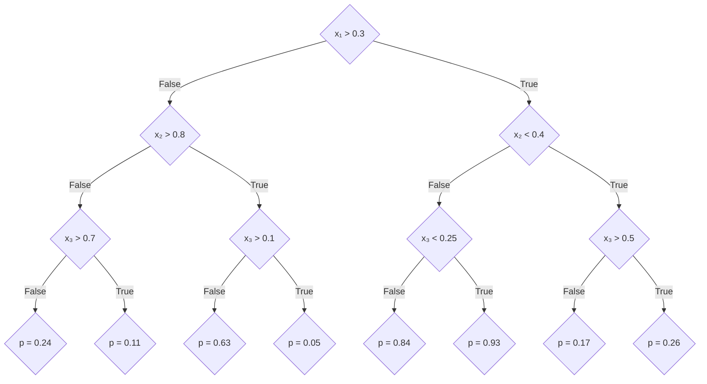

# Gaussian-Loss Boosted Regression Trees

This document describes the methodology behind the BON-in-a-Box (BiaB) script for using Boosted Regression Trees (BRTs) for modeling species distributions from a set of occurrence records and absences in the `julia` language. Specifically, this pipeline uses the `julia` package [`EvoTrees.jl`](https://github.com/Evovest/EvoTrees.jl) to fit a BRT using a Gaussian loss metric, which provides outputs maps of presence probability and uncertainty in presence prediction. 

> [!IMPORTANT]  
> Using BRTs to fit a species distribution model requires _absence data_. For the majority of species where no absence data is available, there are various methods to generate pseudoabsences (PAs) based on heuristics about species occurrence. However, the performance characteristics of an SDM fit using PAs can be widely variable depending on the method and parameters used to generate PAs. This means the results of BRT should be explicitly considered as a function of how PAs were generated, and sensitivity analysis to different PAs is _highly_ encouraged. 

**Inputs:**
- `crs`
- `predictors`
- `presences`
- `absences`
**Outputs**
- `predicted_sdm.tif`
- `uncertainty.tif`
- `fit_statistics.json`

## Species Distribution Models as a Classification Problem

To make an SDM using BRTs, we need a set of presences and absences, In this context, we ideally have _true_ absences, but we can use pseudoabsences instead. Each instance of a presence/absence is denoted $y_i$ and called a _label_, where

$$y_i = \begin{cases} 1 \quad&\text{if present} \\0 &\text{if absent}\end{cases}$$

Each $y_i$ is associated with environmental data $\vec{x}_i$, called _features_, at the location where $y_i$ was recorded. Given a set of $n$ data points, $\mathbf{X} = (x_1, x_2, \dots, x_n)$, $\mathbf{y} =(y_1, y_2, \dots, y_n)$, we split the data into _training_ and _test_ sets, fit the model on the _train_ set, and evaluated the model performance on the _test_ set.

## What is a decision tree?

A decision tree (DT) is a machine learning (ML) model for supervised learning, meaning it takes an input vector $\vec{x}$ to produce an output $y$. DTs can be used either for _regression_, where the output is _continuous_ (and potentially multivariate), or classification, where the output is discrete. In our case, the goal of our SDM is to predict an output score for species occurrence for environmental features $\vec{x}_i$ at each location. 

A DT works by considering a set of _binary_ decision rules, starting at the root of the tree and following a path, based on the values of input features $\vec{x}_i$. For an example, consider the tree below for a three-dimensional input $\vec{x} = (x_1, x_2, x_3)$ 

For example, for the input $\vec{x} = (0.34, 0.62, 0.43)$, if we follow the path in the tree, we get an output predicted score of $p_i = 0.17$. 

Decision trees in their simplest form (as described above), are not commonly used in modern ML, instead there are improvements that can be made 

### Bootstrap Aggregation ("Bagging")

An early method to improve the performance of decision trees is to use _bootstrap aggregation_ (often shorted to _bagging_). The idea of bagging is to take the $t_m$ points of _training data_ $\mathbf{\tilde{y}} = (y_{a}, y_{b}, \dots, y_{c})$ and fit _many_ decision trees on _subsets_ of the training data, and use an average of the prediction from each tree to produce an _ensemble model_.

A common form of bagging is the use of _Random Forests_ (RFs). In addition to bagging, RFs use a _subset_ of features of each tree, for example if each input feature has dimension $n_f$, a common choice is to select $\sqrt{n_f}$  features for each tree in the random forest. 
### Gradient Boosting 

[Gradient boosting](https://en.wikipedia.org/wiki/Gradient_boosting) is a method for improving _ensemble model_ predictions by reweighing the importance of each model using [gradient-descent](https://en.wikipedia.org/wiki/Stochastic_gradient_descent) optimization to improve performance.

## Boosted Regression Trees

Boosted Regression Trees combine gradient boosting with _Random Forest_ style bagging.  

## Including uncertainty in BRTs using Gaussian Maximum Likelihood for Splits

We can associated uncertainty with the predictions made using a BRT by using [maximum likelihood estimation (MLE)](https://en.wikipedia.org/wiki/Maximum_likelihood_estimation) to estimate the values of the splits. We do this using the `GaussianMLE` loss function in [EvoTrees.jl](https://github.com/Evovest/EvoTrees.jl/blob/4caa1269e1a663830887e248e980dc63494dfe3e/src/loss.jl#L87 ),  For example, if each rule $j$ of the decision tree has the from $x_i > \alpha_j$ , the value of $\alpha_j$ is inferred by [Gaussian MLE](http://jrmeyer.github.io/machinelearning/2017/08/18/mle.html), where the true value of $\alpha_j \sim \mathcal{N}(\mu_j, \sigma_j)$. This means for a fitted tree, we can infer the uncertainty associated with each set of input features $\vec{x}_i$  by summing up the $\sigma_j$ values at each decision rule $j$ in the tree that each input feature goes through on the way to an output score $p_i$.

