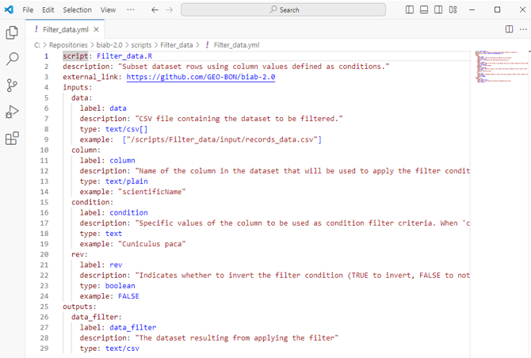
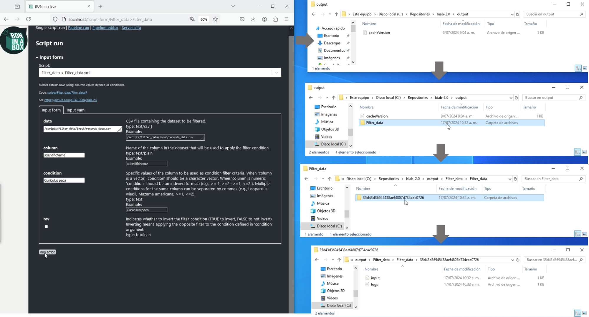
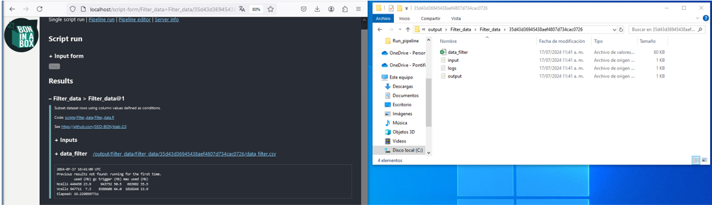
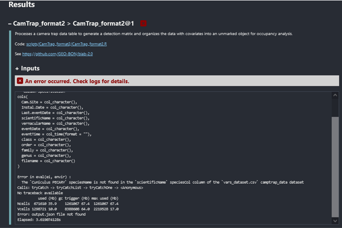

Este tutorial describe los pasos necesarios para crear un `Single Script` y agregarlo a la plataforma Bon in a Box. Estos códigos corresponden a bloques de código diseñados para realizar tareas específicas de principio a fin. Cada `Single Script` está diseñado para recibir ciertos parámetros y argumentos como entradas, procesar estas entradas mediante el código interno y luego generar salidas específicas basadas en el procesamiento realizado.

## Componentes del script

Los `Single Script` constan de dos componentes principales: un bloque de código y un archivo en formato `YML` asociado.

* Bloque de código - script  : Contiene el código y las instrucciones de ejecución del algoritmo y análisis requerido.
* Archivo`YML`: Define la configuración de entradas y salidas de ese código, así como los parámetros necesarios para su ejecución. Este archivo actúa como un puente que permite a los usuarios configurar el código a través de una interfaz amigable, asegurando que los datos sean correctamente interpretados y utilizados por el código subyacente.

Estos componentes deben estar presentes en la carpeta `~/scripts` del repositorio para que se visualicen en Bon in a Box. Ambos archivos deben estar alojados en la misma carpeta para facilitar su lectura y conexión. Además, se recomienda que en esta carpeta conjunta se incluya una subcarpeta input con datos por defecto, lo cual facilitará su prueba y ejecución, sirviendo como guía para los usuarios.


## Archivos `YML`
Los archivos `YML` son un formato de serialización de datos que se utiliza para la configuración de archivos. En Bon in a Box, los archivos `YML` definen la configuración de entradas y salidas del código, así como los parámetros necesarios para ejecutar un script. Actúan como un puente entre la interfaz de usuario y el código subyacente.

### Creación y Estructura de Archivos `YML`
Aunque los archivos `YML` pueden generarse desde cualquier editor de texto, se recomienda organizarlos en [Visual Studio Code](https://code.visualstudio.com/download) para facilitar su organización. Este editor proporciona herramientas de edición, validación y autocompletado que simplifican la configuración de los archivos `YML`, para los que la correcta indexación y organización de saltos de línea son cruciales. Errores en el formato  impediran su correcta inclusión en la plataforma y generarán errores.



En Bon in a Box, los archivos `YML` siguen una estructura específica, detallada en la [documentación oficial de bon in a box](https://github.com/GEO-BON/bon-in-a-box-pipeline-engine/blob/main/README-user.md#describing-a-script), que debe incluir como minimo los siguientes elementos principales:

- `script`: Nombre del código subyacente al `YML`, incluyendo su extensión (ej. `myScript.R`). Debe ubicarse en el mismo folder que el `YML` para una correcta conexión.
- `name`: Etiqueta con la que aparecerá el script en la interfaz de Bon in a Box.
- `description`: Breve descripción del objetivo y procesamiento del código.
- Lista de `input`: Argumentos de entrada que el script necesita. Los inputs tienen una línea example donde se definen los valores de ejemplo por defecto.
- Lista de `output`: Resultados que el script genera como salida.

```
script: # script file with extension, such as "myScript.py".
name: # short name, such as My Script
description: # Targetted to those who will interpret pipeline results and edit pipelines.
author: # 1 to many
  - name: # Full name
    email: # Optional, email address of the author. This will be publicly available.
    identifier: # Optional, full URL of a unique digital identifier, such as an ORCID.
license: # Optional. If unspecified, the project's MIT license will apply.
external_link: # Optional, link to a separate project, github repo, etc.
timeout: # Optional, in minutes. By defaults steps time out after 1h to avoid hung process to consume resources. It can be made longer for heavy processes.

inputs: # 0 to many
  key: # replace the word "key" by a snake case identifier for this input
    label: # Human-readable version of the name
    description: # Targetted to those who will interpret pipeline results and edit pipelines.
    type: # see below
    example: # will also be used as default value, can be null

outputs: # 1 to many
  key:
    label:
    description:
    type:
    
references: # 0 to many
  - text: # plain text reference
    doi: # link
```

Cada input y output comienza nombrándose con una `key` cuyo valor asignado será el mismo que se usará en el código para referenciarla. Esto es crucial, ya que cambios en estos parámetros pueden hacer que el código no interprete correctamente los inputs y outputs definidos. Además, estos elementos incluyen parámetros como label, description y type. Los tipos de archivo admitidos están descritos en la sección input and output types de la [documentación oficial de bon in a box](https://github.com/GEO-BON/bon-in-a-box-pipeline-engine/blob/main/README-user.md#describing-a-script) y corresponden a [MIME media types](https://www.iana.org/assignments/media-types/media-types.xhtml).

## Bloque de Código - Script
La definición del `YML` permite la visualización de sus parámetros en la plataforma de Bon in a Box, donde pueden ejecutarse ya sea como `Single Script` o como `pipeline` integrado con otros códigos. Sin embargo, para que la ejecución se realice de forma efectiva, el código asociado debe estructurarse lógicamente.

El código debe guardarse con el mismo nombre y extensión especificados en el parámetro script del `YML`. Cuando se oprime `run` en Bon in a Box, el servidor crea una carpeta con el nombre del código dentro de la ruta `~/output` del repositorio. En esa carpeta, para cada ejecución, se genera una carpeta con nombre temporal en la que se crea un archivo `input.json` con las entradas especificadas. Ese archivo contiene todas los argumentos `input` especificados en la interfaz. El código leerá ese archivo y lo usará para la ejecución.




### Componentes minimos de código
Para este ejemplo, utilizaremos un código en R, pero la misma lógica aplica para códigos en Python o Julia.

#### Parámetros de Sesión
##### Instalar Librerías

La ejecución de códigos se respalda en el uso de librerías o paquetes. Dichas librerías deben estar instaladas en el servidor del repositorio para la correcta ejecución del código. Esto significa que, aunque en nuestra máquina local ya tengamos instaladas las librerías necesarias, el servidor tiene un entorno completamente diferente y puede ser necesario reinstalarlas allí.

Por este motivo, los códigos deben comenzar haciendo una validación de “packagesPrev”, que es la lista de librerías que ya están instaladas en el servidor, y una lista de “packagesNeed”, en la que el desarrollador debe especificar todos los paquetes o librerías necesarios para la ejecución del código. A partir de estos dos listados, la línea new.packages valida cuáles librerías no están instaladas para proceder a instalarlas.

Dado que el servidor está montado en Linux, se recomienda la instalación de librerias desde [POSIT](https://posit.co/blog/announcing-public-package-manager/) para optimizar tiempos, pues permite la instalación de la versión binaria de las librerías R en Linux. Esto se justifica porque las versiones binarias se instalan más rápido que las versiones que requieren compilación desde el código fuente. Dicha instalación se hace sin dependencias para que el código se optimice lo máximo posible. Sin embargo, esto puede llevar a errores por falta de esas librerías, frente a ese escenario se recomienda listar en “packagesNeed” todas las dependencias exclusivamente necesarias.

```{r,  eval=F, echo=T, results='hide', warning= F, message = F}
# Install necessary libraries - packages  
packagesPrev<- installed.packages()[,"Package"] # Check and get a list of installed packages in this machine and R version
packagesNeed<- c("magrittr", "dplyr", "plyr", "ggplot2", "tibble", "pbapply", "rredlist", "plyr", "reshape2") # Define the list of required packages to run the script
new.packages <- packagesNeed[!(packagesNeed %in% packagesPrev)]; if(length(new.packages)) {install.packages(new.packages, binary=T, force=T, dependencies = F, repos= "https://packagemanager.posit.co/cran/__linux__/jammy/latest")} # Check and install required packages that are not previously installed
```

Esta revisión en las primeras líneas hará que el código instale las librerías necesarias la primera vez que se ejecuten los códigos desde Bon in a Box. Esto sucederá solo la primera vez o cuando se realicen actualizaciones de servidor, pero para ejecuciones posteriores no se detendrá a hacerlo, por lo que correrá más rápido.

##### Cargar Librerías
Una vez instaladas las librerías, se tiene todo el entorno listo para ejecutar el código. Sin embargo, dado que solo se requieren algunas funciones específicas de diferentes librerías, se recomienda llamar esas funciones siempre directamente mediante la sintaxis `library::function()`. En R, lestá notación se utiliza para llamar a una función específica de una librería sin tener que cargar la librería completa en el entorno de trabajo. Por ejemplo, `dplyr::select` llama solo a la función `select` del paquete `dplyr` sin cargar todas las funciones de `dplyr` en la memoria. Esto ayuda a no sobrecargar el servidor con funciones que no se utilizarán, ya que su sola carga puede implicar lentitud en la ejecución del código.

No obstante, algunas librerías requieren obligatoriamente estar cargadas en el entorno del codigo para su correcto funcionamiento (ej. `magrittr`, `raster` o `terra`), por lo que es necesario cargarlas explícitamente. Para esto está la lista `packagesList`, en la que se deben especificar aquellas librerías que deben cargarse estrictamente en el entorno para el funcionamiento del código. El resto de las librerías y sus funciones deben llamarse mediante la sintaxis `::`, como se mencionó anteriormente.

```{r,  eval=F, echo=T, results='hide', warning= F, message = F}
# Load libraries
packagesList<-list("magrittr", "rredlist", "ggplot2") # Explicitly list the required packages throughout the entire routine. Explicitly listing the required packages throughout the routine ensures that only the necessary packages are listed. Unlike 'packagesNeed', this list includes packages with functions that cannot be directly called using the '::' syntax. By using '::', specific functions or objects from a package can be accessed directly without loading the entire package. Loading an entire package involves loading all the functions and objects 
lapply(packagesList, library, character.only = TRUE)  # Load libraries - packages  

```

##### Establecer Entorno de Trabajo

Para completar el puente de conexión entre el código y el `YML`, es necesario que el código lea el archivo `input.json` generado por el `YML` subyacente. Para esto, el servidor usa la función `Sys.setenv` hacia la ruta del folder `output` donde se almacena. Esto crea en el entorno del código en el servidor una variable `outputFolder` con la ruta completa del folder `output` desde donde se facilita la lectura del archivo `input.json`. Además, sobre esa ruta se deben guardar todos los resultados para su visualización y descarga.

Sin embargo, para facilitar la depuración y pruebas del código, se añaden unas líneas de lectura del `outputFolder` fuera del servidor. Estas líneas tienen un condicional que solo se ejecuta fuera del servidor, y lo que hace es completar las rutas del repositorio al entorno de la máquina local para pruebas.

<a id="ID_defineoutputfolder"></a>
```{r,  eval=F, echo=T, results='hide', warning= F, message = F}
Sys.setenv(outputFolder = "/path/to/output/folder")

# Option 2: Recommended for debugging purposes to be used as a testing environment. This is designed to facilitate script testing and correction
if ( (!exists("outputFolder"))  ) {
  outputFolder<- {x<- this.path::this.path();  file_prev<-  paste0(gsub("/scripts.*", "/output", x), gsub("^.*/scripts", "", x)  ); options<- tools::file_path_sans_ext(file_prev) %>% {c(., paste0(., ".R"), paste0(., "_R"))}; folder_out<- options %>% {.[file.exists(.)]} %>% {.[which.max(sapply(., function(info) file.info(info)$mtime))]}; folder_final<- list.files(folder_out, full.names = T) %>% {.[which.max(sapply(., function(info) file.info(info)$mtime))]} }
}
```

Con outputFolder definido, las siguientes líneas cargan `input.json` con las entradas definidas en la interfaz, y hacen algunos ajustes para su correcta lectura posterior.

```{r,  eval=F, echo=T, results='hide', warning= F, message = F}

# Set the 'input' environment variables. The 'input' environment contains the specified inputs from the ByB platform.
# The input file 'input.json' is generated by executing the 'Run Script' command in the ByB platform.
input <- rjson::fromJSON(file=file.path(outputFolder, "input.json")) # Load input file

# This section adjusts the input values based on specific conditions to rectify and prevent errors in the input paths
input<- lapply(input, function(x) { if (!is.null(x) && length(x) > 0 && grepl("/", x) && !grepl("http://", x)  ) { 
  sub("/output/.*", "/output", outputFolder) %>% dirname() %>%  file.path(x) %>% {gsub("//+", "/", .)}  } else{x} }) 

```

#### Ejecucion del código
Con el entorno de trabajo establecido, ya se tienen todas las entradas necesarias para la ejecución del código. El archivo `input.json` se convierte en una lista llamada `input` dentro del entorno de R. Como cualquier lista en este entorno, puede citarse simplemente usando el operador `$` o nombrando el elemento directamente como `input[[element]]`.

```{r,  eval=F, echo=T, results='hide', warning= F, message = F}
print(input)
```

```
input
$condition
[1] "Mazama americana"

$rev
[1] FALSE

$data
[1] "C:/Repositories/biab-2.0/scripts/Filter_data/input/records_data.csv"

$column
[1] "scientificName"
```

Con esto establecido, el código puede ejecutarse normalmente. Es crucial que el código esté bien documentado con comentarios internos claros que faciliten su comprensión y mantenimiento. Algunos consejos de buenas prácticas de documentación se detallan en [R-bloggers](https://www.r-bloggers.com/2024/06/writing-r-code-the-good-way/#google_vignette). 

####	Exportar resultados
Una vez se obtengan los resultados del código, estos deben exportarse de la manera preferida. Por ejemplo, un archivo `CSV` se puede exportar utilizando la función `write.csv` o cualquier equivalente que genere un archivo con la misma extensión. Es recomendable que en el código se especifique explícitamente la ruta completa del archivo exportado y que se guarde en la ruta establecida como `outputFolder`, para facilitar su referencia posterior.

```{r,  eval=F, echo=T, results='hide', warning= F, message = F}
## Write results ####  
IUCN_historyAssesment_data_path<- file.path(outputFolder, paste0("IUCN_historyAssesment_data", ".csv")) # Define the file path 
write.csv(IUCN_historyAssesment_data, IUCN_historyAssesment_data_path, row.names = F) # write result
```

Todas estas rutas deben incorporarse en una lista `output`, cuyos nombres deben ser equivalentes a los elementos nombrados en la lista output del archivo `YML`. Esto es necesario porque Bon in a Box espera esos argumentos para disponer la visualización y la posibilidad de descarga de esos archivos. Con la lista generada, el último paso es exportarla como `JSON` en el `outputFolder` para completar el proceso.

```{r,  eval=F, echo=T, results='hide', warning= F, message = F}
# Define final output list
output<- list(IUCN_historyAssesment_data= IUCN_historyAssesment_data_path)

#### Outputing result to JSON ####

# Write the output list to the 'output.json' file in JSON format
setwd(outputFolder)
jsonlite::write_json(output, "output.json", auto_unbox = TRUE, pretty = TRUE)
```

Como resultado, en el `outputFolder` se guardan todos los resultados y un archivo `output.json` que almacena la ruta de todos esos resultados. Este archivo `output.json` será el que Bon in a Box usará como guía para mostrar las rutas, la visualización y la opción de descarga para los usuarios. Adicionalmente, se genera un archivo `logs.txt` que almacena el historial de todos los avisos del código mientras se ejecutaba. Este archivo de registros también se visualizará como un cuadro debajo de los resultados en la plataforma.Dicho cuadro es dinámico e irá imprimiendo los progresos en tiempo real del código, proporcionando a los usuarios una visión continua del estado de la ejecución.



####	Probar y Validar el Script

Un script bien estructurado y documentado no debería generar errores. En general, los errores suelen surgir debido a problemas en los datos de entrada o a parámetros especificados incorrectamente por los usuarios. Los códigos deben estar preparados para manejar estos problemas e imprimir mensajes claros sobre la causa del error. Se recomienda incluir líneas de código de validación internas que prevengan estos errores.

En este ejemplo, se incluyen líneas de código que validan todas las entradas proporcionadas por el usuario en relación con un conjunto de datos, asegurándose de que cada columna requerida esté presente y que cada valor especificado exista. 

```{r,  eval=F, echo=T, results='hide', warning= F, message = F}
## Check and Validate Inputs: Common Errors ####
if(is.null(input$speciesCol)){stop("The `speciesCol` is NULL. A value is required.")}else{if(!(input$speciesCol %in% names(camptrap_data))){stop( paste0("The `", input$speciesCol , "` speciesCol column is not found in the `", basename(input$camptrap_data),"` camptrap_data dataset") )}}
if(is.null(input$speciesName)){stop("The `speciesName` is NULL. A value is required.")}else{if(!(input$speciesName %in% camptrap_data[,input$speciesCol])){stop( paste0("The `", input$speciesName , "` speciesName is not found in the `", input$speciesCol,"` speciesCol column of the `", basename(input$camptrap_data),"` camptrap_data dataset") )}}
if(is.null(input$cameraCol)){stop("The `cameraCol` is NULL. A value is required.")}else{if(!(input$cameraCol %in% names(camptrap_data))){stop( paste0("The `", input$cameraCol , "` cameraCol column is not found in the `", basename(input$camptrap_data),"` camptrap_data dataset") )}}
if(is.null(input$evendateCol)){stop("The `evendateCol` is NULL. A value is required.")}else{if(!(input$evendateCol %in% names(camptrap_data))){stop( paste0("The `", input$evendateCol , "` evendateCol column is not found in the `", basename(input$camptrap_data),"` camptrap_data dataset") )}}
if(is.null(input$eventTimeCol)){stop("The `eventTimeCol` is NULL. A value is required.")}else{if(!(input$eventTimeCol %in% names(camptrap_data))){stop( paste0("The `", input$eventTimeCol , "` eventTimeCol column is not found in the `", basename(input$camptrap_data),"` camptrap_data dataset") )}}
if(is.null(input$setupCol)){stop("The `setupCol` is NULL. A value is required.")}else{if(!(input$setupCol %in% names(camptrap_data))){stop( paste0("The `", input$setupCol , "` setupCol column is not found in the `", basename(input$camptrap_data),"` camptrap_data dataset") )}}
if(is.null(input$retrievalCol)){stop("The `retrievalCol` is NULL. A value is required.")}else{if(!(input$retrievalCol %in% names(camptrap_data))){stop( paste0("The `", input$retrievalCol , "` retrievalCol column is not found in the `", basename(input$camptrap_data),"` camptrap_data dataset") )}}
```

Si se encuentra alguna discrepancia, el código se detiene y se imprime un mensaje de error claro y específico en la consola. Este mensaje de error también se registrará en el archivo `logs.txt` y se mostrará en la interfaz de Bon in a Box, facilitando así la identificación y corrección del problema por parte del usuario. Cuando esto sucede, la interfaz de Bon in a Box mostrará un mensaje de error con una `X` roja en el paso del error, acompañado del texto `An error occurred. Check logs for details.`. Sumado a esto sobre el cuadro `logs` se detallara el error.



Si el error es desconocido o no es fácilmente detectable, se debe realizar mantenimiento al código. Para esto, debe abrirse una sesión con un entorno completamente vacío y ejecutar todo el código desde la consola. La línea [outputFolder para pruebas](#ID_defineoutputfolder) está configurada para cargar el intento de ejecución más reciente, por lo que al ejecutarla debe replicar el error detectado. Esto permite depurar y hacer los ajustes necesarios para repararlo.

Los pasos resumidos son:

*1. Abrir una sesión con un entorno vacío: Asegurarse de que no haya variables o datos cargados que puedan interferir con la ejecución. 
*2. Borrar el caché de carpetas en output: Limpiar los resultados previos para evitar conflictos de interpretación, y mantener solo el folder del intento que genera el error para que el código se ejecute correctamente con los datos actuales.
*3. Configurar outputfolder: Cargar el intento de ejecución más reciente para replicar el error. El codigo por defecto lo hace.
*4. Ejecutar el código hasta identificar los errores. Deben ser los mismos impresos en el log de bon in a box.
*5 . Depurar y ajustar: Identificar el error, realizar los ajustes necesarios y verificar que el código funcione correctamente.

Estas acciones permiten mantener el código limpio y funcional, asegurando que Bon in a Box opere de manera eficiente y precisa.


