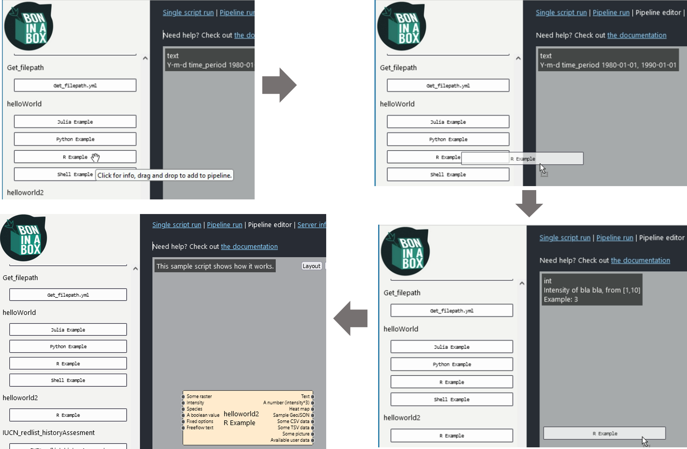
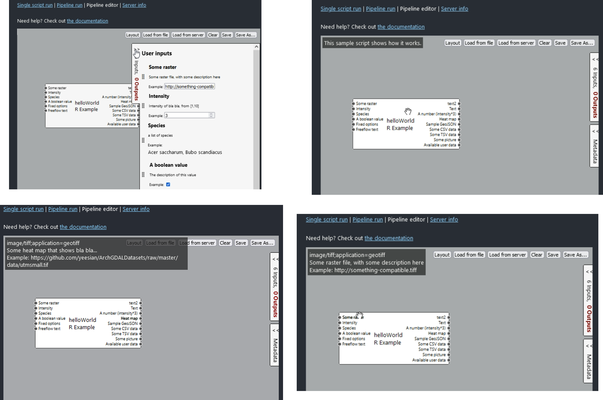
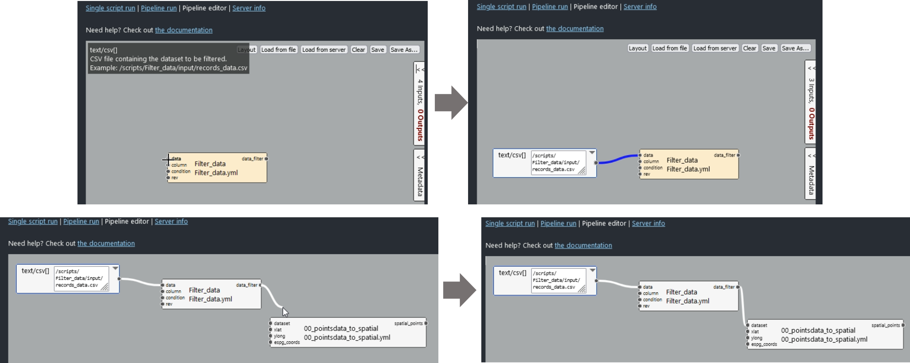
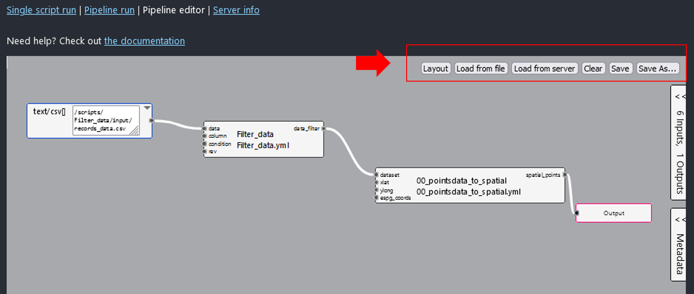
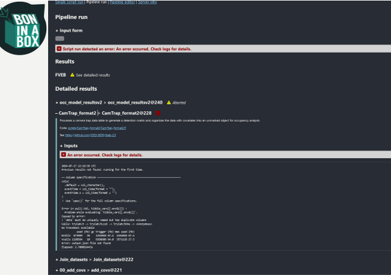

Un pipeline es una serie de etapas o pasos de procesamiento de datos que se ejecutan de manera secuencial. Cada paso toma la salida del paso anterior como su entrada, permitiendo que los datos se transformen y procesen de manera ordenada y eficiente, facilitando así la automatización para el procesamiento de datos.

En Bon in a Box, cada `single script` puede ensamblarse como un paso de pipeline, organizando y ejecutando flujos de trabajo complejos. Este enfoque automatiza la conexión entre los scripts, creando pasos interrelacionados a partir de sus entradas y salidas. 
Para más información sobre cómo usar los pipelines, consulte la [documentación oficial de usuario de Bon in a Box]( https://github.com/GEO-BON/bon-in-a-box-pipeline-engine/blob/main/README-user.md#pipelines).

La pestaña `Pipeline Editor` contiene un editor de diagramas interactivo diseñado para facilitar la creación y gestión de flujos de trabajo tipo pipeline. En este editor, se pueden arrastrar, soltar y conectar diferentes `single scripts` para crear flujos de trabajo personalizados. Cada `single script` se organiza como una caja y se configura como un paso del pipeline. Los componentes principales del pipeline incluyen los scripts, que funcionan como pasos con entradas y salidas, y los conectores entre ellos que determinan el flujo de datos.

Para obtener más información sobre los `single script`, consulta en la documentación sobre estos en [Create_SimpleScript](../Create_SimpleScript) y [Run_SimpleScript](../Run_SimpleScript) 

La interfaz del `Pipeline Editor` tiene un panel izquierdo que muestra los `single scripts` disponibles. Cada `single script` puede ponerse en el lienzo principal como un paso de pipeline simplemente arrastrándolo y soltándolo allí. 

En el lado derecho hay un panel desplegable `metadata` que describe los metadatos editables del pipeline como su descripción general, autor y enlaces de consulta para mayor información. Ademas, hay un panel plegable con la descripción de todos los `inputs` y `outputs` de los scripts en el lienzo. Asimismo, al poner el cursor sobre cada caja o step, y sobre cada input o output, aparece un tooltip que describe esos argumentos. Los inputs pueden definirse desde el `Pipeline Editor` o desde el `Pipeline Run`. 

Los `inputs` pueden definirse desde el `Pipeline Editor` o desde el `Pipeline Run`. Cuando se definen desde el `Pipeline Editor` se configuran como `variables constantes` por lo que no aparecerán en la interfaz `Pipeline Run`. Esto puede ser útil, por ejemplo, si el pipeline se ejecuta múltiples veces con una sola variable dinámica, como cuando solo cambia el nombre de una especie, pero el resto de parámetros son constantes entre especies. Cualquier entrada sin un valor constante asignado se considerará una entrada de pipeline y el usuario tendrá que completar el valor desde [Pipeline Run](#ID_pipeline_run).

Para definir estos inputs desde el `Pipeline Editor`, basta con hacer doble clic sobre el punto conexo al argumento input. Esto generará un vínculo de conexión hacia donde se debe definir el input. Si se busca que sea una conexión con un `single script` de un paso previo, se debe hacer un solo clic y arrastrar la conexión generada hasta el output del paso previo.

Es importante que los tipos de archivo entre los inputs y los outputs sean coincidentes; de lo contrario, se generará un error. Los tipos de archivo admitidos están descritos en la sección [`input and output types` de la documentación oficial de usuario de Bon in a Box](https://github.com/GEO-BON/bon-in-a-box-pipeline-engine/blob/main/README-user.md#describing-a-script) que corresponden a [MIME media types](https://www.iana.org/assignments/media-types/media-types.xhtml).

Cuando el pipeline esté listo, debe añadirse un box final denominado `Output` sobre el paso final, que representará la salida final del pipeline. Para esto debe hacerse doble click sobre cualquier output del paso final. Una vez hecho esto, el pipeline debe guardarse utilizando los botones dispuestos en la parte superior derecha de la interfaz.

En la parte superior derecha, hay varios botones útiles:

* `Layout`: Permite organizar automáticamente el diseño de los scripts en el lienzo para una mejor visualización.
* `Load from file`: Carga un pipeline desde un archivo guardado previamente.
* `Load from server`: Carga un pipeline guardado en el servidor.
* `Clear`: Limpia el lienzo, eliminando todos los scripts y conexiones.
* `Save`: Guarda y sobreescribe sobre el pipeline actual.
* `Save As`: Permite guardar el pipeline actual con un nuevo nombre o ubicación.

En ambas opciones de guardado, los pipelines se almacenarán por defecto en la carpeta `~/pipelines` dentro de la ruta del repositorio. Asimismo, los pipelines que se cargan con `Load from server` son aquellos guardados en esa carpeta.

Los pipelines guardados en la carpeta `~/pipelines` se visualizarán en la pestaña `Pipeline Run` desde donde se ejecutarán.

Durante la ejecución del pipeline en la interfaz de Bon in a Box, se visualiza un cuadro de `log` de progresos en la parte inferior de cada código. Este cuadro muestra los avances en tiempo real de la ejecución de cada código, proporcionando a los usuarios una visión continua del estado de ejecución del pipeline.

Si se genera algún error durante la ejecución, el pipeline se detiene y la interfaz mostrará un mensaje de error con una `X` roja a la derecha del código que generó el error, acompañado del texto `"An error occurred. Check logs for details."` Además, se imprime un mensaje de error en el cuadro de `log` de ese código que refleja el mensaje desde la consola indicando por qué ese código no funciona. Una vez ocurre el error, se detiene toda la cascada de pasos dependientes de ese código en el pipeline.

Un script bien estructurado y documentado no debería generar errores. En general, los errores suelen surgir debido a problemas en los datos de entrada o a parámetros especificados incorrectamente por los usuarios. Los códigos deben estar preparados para manejar estos problemas e imprimir mensajes claros sobre la causa del error. Se recomienda incluir líneas de código de validación internas que prevengan estos errores, como las detalladas en la sección de prueba y validación de scripts en [Create_SimpleScript](../Create_SimpleScript).

Si el error es desconocido o no es fácilmente detectable, se debe realizar mantenimiento al código. Para esto, debe abrirse una sesión con un entorno completamente vacío y ejecutar el código que genera error en el pipeline desde la consola. Los codigos estan configurados para cargar el intento de ejecución más reciente (ver [Create_SimpleScript](../Create_SimpleScript) para obtener mas detalles), por lo que al ejecutarla debe replicar el error detectado desde el último pipeline ejecutado. Esto permite depurar y hacer los ajustes necesarios para repararlo.

Los pasos resumidos son:

* 1. Abrir una sesión con un entorno vacío: Asegurarse de que no haya variables o datos cargados que puedan interferir con la ejecución.
* 2. Borrar el caché de carpetas en output: Limpiar los resultados previos para evitar conflictos de interpretación, y mantener solo los folders del intento de ejecución más reciente del código de error y el pipeline asociado, para que el código se ejecute correctamente con los datos actuales.
* 3. Configurar outputFolder: Cargar el intento de ejecución más reciente para replicar el error. El código por defecto lo hace.
* 4. Ejecutar el código con errores: Ejecutar el código hasta identificar los errores. Estos deben coincidir con los impresos en el log de Bon in a Box.
* 5. Depurar y ajustar: Identificar el error, realizar los ajustes necesarios y verificar que el código y el pipeline funcionen correctamente.

Estas acciones permiten mantener el código y el pipeline limpios y funcionales, asegurando que Bon in a Box opere de manera eficiente y precisa.