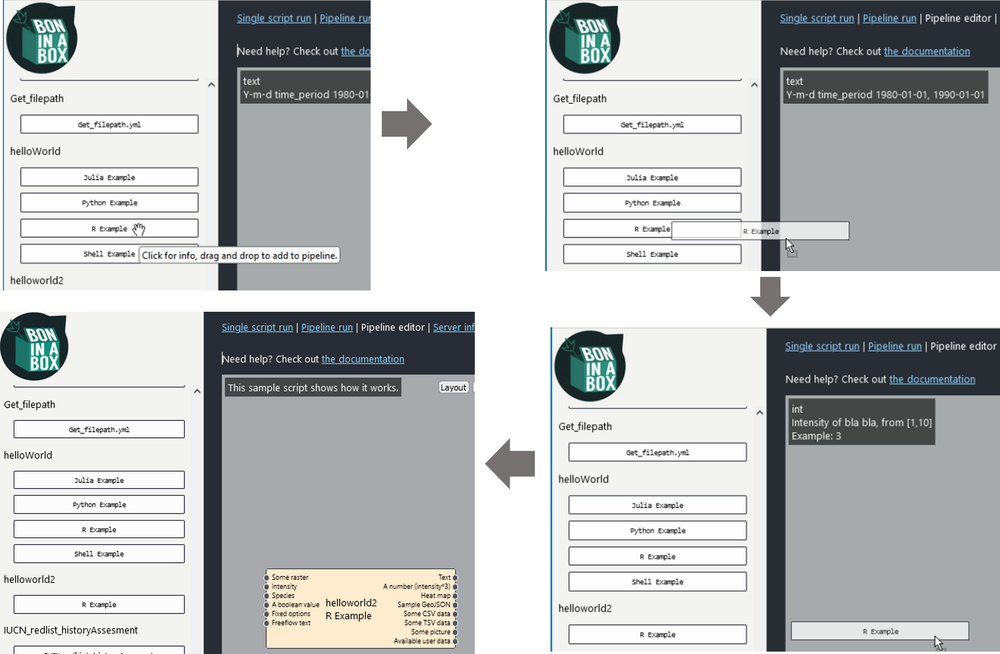
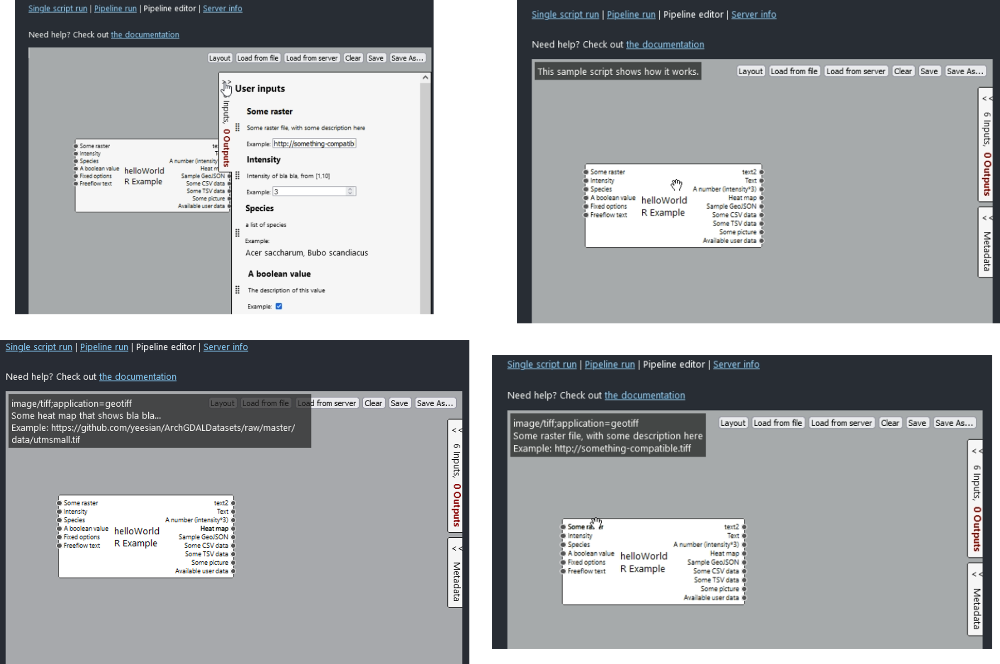
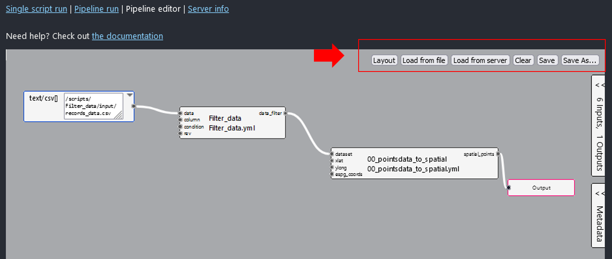

Creación de pipeline
================
true

Un pipeline es una serie de etapas o pasos de procesamiento de datos que
se ejecutan de manera secuencial. Cada paso toma la salida del paso
anterior como su entrada, permitiendo que los datos se transformen y
procesen de manera ordenada y eficiente, facilitando así la
automatización para el procesamiento de datos.

En Bon in a Box, cada `single script` puede ensamblarse como un paso de
pipeline, organizando y ejecutando flujos de trabajo complejos. Este
enfoque automatiza la conexión entre los scripts, creando pasos
interrelacionados a partir de sus entradas y salidas. Para más
información sobre cómo usar los pipelines, consulte la [documentación
oficial de usuario de Bon in a
Box](https://github.com/GEO-BON/bon-in-a-box-pipeline-engine/blob/main/README-user.md#pipelines).

La pestaña `Pipeline Editor` contiene un editor de diagramas interactivo
diseñado para facilitar la creación y gestión de flujos de trabajo tipo
pipeline. En este editor, se pueden arrastrar, soltar y conectar
diferentes `single scripts` para crear flujos de trabajo personalizados.
Cada `single script` se organiza como una caja y se configura como un
paso del pipeline. Los componentes principales del pipeline incluyen los
scripts, que funcionan como pasos con entradas y salidas, y los
conectores entre ellos que determinan el flujo de datos.

Para obtener más información sobre los `single script`, consulta en la
documentación sobre estos en
[Create_SimpleScript](../Create_SimpleScript) y
[Run_SimpleScript](../Run_SimpleScript)

La interfaz del `Pipeline Editor` tiene un panel izquierdo que muestra
los `single scripts` disponibles. Cada `single script` puede ponerse en
el lienzo principal como un paso de pipeline simplemente arrastrándolo y
soltándolo allí.

 En el lado derecho hay un panel
desplegable `metadata` que describe los metadatos editables del pipeline
como su descripción general, autor y enlaces de consulta para mayor
información. Ademas, hay un panel plegable con la descripción de todos
los `inputs` y `outputs` de los scripts en el lienzo. Asimismo, al poner
el cursor sobre cada caja o step, y sobre cada input o output, aparece
un tooltip que describe esos argumentos. Los inputs pueden definirse
desde el `Pipeline Editor` o desde el `Pipeline Run`.

Los `inputs` pueden definirse desde el `Pipeline Editor` o desde el
`Pipeline Run`. Cuando se definen desde el `Pipeline Editor` se
configuran como `variables constantes` por lo que no aparecerán en la
interfaz `Pipeline Run`. Esto puede ser útil, por ejemplo, si el
pipeline se ejecuta múltiples veces con una sola variable dinámica, como
cuando solo cambia el nombre de una especie, pero el resto de parámetros
son constantes entre especies. Cualquier entrada sin un valor constante
asignado se considerará una entrada de pipeline y el usuario tendrá que
completar el valor desde [Pipeline Run](#ID_pipeline_run).

Para definir estos inputs desde el `Pipeline Editor`, basta con hacer
doble clic sobre el punto conexo al argumento input. Esto generará un
vínculo de conexión hacia donde se debe definir el input. Si se busca
que sea una conexión con un `single script` de un paso previo, se debe
hacer un solo clic y arrastrar la conexión generada hasta el output del
paso previo.

Es importante que los tipos de archivo entre los inputs y los outputs
sean coincidentes; de lo contrario, se generará un error. Los tipos de
archivo admitidos están descritos en la sección
[`input and output types` de la documentación oficial de usuario de Bon
in a
Box](https://github.com/GEO-BON/bon-in-a-box-pipeline-engine/blob/main/README-user.md#describing-a-script)
que corresponden a [MIME media
types](https://www.iana.org/assignments/media-types/media-types.xhtml).

Cuando el pipeline esté listo, debe añadirse un box final denominado
`Output` sobre el paso final, que representará la salida final del
pipeline. Para esto debe hacerse doble click sobre cualquier output del
paso final. Una vez hecho esto, el pipeline debe guardarse utilizando
los botones dispuestos en la parte superior derecha de la interfaz.

En la parte superior derecha, hay varios botones útiles:

- `Layout`: Permite organizar automáticamente el diseño de los scripts
  en el lienzo para una mejor visualización.
- `Load from file`: Carga un pipeline desde un archivo guardado
  previamente.
- `Load from server`: Carga un pipeline guardado en el servidor.
- `Clear`: Limpia el lienzo, eliminando todos los scripts y conexiones.
- `Save`: Guarda y sobreescribe sobre el pipeline actual.
- `Save As`: Permite guardar el pipeline actual con un nuevo nombre o
  ubicación.

En ambas opciones de guardado, los pipelines se almacenarán por defecto
en la carpeta `~/pipelines` dentro de la ruta del repositorio. Asimismo,
los pipelines que se cargan con `Load from server` son aquellos
guardados en esa carpeta.

 Los pipelines guardados en la
carpeta `~/pipelines` se visualizarán en la pestaña `Pipeline Run` desde
donde se ejecutarán.

Durante la ejecución del pipeline en la interfaz de Bon in a Box, se
visualiza un cuadro de `log` de progresos en la parte inferior de cada
código. Este cuadro muestra los avances en tiempo real de la ejecución
de cada código, proporcionando a los usuarios una visión continua del
estado de ejecución del pipeline.

Si se genera algún error durante la ejecución, el pipeline se detiene y
la interfaz mostrará un mensaje de error con una `X` roja a la derecha
del código que generó el error, acompañado del texto
`"An error occurred. Check logs for details."` Además, se imprime un
mensaje de error en el cuadro de `log` de ese código que refleja el
mensaje desde la consola indicando por qué ese código no funciona. Una
vez ocurre el error, se detiene toda la cascada de pasos dependientes de
ese código en el pipeline.

Un script bien estructurado y documentado no debería generar errores. En
general, los errores suelen surgir debido a problemas en los datos de
entrada o a parámetros especificados incorrectamente por los usuarios.
Los códigos deben estar preparados para manejar estos problemas e
imprimir mensajes claros sobre la causa del error. Se recomienda incluir
líneas de código de validación internas que prevengan estos errores,
como las detalladas en la sección de prueba y validación de scripts en
[Create_SimpleScript](../Create_SimpleScript).

Si el error es desconocido o no es fácilmente detectable, se debe
realizar mantenimiento al código. Para esto, debe abrirse una sesión con
un entorno completamente vacío y ejecutar el código que genera error en
el pipeline desde la consola. Los codigos estan configurados para cargar
el intento de ejecución más reciente (ver
[Create_SimpleScript](../Create_SimpleScript) para obtener mas
detalles), por lo que al ejecutarla debe replicar el error detectado
desde el último pipeline ejecutado. Esto permite depurar y hacer los
ajustes necesarios para repararlo.

Los pasos resumidos son:

- 1.  Abrir una sesión con un entorno vacío: Asegurarse de que no haya
      variables o datos cargados que puedan interferir con la ejecución.
- 2.  Borrar el caché de carpetas en output: Limpiar los resultados
      previos para evitar conflictos de interpretación, y mantener solo
      los folders del intento de ejecución más reciente del código de
      error y el pipeline asociado, para que el código se ejecute
      correctamente con los datos actuales.
- 3.  Configurar outputFolder: Cargar el intento de ejecución más
      reciente para replicar el error. El código por defecto lo hace.
- 4.  Ejecutar el código con errores: Ejecutar el código hasta
      identificar los errores. Estos deben coincidir con los impresos en
      el log de Bon in a Box.
- 5.  Depurar y ajustar: Identificar el error, realizar los ajustes
      necesarios y verificar que el código y el pipeline funcionen
      correctamente.

Estas acciones permiten mantener el código y el pipeline limpios y
funcionales, asegurando que Bon in a Box opere de manera eficiente y
precisa.
