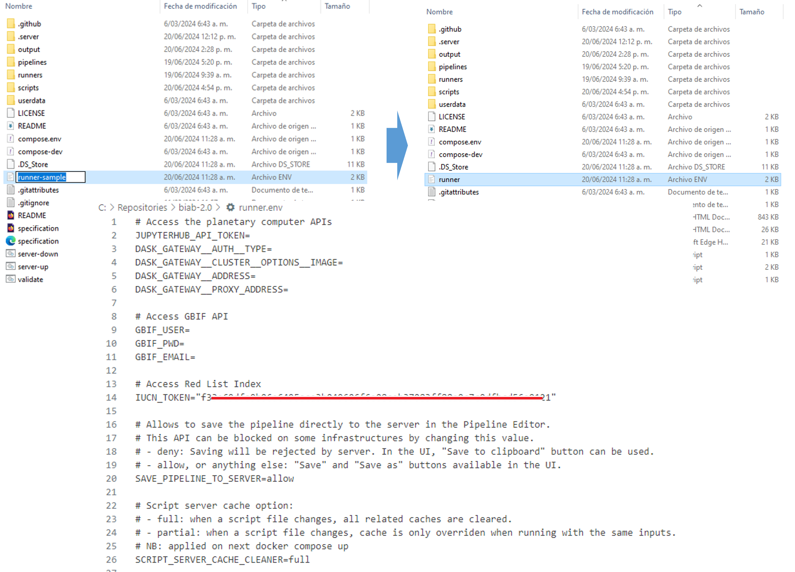

Instalación Bon in a Box
================
Esta guía de instalación y lanzamiento de la plataforma Bon in a Box
está diseñada para usuarios con poco conocimiento en desarrollo. Se
caracteriza por ser altamente visual, respaldándose en interfaces de
software de escritorio y complementada con capturas de pantalla
detalladas en cada paso del proceso. Esta estructura permite a los
usuarios seguir instrucciones sencillas de manera clara y efectiva,
minimizando la necesidad de conocimientos técnicos avanzados.

## Tabla de contenido

- <a href="#instalación-de-software-necesarios"
  id="toc-instalación-de-software-necesarios">Instalación de software
  necesarios</a>
- <a href="#clonar-el-repositorio-github-localmente"
  id="toc-clonar-el-repositorio-github-localmente">Clonar el Repositorio
  GitHub Localmente</a>
- <a href="#instalación-y-lanzamiento-de-bon-in-a-box-por-primera-vez"
  id="toc-instalación-y-lanzamiento-de-bon-in-a-box-por-primera-vez">Instalación
  y lanzamiento de Bon in a Box por primera vez</a>
  - <a href="#autenticación-de-clave-ssh"
    id="toc-autenticación-de-clave-ssh">Autenticación de clave SSH</a>
- <a href="#lanzar-servidor" id="toc-lanzar-servidor">Lanzar servidor</a>
- <a href="#abrir-bon-in-a-box" id="toc-abrir-bon-in-a-box">Abrir Bon in a
  Box</a>

## Instalación de software necesarios

Para utilizar la plataforma de Bon in a Box en su computadora, es
necesario usar las herramientas GitHub y Docker. Docker es una
plataforma que empaqueta aplicaciones y sus componentes necesarios en
contenedores, permitiendo su ejecución en entornos virtuales dentro de
computadoras locales. GitHub es una plataforma de gestión de código
fuente que permite la colaboración entre desarrolladores y proporciona
un entorno centralizado para alojar la estructura necesaria para
construir y ejecutar contenedores Docker.

Toda la infraestructura necesaria para la construcción de los
contenedores que contienen la máquina virtual para lanzar Bon in a Box
está alojada en el repositorio
[PEM-Humboldt/biab-2.0](https://github.com/PEM-Humboldt/biab-2.0). Este
repositorio facilita el desarrollo y la ejecución de flujos de trabajo
para la estimación de indicadores globales de biodiversidad. El
repositorio
[PEM-Humboldt/biab-2.0](https://github.com/PEM-Humboldt/biab-2.0) es una
bifurcación del repositorio global
[GEO-BON/bon-in-a-box-pipelines](https://github.com/GEO-BON/bon-in-a-box-pipelines),
pero enfocado en la implementación y mapeo de indicadores de
biodiversidad en el contexto de Colombia. Como bifurcación del
repositorio global, el repositorio colombiano mantiene la misma
infraestructura y se actualiza constantemente con el repositorio
original, pero también contiene ramas y proyectos específicos adaptados
al contexto Colombia.

La forma más sencilla de lanzar bon in a box de forma rápida y sencilla
consiste en descargar e instalar las versiones de escritorio de los
softwares mencionados: 1) GitHub Desktop: Disponible en [GitHub
Desktop](https://docs.github.com/en/desktop/installing-and-authenticating-to-github-desktop/installing-github-desktop).
Necesario para clonar el repositorio GitHub en la máquina local. 2)
Docker Desktop: Disponible en [Docker
Desktop](https://www.docker.com/products/docker-desktop/). Necesario
para generar una máquina virtual en la máquina local. Esta máquina
virtual instalará y ejecutará internamente software como R, Python o
Julia en versiones específicas, facilitando la portabilidad y la
ejecución del código. Mas información en
[GEO-BON/bon-in-a-box-pipelines/README-user](https://github.com/GEO-BON/bon-in-a-box-pipeline-engine/blob/main/README-user.md#scripts).
3) Para usuarios Windows es necesario una terminal Linux Shell como git
bash. 4) En algunos casos, los usuarios de Windows pueden necesitar
activar la virtualización y otras herramientas para que Docker Desktop
funcione correctamente y actualizar WSL (`wsl--update`, ver
<https://docs.docker.com/desktop/troubleshoot/topics/#virtualization>).
Es posible que se requiera acceder al BIOS para habilitar la
virtualización. Para más detalles sobre requisitos particulares
consultar en
[GEO-BON/bon-in-a-box-pipelines/README-user](https://github.com/GEO-BON/bon-in-a-box-pipeline-engine/blob/main/README-user.md#scripts).

## Clonar el Repositorio GitHub Localmente

Copiar el repositorio en tu computadora local te permitirá disponer de
toda la infraestructura necesaria para lanzar Bon in a Box. Para
hacerlo, sigue estos pasos: • Abre la aplicación GitHub Desktop e inicia
sesión con tu cuenta de GitHub. Si aún no tienes una cuenta, crea una en
github.com. • Con la sesión iniciada, haz clic en `File` en la esquina
superior izquierda y selecciona `Clone repository`. • En la ventana que
se abre, selecciona la pestaña URL y defínela con la del repositorio
<https://github.com/PEM-Humboldt/biab-2.0> • Especifica un directorio
local en el campo `Local Path` donde se guardará la copia del
repositorio en tu computadora, y haz clic en `Clone`. Esto copiará todos
los archivos del repositorio a tu computadora local, permitiéndote
trabajar con ellos directamente.

Este proceso tardará unos minutos mientras se descarga toda la
infraestructura necesaria para lanzar Bon in a Box.

• Después de completar el clonado, es necesario acceder al directorio
del repositorio clonado y renombrar el archivo runner-sample.env a
runner.env. Este archivo define las credenciales confidenciales
requeridas para el funcionamiento del código, como tokens de APIs,
contraseñas y otros datos esenciales para la correcta ejecución de los
programas. Al guardarlo con el nombre runner.env, se asegura que esta
información sensible permanezca solo en tu computadora, pero que no se
comparta con el repositorio al realizar actualizaciones de código o
desarrollo.

## Instalación y lanzamiento de Bon in a Box por primera vez

Docker es necesario para activar la virtualización en tu computadora y
ejecutar la aplicación del repositorio. Utiliza esta virtualización para
crear y ejecutar contenedores, que son entornos ligeros y portátiles que
permiten ejecutar aplicaciones independientemente del sistema operativo.
Docker Desktop facilita este proceso. Para lanzar Bon in a Box,
simplemente asegúrate de tener Docker Desktop abierto; no es necesario
iniciar sesión, pero no hay problema si prefieres hacerlo.

Una vez clonado el repositorio y con Docker Desktop en ejecución, abre
GitHub Desktop y asegúrate de estar en el repositorio clonado. En la
parte superior de la aplicación, encontrarás un menú desplegable llamado
`Current Repository` que te indicará el repositorio en el que estás
trabajando. Justo al lado, la barra `Current Branch` te mostrará la rama
en la que estás trabajando. Asegúrate de que estos campos muestren el
repositorio de BIAB o el nombre del directorio que especificaste durante
la clonación. La rama, que por defecto estará seleccionada como `main`,
es una versión del código que permite trabajar en diferentes
características o correcciones sin afectar a la versión principal.

En este ejemplo, trabajaremos sobre la rama test_pipeline_IAvH, que es
una rama en la que el Instituto Humboldt ha venido realizando pruebas de
indicadores de biodiversidad y contiene flujos completos de trabajo para
estimarlos.

Una vez estemos en el repositorio deseado, haz clic en la opción
`Repository` en la barra superior y selecciona `Open in Git Bash` o
`Open in Terminal` según tu sistema operativo. Esto abrirá una consola
de comandos. Al abrir la consola desde GitHub Desktop, esta se ubicará
automáticamente en la ruta del repositorio clonado, permitiéndote
trabajar con los archivos y subdirectorios contenidos en él, lo cual
facilita la ejecución de Bon in a Box.

Para lanzar Bon in a Box, siempre será necesario ejecutar el comando
`./server-up.sh`. La primera ejecución tomará más tiempo, ya que
descargará los micro-servicios necesarios para lanzar el contenedor
Docker. Las siguientes ejecuciones serán más rápidas o inmediatas,
dependiendo de los cambios realizados. Este comando ejecutará todas las
acciones definidas en el archivo server-up.sh que se encuentra en el
directorio clonado, iniciando así Bon in a Box.

Para hacer esto, digita el comando `./server-up.sh` en la consola y
oprime Enter. Bon in a Box requiere que la cuenta de GitHub desde donde
se ejecuta tenga una clave SSH configurada en el computador. Una clave
SSH es una configuración criptográfica de seguridad que permite la
autenticación segura entre el cliente (tu computadora) y el servidor
(GitHub), evitando la necesidad de introducir contraseñas cada vez que
se accede al repositorio. Si el usuario no tiene una clave SSH activa en
la cuenta asociada al computador, se generará un error de autenticación.

### Autenticación de clave SSH

Para configurar una clave SSH, ejecuta el comando
`ssh-keygen -t ed25519 -C "email@dominio.com"`. Este comando puede
ejecutarse tal cual, sin cambiar el correo electrónico ni el dominio.
Esto genera un par de claves SSH, una privada y una pública. Al
presionar Enter, el comando preguntará si deseas asignar un nombre
particular a las claves; puedes dejar este campo vacío y simplemente
presionar Enter para aceptar la ubicación predeterminada del usuario. El
código luego solicitará una frase de contraseña (passphrase). Puedes
omitir este paso presionando Enter nuevamente. A continuación, te pedirá
que verifiques la frase de contraseña, por lo que deberás presionar
Enter una vez más. Al hacerlo, se habrá generado la clave. La clave
queda almacenada en un directorio particular, cuya dirección está
resaltada en rojo en la figura.

 En esa dirección se generará un
archivo con extensión .pub, que contiene la clave pública. Esta clave
debe asociarse a las credenciales de GitHub del usuario. Para hacerlo,
copia el contenido del archivo en el portapapeles y asígnalo a la cuenta
de GitHub del usuario. Ve a tu cuenta de GitHub online, accede a
`Settings` \> `SSH and GPG keys` y selecciona `New SSH key`.

 Asigna un título, pega el contenido de
la clave pública en el campo correspondiente y guarda los cambios
oprimiendo `Add SSH key`. GitHub te solicitara tu clave de usuario para
terminar el proceso.

Este proceso de autenticación debe hacerse una sola vez por máquina. Una
vez hecho esto, ejecuta de nuevo `./server-up.sh` y se instalarán los
contenedores Docker y el servidor de Bon in a Box.

## Lanzar servidor

La primera vez que se ejecute `server-up.sh` tardará varios minutos
porque instala todo el contenedor, pero una vez configurado, las
siguientes veces lanzara el servidor más rápido pues solo buscara
actualizarse y ejecutarse directamente.

Una vez que todo esté correctamente configurado, se imprimirá el mensaje
`server running` en la consola.

## Abrir Bon in a Box

Con el servidor en funcionamiento, solo necesitas escribir la dirección
`http://localhost/` en tu navegador para acceder a la plataforma de Bon
in a Box.

