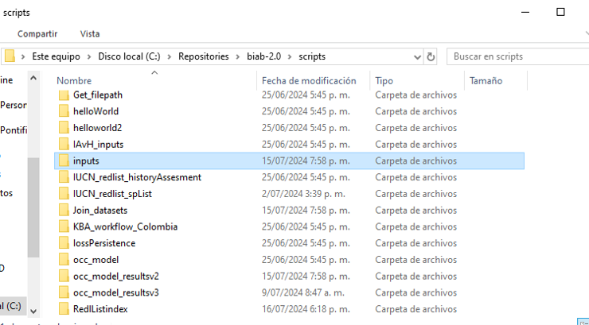
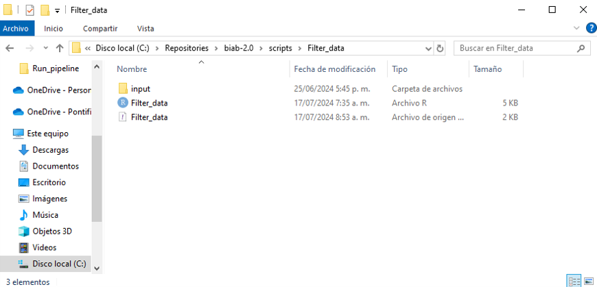

Cargar archivos en el servidor de Bon in a Box
================
true

El servidor de Bon in a Box requiere que las entradas para ejecutar
código sean rutas relativas dentro de su entorno. Esto significa que las
rutas deben estar definidas de tal manera que sean accesibles desde el
directorio raíz del entorno del servidor. Por lo tanto, para utilizar
archivos propios como ‘input’ en la ejecución de código, es necesario
cargarlos en el repositorio local, clonando el repositorio donde está
alojado el servidor. Esto asegura que las rutas de los archivos sean
correctas y accesibles desde el entorno del servidor.

Por ejemplo, la ruta `/scripts/Filter_data/input/records_data.csv` es
una ruta relativa que funciona correctamente dentro del entorno del
servidor, ya que comienza desde el directorio raíz del servidor y sigue
la estructura de directorios esperada. En contraste, la ruta
`C:/Repositories/biab-2.0/tutorials/backend_manual/Create_SimpleScript /scripts/Filter_data/input/records_data.csv`
no funciona porque al ser una ruta mixta desde el computador local no
permite al servidor la localización de los archivos.

Usar rutas relativas no solo facilita la portabilidad del código entre
diferentes entornos y máquinas, sino que también mejora la flexibilidad
al permitir cambios en la estructura del proyecto sin necesidad de
actualizar todas las referencias a archivos. Esto significa que el mismo
código se puede ejecutar correctamente sin importar en qué directorio o
máquina se despliegue el servidor, lo cual es crucial para el
mantenimiento y la estabilidad del código. Además, mantener las rutas
relativas contribuye a la seguridad y conveniencia, evitando la
exposición de la estructura completa del sistema de archivos del
servidor y simplificando la configuración y administración del entorno.

Según esto, los archivos `input` propios deben ubicarse en rutas dentro
del repositorio donde está el servidor para facilitar su ubicación, o de
lo contrario no serán admitidos. En algunos casos, las configuraciones
de seguridad y acceso del servidor dificultan esta lectura, por lo que
lo más recomendable es cargarlos en la carpeta `/scripts/` junto con los
códigos. Para facilitar la organización de archivos, se recomienda
guardarlos específicamente en la carpeta `/scripts/inputs`. El usuario
no debe preocuparse por el tamaño de los archivos alojados allí, ya que
aunque GitHub no admite archivos de más de 75 MB, lo cual puede causar
errores al intentar subirlos o actualizar el repositorio, el repositorio
cuenta con un archivo `.gitignore` que evita que estos archivos grandes
intenten cargarse, previniendo así problemas durante las operaciones de
actualización.

Además de esto, es recomendable para los encargados del mantenimiento de
los códigos que los inputs por defecto de los códigos se almacenen junto
al codigo y el archivo `YML`, de manera que se pueda acceder más
fácilmente a ellos para su mantenimiento. Esto facilita la gestión y
actualización de los archivos, asegurando que todos los elementos
necesarios para la ejecución del código estén organizados y accesibles
en un mismo lugar. Al mantener los archivos de entrada, el código y los
archivos de configuración (como los archivos `YML`) juntos, se mejora la
eficiencia del trabajo y se reduce el riesgo de errores al buscar o
actualizar estos componentes.

