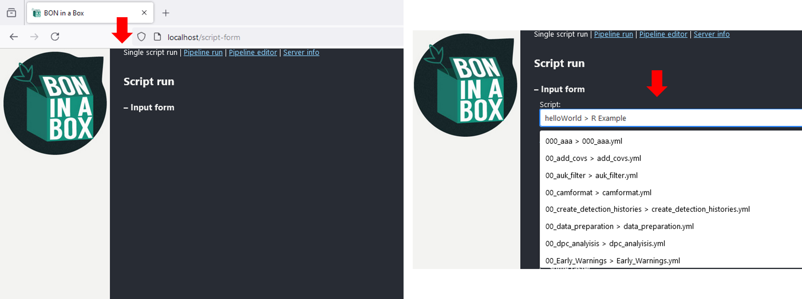
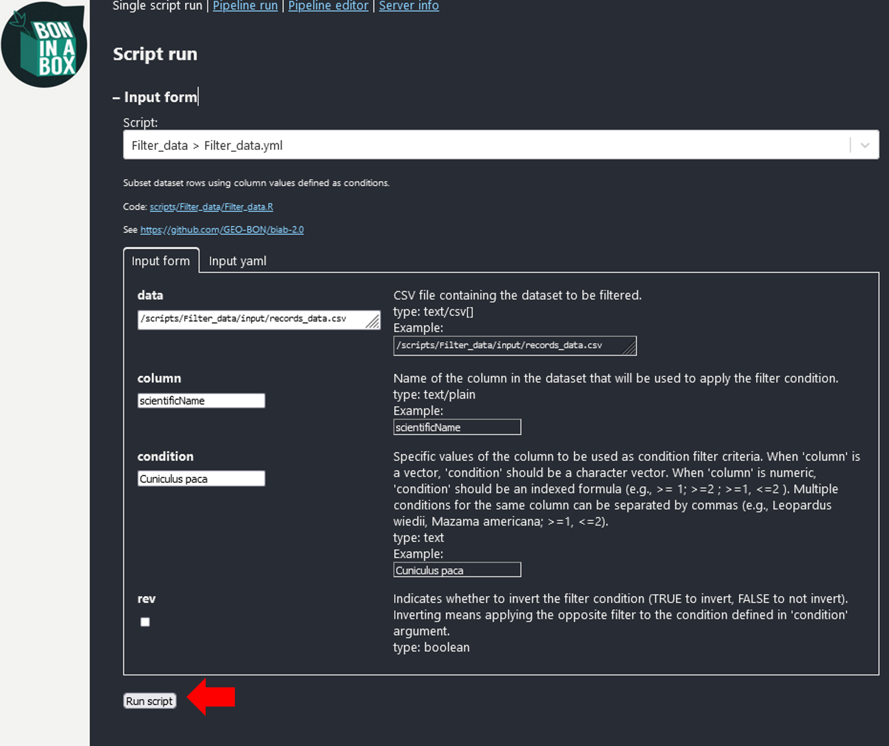
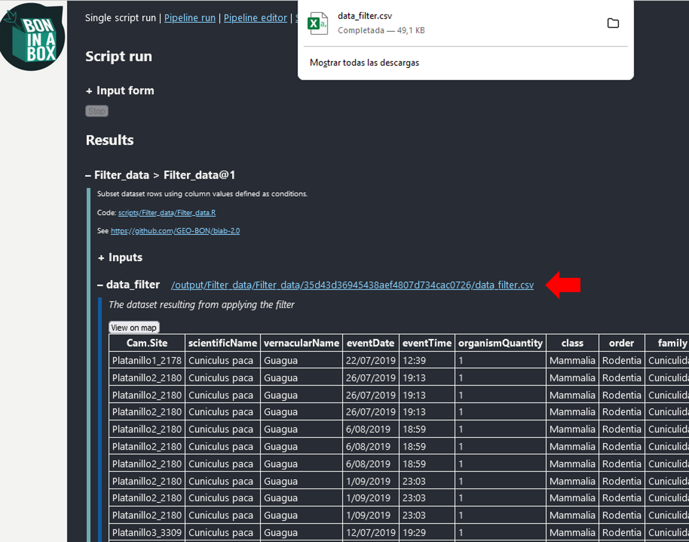
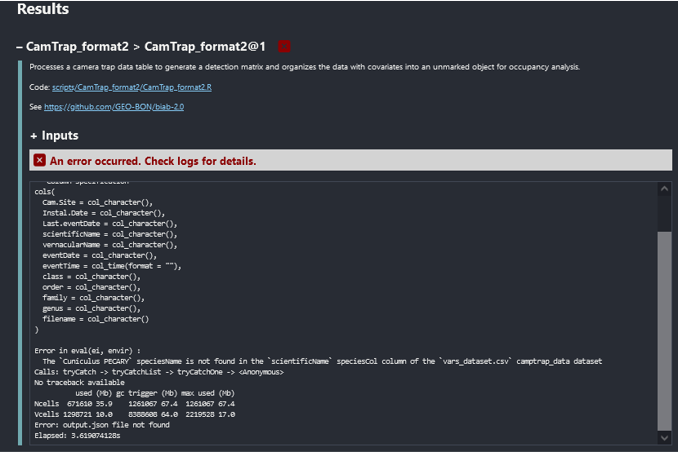

Ejecución de script simple
================
true

Las órdenes de servidor ejecutadas en Bon in a Box se organizan a partir
de códigos individuales conocidos como `single script`. Estos códigos
corresponden a bloques de código diseñados para realizar tareas
específicas de principio a fin. Cada `single script` está diseñado para
recibir ciertos parámetros y argumentos como entradas, procesar estas
entradas mediante el código interno y luego generar salidas específicas
basadas en el procesamiento realizado.

Para ejecutar un `single script`, basta con oprimir el botón
`Single script run` en la parte superior izquierda de la interfaz de Bon
in a Box. Una vez allí, la interfaz mostrará una barra de selección
donde están todos los scripts disponibles.

 Al seleccionar el
script de interés en la barra, la interfaz mostrará en primera línea una
descripción de lo que hace ese script, una línea titulada `Code`, una
linea `See` con un enlace donde hay una descripción detallada del codigo
seleccionado, y una linea con la ruta del archivo del código a ejecutar.

Dicha ruta corresponde a la dirección interna del codigo dentro del
repositorio clonado (ej. `scripts/Filter_data/Filter_data.R` corresponde
a maquina local en
`C:\Repositories\biab-2.0\scripts\Filter_data\Filter_data.R`). Asimismo,
los `inputs` referentes a rutas de archivos deben hacer referencia a
rutas internas del servidor, de lo contrario, los códigos no podrán
cargar los archivos. Por esta razón, todos los archivos que se utilicen
como `inputs` deben estar obligatoriamente dentro de la carpeta del
repositorio para que el servidor pueda leerlos correctamente. Para mayor
información sobre rutas relativas consulte el [tutorial para Cargar
archivos en el servidor de Bon in a Box](../load_files_server).

Con el script de interes seleccionado, en la parte central, la
plataforma mostrará un cuadro `Input form` con campos de autollenado
para las entradas `inputs` o argumentos requeridos para la ejecución del
código. Estas entradas son las variables que le pasas a la función para
que ésta las utilice en su ejecución y que son necesarias para que el
codigo pueda realizar su tarea. Cada `input` tiene un nombre, un espacio
para completarse, y una descripción de lo que debería especificar. Por
defecto, estos códigos traen unas entradas predeterminadas, pero deben
acomodarse según los objetivos del usuario.

Una vez definidos los `inputs` , basta con oprimir `Run script` en la
parte inferior del `Input form`.

Una vez ejecutado, la interfaz mostrará los resultados como listas
desplegables. Cada una con la descripción general del resultado y la
ruta relativa dentro del folder del repositorio donde se almacenó.
Dichas rutas pueden buscarse en la máquina o descargar una copia del
resultado directamente haciendo click sobre el hipervínculo de la ruta.
Sumado a esto, si se expande la lista haciendo click en el símbolo `+`,
la interfaz mostrará una vista previa del resultado.

Durante la ejecución del código en la interfaz de Bon in a Box, se
visualiza un cuadro de `log` de progresos del código en la parte
inferior. Este cuadro es dinámico e irá mostrando los avances en tiempo
real, proporcionando a los usuarios una visión continua del estado de la
ejecución. Si se genera algún error durante la ejecución, el codigo se
detiene y la interfaz mostrará un mensaje de error con una `X` roja en
el paso correspondiente, acompañado del texto
`"An error occurred. Check logs for details."`. Sumado a esto, se
imprime un mensaje de error en el cuadro de `log` que refleja el mensaje
desde la consola por el que el codigo no funciona.

Generalmente, los errores surgen debido a problemas en los datos de
entrada o a parámetros incorrectamente especificados por los usuarios.
Los códigos están preparados para manejar estos problemas e imprimir
mensajes claros sobre la causa del error. Por lo tanto, se recomienda
revisar los mensajes del cuadro de `log` en caso de error.

Este mensaje facilita la identificación y corrección del problema por
parte del usuario. El usuario debe corregir los datos de entrada para
ejecutar correctamente el código. Si el error persiste, el usuario debe
comunicarse con el autor del código detallado en la descripción para
solucionarlo.

