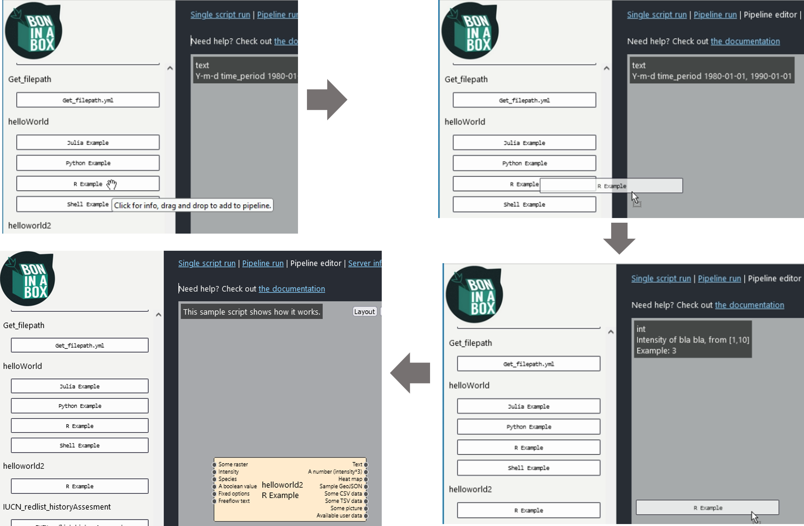
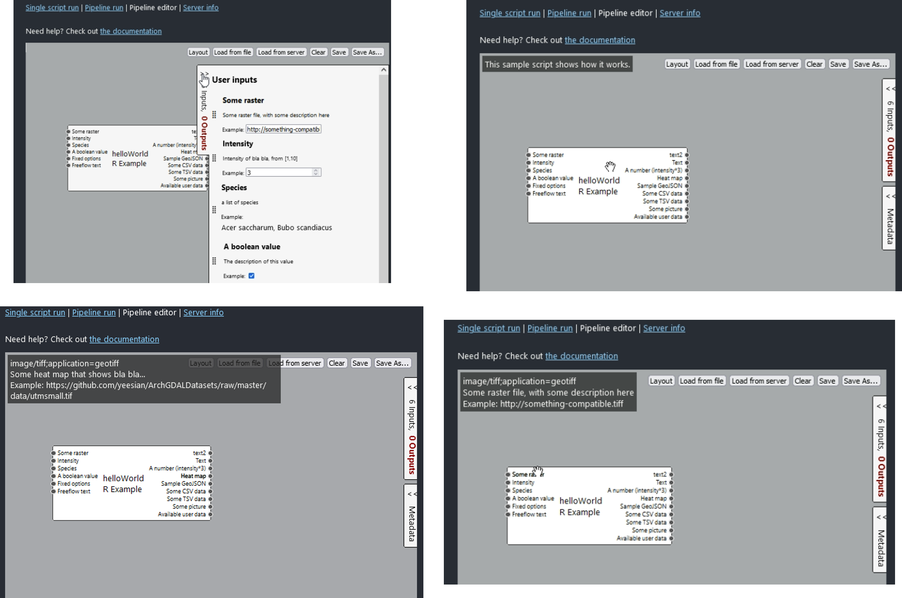
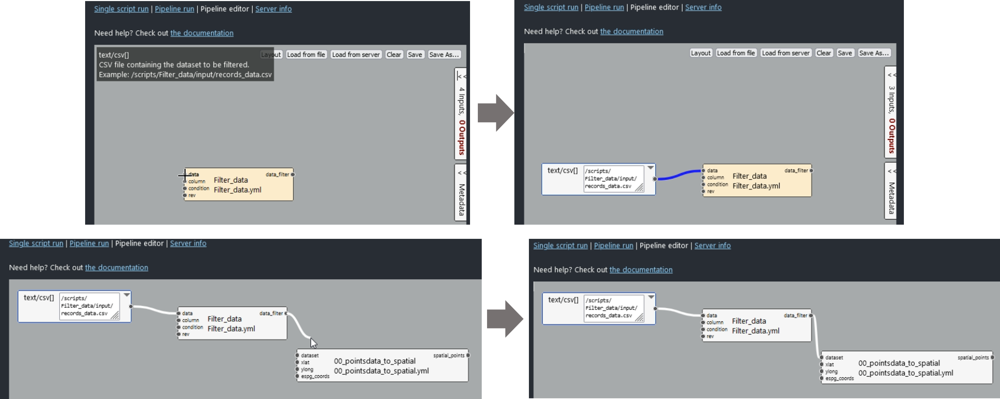
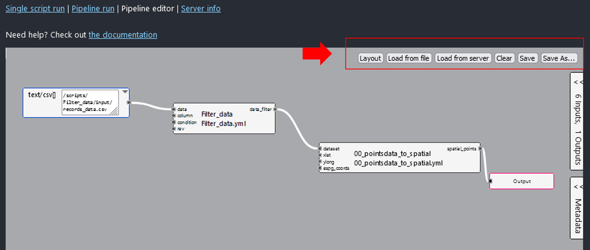
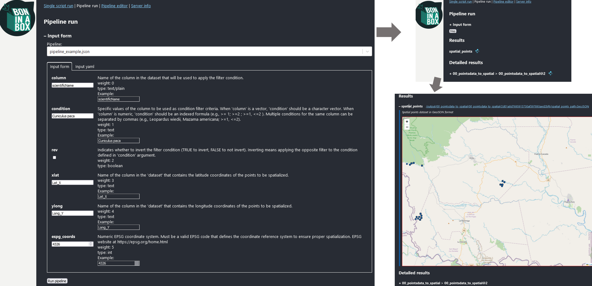

Un pipeline es una serie de etapas o pasos de procesamiento de datos que se ejecutan de manera secuencial. Cada paso toma la salida del paso anterior como su entrada, permitiendo que los datos se transformen y procesen de manera ordenada y eficiente, facilitando así la automatización para el procesamiento de datos.

En Bon in a Box, cada `single script` puede ensamblarse como un paso de pipeline, organizando y ejecutando flujos de trabajo complejos. Este enfoque automatiza la conexión entre los scripts, creando pasos interrelacionados a partir de sus entradas y salidas. 
Para más información sobre cómo usar los pipelines, consulte la [documentación oficial de usuario de Bon in a Box]( https://github.com/GEO-BON/bon-in-a-box-pipeline-engine/blob/main/README-user.md#pipelines).

## Interfaz Pipeline editor

El `Pipeline Editor` es un editor de diagramas interactivo diseñado para facilitar la creación y gestión de flujos de trabajo tipo pipeline. En este editor, se pueden arrastrar, soltar y conectar diferentes `single scripts` para crear flujos de trabajo personalizados. Cada `single script` se organiza como una caja y se configura como un paso del pipeline. Los componentes principales del pipeline incluyen los scripts, que funcionan como pasos con entradas y salidas, y los conectores entre ellos que determinan el flujo de datos.

Para obtener más información sobre los `single script`, consulta en la documentación sobre [Run_SimpleScript](../user_manual/Run_SimpleScript).

La interfaz del `Pipeline Editor` tiene un panel izquierdo que muestra los `single scripts` disponibles. Cada `single script` puede ponerse en el lienzo principal como un paso de pipeline simplemente arrastrándolo y soltándolo allí. 

En el lado derecho hay un panel desplegable `metadata` que describe los metadatos del pipeline, y un panel plegable con la descripción de todos los `inputs` y `outputs` de los scripts en el lienzo.Asimismo, al poner el cursor sobre cada caja o step, y sobre cada input o output, aparece un tooltip que describe esos argumentos. Los inputs pueden definirse desde el `Pipeline Editor` o desde el `Pipeline Run`. 

Los `inputs` pueden definirse desde el `Pipeline Editor` o desde el `Pipeline Run`. Cuando se definen desde el `Pipeline Editor` se configuran como `variables constantes` por lo que no aparecerán en la interfaz `Pipeline Run`. Esto puede ser útil, por ejemplo, si el pipeline se ejecuta múltiples veces con una sola variable dinámica, como cuando solo cambia el nombre de una especie, pero el resto de parámetros son constantes entre especies. Cualquier entrada sin un valor constante asignado se considerará una entrada de pipeline y el usuario tendrá que completar el valor desde [Pipeline Run](#ID_pipeline_run).

Para definir estos inputs desde el `Pipeline Editor`, basta con hacer doble clic sobre el punto conexo al argumento input. Esto generará un vínculo de conexión hacia donde se debe definir el input. Si se busca que sea una conexión con un `single script` de un paso previo, se debe hacer un solo clic y arrastrar la conexión generada hasta el output del paso previo.

Es importante que los tipos de archivo entre los inputs y los outputs sean coincidentes; de lo contrario, se generará un error. Los tipos de archivo admitidos están descritos en la sección [`input and output types` de la documentación oficial de usuario de Bon in a Box](https://github.com/GEO-BON/bon-in-a-box-pipeline-engine/blob/main/README-user.md#describing-a-script) que corresponden a [MIME media types](https://www.iana.org/assignments/media-types/media-types.xhtml).

Cuando el pipeline esté listo, debe añadirse un box final denominado `Output` sobre el paso final, que representará la salida final del pipeline. Para esto debe hacerse doble click sobre cualquier output del paso final. Una vez hecho esto, el pipeline debe guardarse utilizando los botones dispuestos en la parte superior derecha de la interfaz.

En la parte superior derecha, hay varios botones útiles:

* Layout: Permite organizar automáticamente el diseño de los scripts en el lienzo para una mejor visualización.
* Load from file: Carga un pipeline desde un archivo guardado previamente.
* Load from server: Carga un pipeline guardado en el servidor.
* Clear: Limpia el lienzo, eliminando todos los scripts y conexiones.
* Save: Guarda y sobreescribe sobre el pipeline actual.
* Save As: Permite guardar el pipeline actual con un nuevo nombre o ubicación.

En ambas opciones de guardado, los pipelines se almacenarán por defecto en la carpeta `~/pipelines` dentro de la ruta del repositorio. Asimismo, los pipelines que se cargan con `Load from server` son aquellos guardados en esa carpeta.

Los pipelines guardados en la carpeta `~/pipelines` se visualizarán en la pestaña `Pipeline Run` desde donde se ejecutarán.

## Interfaz Pipeline run

La interfaz `Pipeline Run` permite ejecutar los pipelines que han sido previamente guardados. En esta interfaz, los pipelines guardados se pueden abrir desde el menú desplegable `Pipeline`. Una vez seleccionado un pipeline, en la sección `Input Form` se visualizan todos los argumentos que no se definieron como constantes en el [Pipeline Editor](#ID_pipeline_editor).

Cada argumento de entrada se muestra con su descripción, la cual es la misma que se visualizaba en los tooltips del [Pipeline Editor](#ID_pipeline_editor). Esto proporciona una guía clara sobre qué valores deben ingresarse para cada parámetro.

Con todos los parámetros ajustados, el pipeline se ejecuta presionando el botón `Pipeline Run`. Esta acción iniciará el procesamiento del pipeline, ejecutando cada uno de los `single scripts` especificados con los valores de entrada proporcionados. Mientras se ejecuta cada paso, se visualizarán iconos de carga.

Una vez finalizado, el resultado principal se muestra en la sección `Results`. Adicionalmente, en la sección `Detailed Results` se muestran los resultados de cada paso para explorar los resultados en detalle.

La interfaz mostrará los resultados como listas desplegables. Cada una con la descripción general del resultado y la ruta relativa dentro del folder del repositorio donde se almacenó. Dichas rutas pueden buscarse en la máquina o descargar una copia del resultado directamente haciendo click sobre el hipervínculo de la ruta. Sumado a esto, si se expande la lista haciendo click en el símbolo `+`, la interfaz mostrará una vista previa del resultado.

