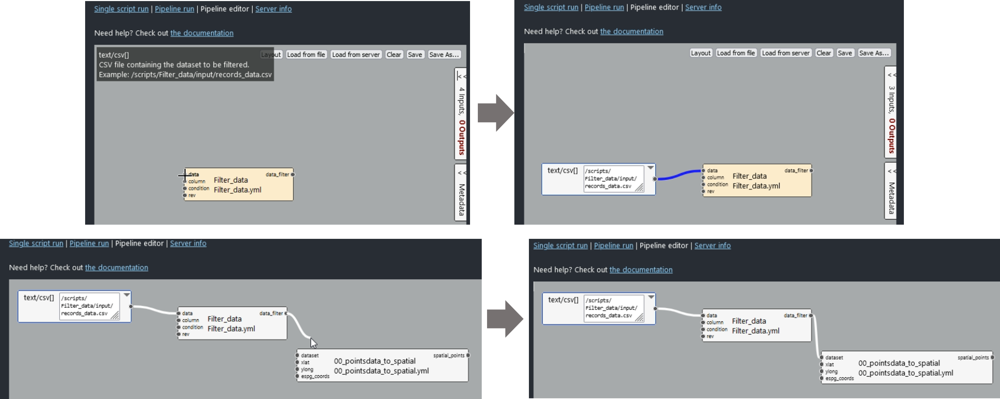
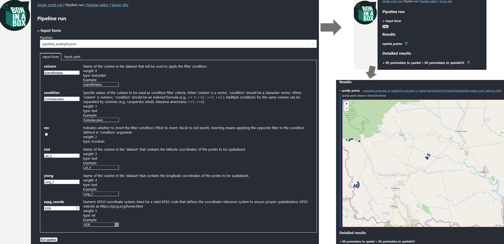

Ejecución de pipeline
================
Un pipeline es una serie de etapas o pasos de procesamiento de datos que
se ejecutan de manera secuencial. Cada paso toma la salida del paso
anterior como su entrada, permitiendo que los datos se transformen y
procesen de manera ordenada y eficiente, facilitando así la
automatización para el procesamiento de datos.

- [Interfaz Pipeline editor](#interfaz-pipeline-editor)
- [Interfaz Pipeline run](#interfaz-pipeline-run)

En Bon in a Box, cada `single script` puede ensamblarse como un paso de
pipeline, organizando y ejecutando flujos de trabajo complejos. Este
enfoque automatiza la conexión entre los scripts, creando pasos
interrelacionados a partir de sus entradas y salidas. Para más
información sobre cómo usar los pipelines, consulte la [documentación
oficial de usuario de Bon in a
Box](https://github.com/GEO-BON/bon-in-a-box-pipeline-engine/blob/main/README-user.md#pipelines).

## Interfaz Pipeline editor

El `Pipeline Editor` es un editor de diagramas interactivo diseñado para
facilitar la creación y gestión de flujos de trabajo tipo pipeline. En
este editor, se pueden arrastrar, soltar y conectar diferentes
`single scripts` para crear flujos de trabajo personalizados. Cada
`single script` se organiza como una caja y se configura como un paso
del pipeline. Los componentes principales del pipeline incluyen los
scripts, que funcionan como pasos con entradas y salidas, y los
conectores entre ellos que determinan el flujo de datos.

La interfaz del `Pipeline Editor` tiene un panel izquierdo que muestra
los `single scripts` disponibles. Cada `single script` puede ponerse en
el lienzo principal como un paso de pipeline simplemente arrastrándolo y
soltándolo allí.

 En el lado derecho hay un panel
desplegable `metadata` que describe los metadatos del pipeline, y un
panel plegable con la descripción de todos los `inputs` y `outputs` de
los scripts en el lienzo.Asimismo, al poner el cursor sobre cada caja o
step, y sobre cada input o output, aparece un tooltip que describe esos
argumentos. Los inputs pueden definirse desde el `Pipeline Editor` o
desde el `Pipeline Run`.

Los `inputs` pueden definirse desde el `Pipeline Editor` o desde el
`Pipeline Run`. Cuando se definen desde el `Pipeline Editor` se
configuran como `variables constantes` por lo que no aparecerán en la
interfaz `Pipeline Run`. Esto puede ser útil, por ejemplo, si el
pipeline se ejecuta múltiples veces con una sola variable dinámica, como
cuando solo cambia el nombre de una especie, pero el resto de parámetros
son constantes entre especies. Cualquier entrada sin un valor constante
asignado se considerará una entrada de pipeline y el usuario tendrá que
completar el valor desde [Pipeline Run](#ID_pipeline_run).

Para definir estos inputs desde el `Pipeline Editor`, basta con hacer
doble clic sobre el punto conexo al argumento input. Esto generará un
vínculo de conexión hacia donde se debe definir el input. Si se busca
que sea una conexión con un `single script` de un paso previo, se debe
hacer un solo clic y arrastrar la conexión generada hasta el output del
paso previo.

Es importante que los tipos de archivo entre los inputs y los outputs
sean coincidentes; de lo contrario, se generará un error. Los tipos de
archivo admitidos están descritos en la sección
[`input and output types` de la documentación oficial de usuario de Bon
in a
Box](https://github.com/GEO-BON/bon-in-a-box-pipeline-engine/blob/main/README-user.md#describing-a-script)
que corresponden a [MIME media
types](https://www.iana.org/assignments/media-types/media-types.xhtml).

Cuando el pipeline esté listo, debe añadirse un box final denominado
`Output` sobre el paso final, que representará la salida final del
pipeline. Para esto debe hacerse doble click sobre cualquier output del
paso final. Una vez hecho esto, el pipeline debe guardarse utilizando
los botones dispuestos en la parte superior derecha de la interfaz.

En la parte superior derecha, hay varios botones útiles:

- Layout: Permite organizar automáticamente el diseño de los scripts en
  el lienzo para una mejor visualización.
- Load from file: Carga un pipeline desde un archivo guardado
  previamente.
- Load from server: Carga un pipeline guardado en el servidor.
- Clear: Limpia el lienzo, eliminando todos los scripts y conexiones.
- Save: Guarda y sobreescribe sobre el pipeline actual.
- Save As: Permite guardar el pipeline actual con un nuevo nombre o
  ubicación.

En ambas opciones de guardado, los pipelines se almacenarán por defecto
en la carpeta `~/pipelines` dentro de la ruta del repositorio. Asimismo,
los pipelines que se cargan con `Load from server` son aquellos
guardados en esa carpeta.

 Los pipelines guardados en la
carpeta `~/pipelines` se visualizarán en la pestaña `Pipeline Run` desde
donde se ejecutarán.

## Interfaz Pipeline run

La interfaz `Pipeline Run` permite ejecutar los pipelines que han sido
previamente guardados. En esta interfaz, los pipelines guardados se
pueden abrir desde el menú desplegable `Pipeline`. Una vez seleccionado
un pipeline, en la sección `Input Form` se visualizan todos los
argumentos que no se definieron como constantes en el [Pipeline
Editor](#ID_pipeline_editor).

Cada argumento de entrada se muestra con su descripción, la cual es la
misma que se visualizaba en los tooltips del [Pipeline
Editor](#ID_pipeline_editor). Esto proporciona una guía clara sobre qué
valores deben ingresarse para cada parámetro.

Con todos los parámetros ajustados, el pipeline se ejecuta presionando
el botón `Pipeline Run`. Esta acción iniciará el procesamiento del
pipeline, ejecutando cada uno de los `single scripts` especificados con
los valores de entrada proporcionados. Mientras se ejecuta cada paso, se
visualizarán iconos de carga.

Una vez finalizado, el resultado principal se muestra en la sección
`Results`. Adicionalmente, en la sección `Detailed Results` se muestran
los resultados de cada paso para explorar los resultados en detalle.

La interfaz mostrará los resultados como listas desplegables. Cada una
con la descripción general del resultado y la ruta relativa dentro del
folder del repositorio donde se almacenó. Dichas rutas pueden buscarse
en la máquina o descargar una copia del resultado directamente haciendo
click sobre el hipervínculo de la ruta. Sumado a esto, si se expande la
lista haciendo click en el símbolo `+`, la interfaz mostrará una vista
previa del resultado.
