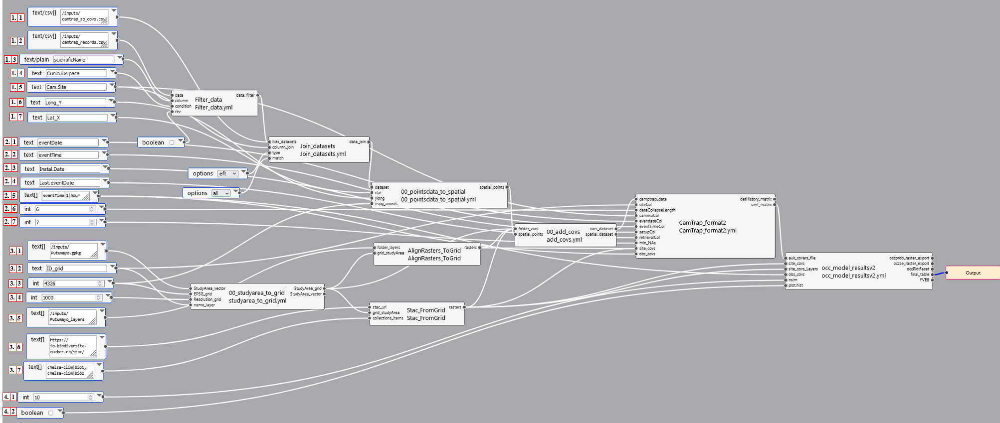

This pipeline is designed to estimate occupancy models from camera trap data. The main inputs required to run it are record files (1.1) and sampling data (1.2) associated with wildlife inventories using camera traps, as well as site covariate data related to the study area of these inventories.

The workflow is divided into four sections: Section one is dedicated to loading and organizing camera trap data, section two to estimating the detection matrix and concatenating it with covariates in the unmarked format (designed to handle and analyze observation data for occupancy models), section three to loading and organizing spatial inputs such as site/landscape covariates, and section four to estimating the occupancy model.

If you already have a consolidated file that includes site and detection variables per sampling event, proceed to pipeline X. Similarly, if you already have a file in unmarked format for analysis, go to the simple execution code Y.

This workflow loads and adjusts spatial covariates of site/landscape to the study area. For this, it loads raster files from your local computer and from STAC repositories. If you want to load files as covariates only from the local machine, use pipeline X, and if you want to load only covariates from the STAC, consult pipeline Y.

 

  

Para faciltiar la visualizacion del pipeline descarga la version svg aca 

Sections 1 and 2 mostly refer to column names of input files to execute the analysis.

### Section 1: Loading and organizing camera trap data

* 1.1: Path to the CSV file with record data (default: /inputs/camtrap_records.csv).
* 1.2: Path to the file with sampling data (default: /inputs/camtrap_sp_covs.csv).
* 1.3: Name of the column referring to the scientific name of species (default: scientificName).
* 1.4: Name of the column referring to the camera site (default: Cam_Site).
* 1.5: Name of the common column with the camera trap ID (default: Cam_Site).
* 1.6: Name of the column with longitude (default: Long_Y).
* 1.7: Name of the column with latitude (default: Lat_X).

The main input for section 1 is the paths to the CSV files of records (1.1) and sampling data (1.2) associated with camera trap surveys. The record file (1.1) must contain columns referring to the scientific name of species (1.3), with a level corresponding to the species name to be analyzed specified in input (1.4), in addition to columns for date (2.1) and time (2.2) of records.

Inputs 1.3 and 1.4 are used in FilterData to obtain only the records of the species of interest, while 2.1 and 2.2 will be necessary in CamTrap_format as metadata for date and time to organize events in the detection matrix.

Both the record file (1.1) and the sampling data file (1.2) must have a common column (1.5) specifying a unique ID for each camera trap that will be used to merge these files into one compiled through Join_datasets. This common column (1.5) will also be used as a unique identification of camera traps for the detection matrix in CamTrap_format.

The sampling data file (1.2) must contain columns referring to the longitude (1.6) and latitude (1.7) coordinates of the camera trap location, as well as columns for the installation date (2.3) and removal (2.4) of the camera. The coordinate columns must be in the same coordinate format specified in input 3.3 and will allow the data table to be spatialized to add spatial covariates to the records. The columns for installation date (2.3) and removal (2.4) are also necessary to organize the sequence of events in the detection matrix in CamTrap_format.

## Section 2: Generation of the detection matrix and unmarked format

2.1: Name of the column with the event date (default: eventDate).
2.2: Name of the column with the event time (default: eventTime).
2.3: Name of the column with the installation date (default: Instal.Date).
2.4: Name of the column with the last event date (default: Last.eventDate).
2.5: Name of the observation variables (default: eventTime|1|hour). If NULL, it is ignored. Several can be specified separated by commas (default: eventTime|1|hour, effort|1, moonPhase). If only the name is specified, the variable collapses according to unique values. If the specified variable column is numeric, it rounds using name|rounding_value, and if it is temporal with name|rounding_value|time_unit. Factors are not rounded. Temporal units can be specified according to all formats detailed in lubridate::round_date. Specification errors will result in them being ignored.
2.6: Time interval in days in which detections are grouped or collapsed as sampling events (default: 6).
2.7: Minimum number of events per site to include in the detection matrix (default: 7).
Input 2.5 refers to observation covariates (e.g., time, moon phase, weather) that will be used in CamTrap_format and occ_model_results to organize the detection matrix and estimate the occupancy model. These must correspond to column names in the record files (1.1) or sampling data (1.2), otherwise, they will be omitted. When specifying, the column name must be given. However, as observation covariates can have multiple values for the same site, they must be grouped/collapsed for the correct organization of the unmarked object, which receives unique entries per site. When only the name is given, it will collapse in unmarked by the number of unique values of that column, or if it is numeric, it can be rounded specifying it as name|rounding value (e.g., eventTime|1). When they are factors, they are not rounded. Numeric variables are specified with the variable name and the rounding factor in the form eventTime|1, where 1 is the rounding value. Temporal variables are accepted and rounded by adding a third temporal unit factor in the form eventTime|1|hour, where hour is the rounding unit. Temporal units from lubridate::round_date are accepted.

Inputs 2.6 and 2.7 are numerical arguments for the CamTrapFormat box that organize the detection matrix and the unmarked object. Input 2.6 defines the time interval in days in which detections are grouped or collapsed to determine a sampling occasion or event. Input 2.7 specifies the minimum number of events required per site to include that site in the detection matrix in camtrapR. Sites with fewer events will be excluded from the matrix and the unmarked object.

## Section 3: Loading and organizing spatial inputs as site covariates

3.1: Path to the vector file of the study area (default: /inputs/Putumayo.gpkg).
3.2: Name to be given to the base raster of the study area (default: ID_grid).
3.3: EPSG numerical coordinate system to which the base raster will be adjusted (default: 4326).
3.4: Numerical resolution value in meters to which the base raster will be adjusted (default: 1000).
3.5: Path to the folder where the raster files of the landscape covariates are located (default: /inputs/Putumayo_layers). If set to NULL, no layers are loaded from the local machine.
3.6: Path to the STAC repository where the landscape covariates of interest are located (default: https://io.biodiv/). If set to NULL, no layers are loaded from the STAC repository.
3.7: Name of the collection and layer of the specified STAC repository of the landscape covariates of interest. Ignored if 3.6 is NULL.
The inputs in section 3 correspond to cartographic parameters of the study area. The main input required is the path to a vector file of the study area (3.1). This file is used as a base mask in studyarea_to_grid to generate the base raster grid that will support the analysis and will have parameters such as a name given in 3.2, numerical EPSG cartographic projection defined in 3.3, and spatial resolution in meters defined in 3.4.

The workflow adjusts spatial covariates of site/landscape to this defined base. This workflow loads and adjusts spatial covariates of site/landscape to the study area from your computer and from STAC repositories.

To load covariates from a local repository, the folder path must be specified in 3.5 where the raster files are stored. The AlignRasters_ToGrid box will load those files and align them to the base grid.

To load covariates from the STAC repository, the STAC URL must be defined in 3.6 and in 3.7 the name of the collection and the required layer, separated by | in the form collection|layer. Multiple layers can be specified, separated by commas. The Stac_From_Grid box will load those layers online and align them to the base raster.

The information of the covariates is incorporated into the spatial dataset obtained from poins_data_to_spatial through the add_covs box, which adds the values of the loaded raster covariates as new columns